<!-- GENERATED by the string-diagram skill from docs/sim-theory-equations.txt
     (itself hand-derived from docs/sim-theory.edn -- see that file's own
     header for why no Clojure translator does this mechanically here, unlike
     ehr-testing-tools' `make pipeline`). Do not hand-edit the mermaid block
     below except as noted here. Regenerate with:

       python .agents/skills/string-diagram/tools/resource_equations_to_mermaid.py \
         docs/sim-theory-equations.txt -o docs/sim-theory-diagram.mermaid

     then paste the output back in below.

     MILESTONE site-profiles NOTE: this session's environment DID have
     Python available, so the whole block below is a mechanical
     regeneration (not a hand-edit) -- `site-profile` joined EmitHL7's
     equation as a real catalytic input (this milestone's own catalytic
     wire, docs/sim-theory.edn). This also resolves the M4 session's own
     open item (its note, once here, asked a future Python-having
     session to diff its hand-applied `payer-pool` wire against the
     tool's real output): re-running the converter over the
     THEN-CURRENT equations file first, before this milestone's own
     edit, and diffing against the already-shipped M4 block confirmed
     every node declaration, wire, and style line matched exactly --
     the only difference was the `%% Arrow N` comment numbers (off by
     one, an artifact of a since-added header line changing the
     equations file's own line count, not a structural or convention

     M5-PREP NOTE (docs/gmf-interpreter.md, ADR-0013): this session's
     sim-theory.edn edit was prose-only (:contract notes on :trajectory/
     :compile; gmf-module-set's catalytic TARGET resolving from OPEN to
     3 -- a Catalytic-resolution-table fact, not a wire) -- `gmf-module-
     set` was already a declared catalytic on RunModules before this
     session, so no node or wire changed. Confirmed by actually
     regenerating (python available this session too), not merely by
     inspection: the fresh regen is byte-identical to the block below
     modulo line endings. The regeneration ALSO surfaced that the
     standalone docs/sim-theory-diagram.mermaid file had drifted stale
     since the M4/site-profiles milestones (missing `payer-pool`/
     `site-profile`, both already present in THIS file's own embedded
     block below) -- a pre-existing gap between "paste the output back
     in below" (done, each time) and actually overwriting the standalone
     .mermaid file (apparently skipped at least twice), not something
     this session's own edit caused. Fixed this session: the standalone
     file now matches this block exactly.
     mismatch). Confirmed, not merely assumed, before regenerating with
     this milestone's own addition on top.

     M5B NOTE: this session's own sim-theory.edn edit was ALSO status-
     only for diagram purposes -- :trajectory/:compile flipped
     :planned -> :built and their own :contract strings grew, but
     RunModules' catalytic set (gmf-module-set/gmf-interpreter) and
     CompileTrajectory's inputs/outputs (clinical-trajectory in,
     compiled-pathway out, feeding UnionPathwayIr) were both already
     declared before this session -- no node, wire, or catalytic input
     changed, by the same argument the M5-prep session already made for
     its own prose-only edit. UNLIKE that session and the site-profiles
     session, this session's own environment did NOT have Python
     available (this session ran from a native Windows shell, not WSL;
     AGENTS.md's own WSL-recipe note is about git specifically, not a
     blanket guarantee) -- so this note records the argument for why no
     regeneration is needed, not a re-confirmed byte-identical diff the
     way the two prior sessions each recorded. A future session with
     Python (or a WSL shell) available should actually run the
     regeneration once to confirm this argument rather than continue
     trusting it by inspection alone.

     M6 NOTE (EmitState, this session): docs/sim-theory.edn's
     :emit-state flips :planned -> :built. No node, wire, or catalytic
     input changes -- EmitState's own node and its Execute --
     state-history --> EmitState wire were both ALREADY present in this
     file (state-history was always a real output of Execute); the
     diagram's own documented gap (this file's own "Verified in this
     render" section, above) means built-vs-planned renders identically
     regardless, so the ONLY change is docs/sim-theory-equations.txt's
     own "# planned: EmitState" comment line, now removed. This session
     ALSO removed two comment lines that were already stale BEFORE this
     session started ("# planned: RunModules"/"# planned:
     CompileTrajectory" -- both stages flipped :built at M5a/M5b,
     several sessions ago; the comments were simply never cleaned up) --
     a small, adjacent correction, not new drift this session introduced.
     Python was NOT available in this session's own environment (the
     python/python3 names on PATH resolve to the Windows Store's
     install-shim, not a real interpreter) -- the same gap the M5b
     session recorded for itself. This note records the argument for why
     no structural change is expected, the same way that session's own
     note did; a future session with Python (or WSL) available should
     run the actual regeneration once to confirm, rather than continue
     trusting inspection alone. -->

# The simulator's resource theory — diagram

The whole *want* from [`sim-theory.edn`](sim-theory.edn) / [`sim-theory.md`](sim-theory.md), rendered as a Mermaid string diagram via the `string-diagram` skill (`.agents/skills/string-diagram/SKILL.md`) over [`sim-theory-equations.txt`](sim-theory-equations.txt), the equations file's own companion representation (skill Step 3: always deliver both).

Verified in this render:

- **The `pathway-ir` union renders as a funnel/merge node** — `UnionPathwayIr`, green inverted-trapezoid, wiring both `compiled-pathway` and `authored-pathway` in and `pathway-ir` out — exactly ehr-testing-tools' own established convention for a union resource (`docs/notation.md`, `ehr-testing-tools.pipeline/union-resource->equation-line`), reused here rather than invented.
- **`SystemUnderTest` and `ToolsCorpusIntake` render dashed** — both carry `{external: true}`, the same device tools' own external stages use.
- **Gap, reported rather than faked:** the converter has no visual axis for `:built` vs `:planned` — only `{external: true}` (dashed) exists, and ehr-testing-tools' own history (`docs/notation.md`, "External stages") records that reusing dashed rendering for *planned-but-will-be-built-here* stages was tried once and deliberately dropped, because it conflates "not yet built" with "never built by this repo," which is a different claim. `ehr-testing-tools.pipeline/pipeline->equations-text` resolves this the same way this session does: a `:planned` stage gets a `# planned: <Label>` *comment* line in the equations text — documentary only, "not a distinct visual state" (that namespace's own docstring). So below, every stage box is visually identical dark-solid except the two external stages (dashed) and the union (green funnel); built vs. planned is legible only in [`sim-theory-equations.txt`](sim-theory-equations.txt)'s `# planned:` comments, not in the diagram itself. This is the same limitation tools carries in its own pipeline diagram, not a regression introduced here.
- **The site-profiles milestone adds exactly one wire, no new stage or node shape:** `site-profile` joins `EmitHL7`'s existing catalytic set (dashed `.->`, light-rounded source node, same convention every other catalytic already uses) — the milestone's own theory-flip note (docs/sim-theory.edn's `:emit-hl7` entry) said this would be a wire-count change only if the converter renders catalytics; it does, and this is that one new wire.

```mermaid
flowchart LR

    %% --- Source types (raw inputs, not produced by any operation) ---
    authored_pathway(["authored-pathway"])
    demographics_tables(["demographics-tables"])
    feed_statistics(["feed-statistics"])
    gmf_interpreter(["gmf-interpreter"])
    gmf_module_set(["gmf-module-set"])
    hl7_parser_dep(["hl7-parser-dep"])
    invariant_catalog(["invariant-catalog"])
    message_type_registry(["message-type-registry"])
    order_profiles(["order-profiles"])
    payer_pool(["payer-pool"])
    provider_pool(["provider-pool"])
    sim_config(["sim-config"])
    site_profile(["site-profile"])
    snomed_icd10_map(["snomed-icd10-map"])

    %% --- Operations (boxes; spiders use distinct shapes) ---
    Persona["Persona"]
    RunModules["RunModules"]
    CompileTrajectory["CompileTrajectory"]
    InjectChurn["InjectChurn"]
    Execute["Execute"]
    Check["Check"]
    EmitHL7["EmitHL7"]
    EmitState["EmitState"]
    Package["Package"]
    Calibrate["Calibrate"]
    UnionPathwayIr[\"UnionPathwayIr"/]
    SystemUnderTest["SystemUnderTest"]
    ToolsCorpusIntake["ToolsCorpusIntake"]

    %% --- Wires (typed connections) ---
    %% Arrow 19: Persona
    sim_config -- sim-config --> Persona
    demographics_tables -. demographics-tables .-> Persona
    payer_pool -. payer-pool .-> Persona

    %% Arrow 22: RunModules
    Persona -- persona --> RunModules
    gmf_module_set -. gmf-module-set .-> RunModules
    gmf_interpreter -. gmf-interpreter .-> RunModules

    %% Arrow 25: CompileTrajectory
    RunModules -- clinical-trajectory --> CompileTrajectory

    %% Arrow 27: InjectChurn
    UnionPathwayIr -- pathway-ir --> InjectChurn
    Calibrate -- churn-profile --> InjectChurn

    %% Arrow 29: Execute
    InjectChurn -- operational-pathway --> Execute
    provider_pool -. provider-pool .-> Execute
    order_profiles -. order-profiles .-> Execute

    %% Arrow 31: Check
    Execute -- ground-truth-log --> Check
    invariant_catalog -. invariant-catalog .-> Check

    %% Arrow 33: EmitHL7
    Execute -- ground-truth-log --> EmitHL7
    hl7_parser_dep -. hl7-parser-dep .-> EmitHL7
    message_type_registry -. message-type-registry .-> EmitHL7
    snomed_icd10_map -. snomed-icd10-map .-> EmitHL7
    site_profile -. site-profile .-> EmitHL7

    %% Arrow 36: EmitState
    Execute -- state-history --> EmitState

    %% Arrow 39: Package
    EmitHL7 -- hl7v2-stream --> Package
    Execute -- ground-truth-log --> Package

    %% Arrow 42: Calibrate
    Package -- sim-corpus --> Calibrate
    feed_statistics -- feed-statistics --> Calibrate
    Calibrate -- churn-profile --> Calibrate
    Calibrate -- churn-profile --> churn_profile

    %% Arrow 45: UnionPathwayIr
    CompileTrajectory -- compiled-pathway --> UnionPathwayIr
    authored_pathway -- authored-pathway --> UnionPathwayIr

    %% Arrow 48: SystemUnderTest
    EmitHL7 -- hl7v2-stream --> SystemUnderTest

    %% Arrow 49: ToolsCorpusIntake
    Package -- sim-corpus --> ToolsCorpusIntake

    %% --- Styling ---

    %% Operations: dark boxes (fan=blue, funnel=green, enrichment=outlined, gate=purple, external=dashed)
    style Persona fill:#2d2d2d,stroke:#000,color:#fff,stroke-width:2px
    style RunModules fill:#2d2d2d,stroke:#000,color:#fff,stroke-width:2px
    style CompileTrajectory fill:#2d2d2d,stroke:#000,color:#fff,stroke-width:2px
    style InjectChurn fill:#2d2d2d,stroke:#000,color:#fff,stroke-width:2px
    style Execute fill:#2d2d2d,stroke:#000,color:#fff,stroke-width:2px
    style Check fill:#2d2d2d,stroke:#000,color:#fff,stroke-width:2px
    style EmitHL7 fill:#2d2d2d,stroke:#000,color:#fff,stroke-width:2px
    style EmitState fill:#2d2d2d,stroke:#000,color:#fff,stroke-width:2px
    style Package fill:#2d2d2d,stroke:#000,color:#fff,stroke-width:2px
    style Calibrate fill:#2d2d2d,stroke:#000,color:#fff,stroke-width:2px
    style UnionPathwayIr fill:#1b5e20,stroke:#2e7d32,color:#c8e6c9,stroke-width:2px
    style SystemUnderTest fill:#2d2d2d,stroke:#000,color:#fff,stroke-width:2px,stroke-dasharray: 5 5
    style ToolsCorpusIntake fill:#2d2d2d,stroke:#000,color:#fff,stroke-width:2px,stroke-dasharray: 5 5

    %% Source types: light rounded
    style authored_pathway fill:#f5f5f5,stroke:#999,color:#333
    style demographics_tables fill:#f5f5f5,stroke:#999,color:#333
    style feed_statistics fill:#f5f5f5,stroke:#999,color:#333
    style gmf_interpreter fill:#f5f5f5,stroke:#999,color:#333
    style gmf_module_set fill:#f5f5f5,stroke:#999,color:#333
    style hl7_parser_dep fill:#f5f5f5,stroke:#999,color:#333
    style invariant_catalog fill:#f5f5f5,stroke:#999,color:#333
    style message_type_registry fill:#f5f5f5,stroke:#999,color:#333
    style order_profiles fill:#f5f5f5,stroke:#999,color:#333
    style payer_pool fill:#f5f5f5,stroke:#999,color:#333
    style provider_pool fill:#f5f5f5,stroke:#999,color:#333
    style sim_config fill:#f5f5f5,stroke:#999,color:#333
    style site_profile fill:#f5f5f5,stroke:#999,color:#333
    style snomed_icd10_map fill:#f5f5f5,stroke:#999,color:#333
```

