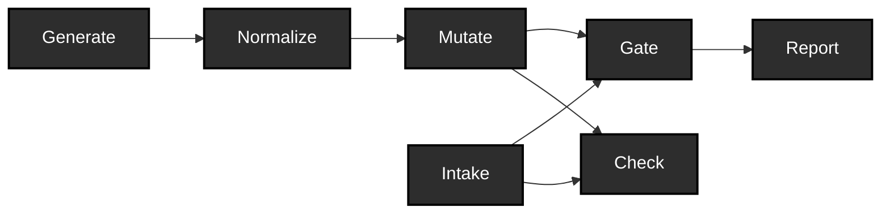

# ehr-testing-tools

[](https://github.com/pragsmike/ehr-testing-tools/actions/workflows/ci.yml)

**Reproducible test data for EHR integrations — generated, broken on purpose, and traceable end to end.**
> ehr-testing-tools builds the test data layer that EHR integration projects always need and never budget for: reproducible synthetic corpora, controlled defect injection with full lineage, and conformance gates (HL7 v2, FHIR) that catch what the defects break — experimental, base-tier, offline. Offline and deterministic by construction; plain FHIR JSON and EDN out the other end, so you can use the results from Python, SQL, or anything else. Clojure inside, no Clojure skills required.

Testing EHR integrations well needs three things most projects don't
have off the shelf: realistic clinical test data at volume, deliberately
broken variants of that data to prove your validation actually catches
problems, and conformance gates that check messages against the
standards they claim to follow. Most teams hand-roll all three, per
project, and the hand-rolled version is usually thin.

This repo gives you reproducible synthetic patient corpora — regenerate
the same corpus byte-for-byte from a manifest, proven in
[EXP-A4](docs/experiments/EXP-A4-results.md) — plus controlled defect
injection with full lineage: every mutant traces back to its base
bundle, the operator that broke it, and the constraint it was built to
violate. Conformance gates against HL7 v2 and FHIR now exist —
base-structural (v2, over HAPI) and base-spec (FHIR, over the official
validator), offline verdict policy, no implementation guide pinned yet
though the machinery to pin one is built, plus baseline-relative mode
for real-world corpora that carry pre-existing findings — see
[`docs/judge-calibration.md`](docs/judge-calibration.md) for exactly
which defects each tier catches and which it doesn't. Check, the
corpus's second judge alongside Gate, now exists too: golden
equivalence against an expected corpus plus a small per-file assertion
vocabulary. See [`docs/use-cases.md`](docs/use-cases.md) for what you
can actually do with all of this, formally, and
[the plan](.agents/plans/corpus-foundations.md) for what's next.

It's for the people who actually test EHR integrations day to day —
interface analysts, QA engineers, data engineers — not necessarily
Clojure programmers. The outputs are plain FHIR JSON and EDN manifests,
readable from Python or anything else, and if you're comfortable working
alongside an AI assistant, [SETUP.md](SETUP.md) has a copy-paste prompt
that walks it through installing and running this for you. What you can
do with this, formally: [`docs/use-cases.md`](docs/use-cases.md) —
generating conforming or controlled-fault data, judging your own
corpora, surrounding a black-box transform with conformance and
equivalence evidence, drift detection, and more, each anchored to the
actual resource equations it composes from.

Maintained by the author of
[`ehr-testing-guide`](https://github.com/pragsmike/ehr-testing-guide) as
the operational companion to that book: the guide explains why these
capabilities belong in a test plan, this repo makes them runnable. It's
pre-release — interfaces may still move — and the maturity table below
is the actual contract, not a formality.

## The pipeline

This is the whole shape before any detail: a Synthea configuration goes
in, a mutated, gate-ready corpus comes out.



Every stage above is built. Check is the corpus's second judge
alongside Gate: Gate checks a datum against a standard, Check verifies
it against a caller's own expectations. The full version — resource
equations, catalytic inputs, the diagram mechanically derived from them
— is [`docs/pipeline.md`](docs/pipeline.md); [`docs/notation.md`](docs/notation.md)
is the notation it's written in.

## Maturity

Pre-release honesty is a feature here, not a hedge — these labels are
the actual contract with readers, not a formality.

| Capability | Maturity | Evidence |
|---|---|---|
| **Generate** (`corpus.generate`) | **Usable** | Clean-environment byte-reproducibility proven — [EXP-A4](docs/experiments/EXP-A4-results.md) |
| **Mutate** (`corpus.mutate`) | **Experimental** | FHIR and v2 both work (v2 landed P7: locator grammar, `corpus.er7` substrate, seed operators, contract-pairing proof against `judge.v2`); interfaces may still move — [EXP-B2](docs/experiments/EXP-B2-results.md) |
| **Intake** (`corpus.intake`) | **Experimental** | Foreign-corpus cataloging; days old — same content-hash lineage as generated corpora |
| **Gate** (`judge.fhir` / `judge.v2`) | **Experimental** | Base-spec (FHIR, official validator) / base-structural (v2, HAPI); offline verdict policy; no implementation guide pinned yet; baseline-relative mode for real-world corpora — [EXP-C5](docs/experiments/EXP-C5-results.md), [judge calibration](docs/judge-calibration.md) |
| **Check** (`ehr-testing-tools.check`) | **Experimental** | Dataset-vs-expectations judge alongside Gate: golden equivalence against an expected corpus (canonicalizer-aware) plus a small per-file assertion vocabulary (present/absent/value/count/schema); days old, v1 vocabulary deliberately small |

**Status: pre-release.** This repo is public (as of
[ADR-0008](notes/ADRs.md)) but has not had a first release: no version
tag, nothing published to Clojars or Maven Central, interfaces may
still move. See [`docs/positioning.md`](docs/positioning.md) for what
publication does and doesn't mean.

## Quickstart

Prerequisites and platform setup — including Linux/WSL2 support (native
Windows is not supported) and a copy-paste prompt for your AI assistant:
[`SETUP.md`](SETUP.md).

Requires a JDK 17+ runtime for Synthea itself — resolved through this
repo's own artifact registry, not your `PATH` (see
[`docs/components.md`](docs/components.md)).

Commands run through `bin/ehr`, from the repo root. It `exec`s straight
into the CLI, so the exit code you see is the CLI's own 0/1/2/3 contract
— and your arguments are plain shell arguments, with none of the nested
quoting `ARGS="..."` needs. `make ehr ARGS="..."` still works as a
compatibility spelling, but make reports its own status (2) for any
non-zero exit, which collapses the contract.

Fetch the pinned artifacts once, then generate and mutate:

```sh
# See every command, flag, and exit code the CLI supports.
bin/ehr help

# One-time: fetch the pinned Synthea distribution and its JDK, into the
# local artifact cache (~/.cache/ehr-testing-tools/artifacts).
bin/ehr artifact fetch --name synthea --version 4.0.0
bin/ehr artifact fetch --name temurin-jdk --version 17.0.19+10

# Generate a small deterministic corpus (EXP-A4's pinned settings).
bin/ehr corpus generate --config-path config/synthea/synthea.properties \
  --seed 100 --clinician-seed 555 --population 10 \
  --reference-date 20260101 --out-dir out/demo-corpus

# Mutate one patient bundle: drop a required element at a named
# locator, with a lineage record for the mutant. (mutate's positional
# PATH -- --path is its explicit twin -- takes a file or a directory of
# files sharing one locator's shape; the corpus dir above also holds two
# non-patient bundles -- hospitalInformation*.json,
# practitionerInformation*.json -- so this picks a patient file
# specifically rather than the whole directory. See the full operator
# catalog: `bin/ehr corpus operators`.)
PATIENT_FILE=$(ls out/demo-corpus/fhir/*.json | grep -v -e hospitalInformation -e practitionerInformation | head -1)
bin/ehr corpus mutate $PATIENT_FILE \
  --operator-id remove-required-element --locator-path entry[0].resource.gender \
  --out-dir out/demo-mutants

# Gate a file or directory against HL7 v2 (base-structural, HAPI) or
# FHIR (base-spec, the official validator -- also fetches its own
# pinned artifact the first time). Exit code: 0 all pass, 1 any
# rejected, 2 operational error, 3 the aggregate contains :no-verdict
# and no --treat-no-verdict-as policy was given (a check the judge
# couldn't fully apply, e.g. terminology-suppressed offline -- distinct
# from a genuine rejection, so it gets its own exit code rather than
# silently inheriting either polarity; see docs/judge-calibration.md).
# --treat-no-verdict-as pass|rejected folds it into an existing
# polarity when that's the right call for your workflow. --report
# writes the corpus report; --json projects it.
bin/ehr artifact fetch --name fhir-validator-cli --version 6.9.12
bin/ehr gate v2 test/fixtures/v2
bin/ehr gate fhir out/demo-mutants --report out/demo-mutants-report.edn

# Check a corpus against an expected corpus (golden equivalence) --
# the corpus's second judge, alongside Gate.
bin/ehr check out/demo-corpus/fhir --expected out/demo-corpus/fhir

# Run the test suite (hermetic — see AGENTS.md). A separate suite
# exercises the real validator/HAPI engines against real mutants
# end-to-end; it lives on the test-integration/ path (a path split, not
# a tag filter) and needs the three artifacts above already fetched:
# `make integration`. See docs/use-cases.md for what it proves.
make test
```

`make help` lists every target. Output is EDN by default; every command
accepts `--json` for a projection (EDN remains the source of truth).
Generated corpora and mutants are plain FHIR JSON plus EDN manifests —
consumable from Python or any language; no Clojure knowledge is needed to
use the results.

## Relationship to ehr-testing-guide

The two exist for different purposes: **the guide's companion code
exists to be read; the tools here exist to be run.** See
[`docs/positioning.md`](docs/positioning.md) for the fuller map of how
the two projects relate, including why the guide doesn't cite this repo
yet (that waits for this repo's first release, not merely publication).

## Scope

This repo does **not** do:

- Semantic correctness checking — properties, metamorphic relations, and
  golden-case comparison remain the caller's own code, written against
  their own transforms.
- Full terminology validation against licensed vocabularies (e.g.
  complete SNOMED CT) — that imports licensing and distribution
  problems this project does not take on.
- Production message routing or integration-engine functionality — these
  are test-time tools, not runtime infrastructure.
- A hosted, public validation service — local deployment is the target.

See [`docs/ehr-testing-tools-problem-statement.md`](docs/ehr-testing-tools-problem-statement.md)
for the full problem statement.

## How this repo works

Term definitions — judge, verdict, findings, gate, baseline, and the
rest of the conformance vocabulary shared with `ehr-testing-sim` — live
in [`docs/GLOSSARY.md`](docs/GLOSSARY.md), the authoritative glossary
for this repo and its family.

Start at [`docs/README.md`](docs/README.md) for the reading order
through everything under `docs/`. The short version: decisions live in
[`notes/ADRs.md`](notes/ADRs.md), externally verifiable facts get an
entry in [`notes/facts-register.md`](notes/facts-register.md), and
architecture claims are pinned by an experiment
([`docs/experiments.md`](docs/experiments.md)) before they're trusted —
this discipline is part of what this repo is selling, not overhead
around it.

## License

MIT — see [`LICENSE`](LICENSE).
