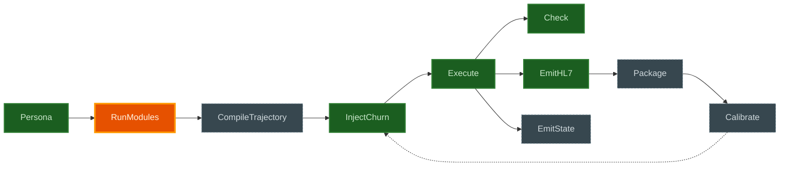

# ehr-testing-sim

Deterministic, seeded generation of synthetic hospital traffic for
testing EHR integrations: clinically plausible, operationally messy
(ADT churn: transfers, cancellations, merges, corrections), US-coded
patient event streams from minimal parameters — with a ground-truth
trajectory log as a first-class output so test harnesses can assert
against what *should* be true, independent of message parsing. See
[`docs/problem-statement.md`](docs/problem-statement.md) for the full
problem, constraints, black-box contract, and validation program.

**Status: pre-release walking skeleton.** Built: the engine, the
invariant catalog, HL7v2 ADT emission (admission/discharge/transfer
plus the full churn family — below), the facility and providers
models (beds, the allocation ladder, boarding, bed-ready transfers,
synthetic attendings — docs/operational-models.md), InjectChurn
(cancel-admit/cancel-transfer/cancel-discharge, transfer-in-error,
bed-swap, merge — docs/patient-state-model.md), order/result step
types with a real CBC+BMP order-profiles catalytic (verified LOINC
codes) plus ORM^O01/ORU^R01 emission (M3), a per-patient
pathway-assignment layer (`:pathways`), `:step-rejected` ground-truth
events for decide-time rejections (ADR-0012), Milestone M4's
**Persona** — demographic sampling (name, DOB, sex, address, phone,
SSN-shaped id) and age-linked payer sampling, folded into every
patient's `:registered` event, with PID and IN1 segment enrichment —
and, landed most recently, **site profiles**
(docs/site-profiles.md): an MSH dialect, PV1-2/PV1-36 code-table
overrides, and a Z-segment template DSL, all bound at emit time and
proven invariant to ground truth (two site profiles over one seed
render the same facts in two accents).

## Pipeline: now / next / later

<!-- Hand-derived from docs/sim-theory.edn's :status fields and its
     ";; NEXT" marker (no generator reads status yet, unlike the full
     diagram below) -- regenerate this block by hand whenever a stage
     flips status or NEXT moves. External stages and the pathway-ir
     union are omitted here to stay under ~12 nodes; see the detail
     view for those. -->



**Now** (green): Execute, Check, EmitHL7, InjectChurn (M2b), Execute's
own order/result step types and EmitHL7's ORM/ORU cycle (M3), Milestone
M4's **Persona** — demographics sampling from vendored, hashed tables
plus a real `payer-pool` catalytic wire, folded into Execute's own step
queue via the `:registered` event, plus PID/IN1 enrichment — and
EmitHL7's fourth catalytic, **site-profile** — MSH dialect, code-table
overrides, Z-segment templates — property-tested and green (230 tests
/ 625 assertions).
**Next** (amber): **RunModules**, Milestone M5 — the GMF interpreter
port, the `gmf-module-set` vendoring-vs-lockfile decision, and
`CompileTrajectory`. **Later** (dashed grey): everything else in the
*want*.

[`docs/sim-theory-diagram.md`](docs/sim-theory-diagram.md) is the full
detail view (every resource wire, catalytic input, and the
`pathway-ir` union) generated mechanically from
[`docs/sim-theory.edn`](docs/sim-theory.edn). [`.agents/plans/roadmap.md`](.agents/plans/roadmap.md)
is the milestone plan this diagram's *next*/*later* stages resolve
into. [`docs/site-profiles.md`](docs/site-profiles.md) answers "how do
I make it simulate *my* hospital" — landed: `--config` a `:site-profile`
(MSH dialect, code-table overrides, Z-segment templates) and get your
own hospital's dialect, ground truth unchanged either way.

## Relation to the ehr-testing-* family

- [`ehr-testing-guide`](https://github.com/pragsmike/ehr-testing-guide)
  teaches the testing method.
- [`ehr-testing-tools`](https://github.com/pragsmike/ehr-testing-tools)
  makes it runnable (corpus construction, conformance gating).
- **ehr-testing-sim** (this repo) is the traffic source — usable
  standalone, and mountable inside tools' `ehr` CLI as the `sim`
  subcommand (three exported values in `ehr-testing-sim.cli`; see
  [`notes/ADRs.md`](notes/ADRs.md) ADR-0001). Dependency direction:
  tools → sim, never the reverse.

## Quick start

```bash
clojure -X:test                                  # run the suite
clojure -M:cli run --seed 42 --patients 5        # a run, as EDN
clojure -M:cli run --seed 42 | clojure -M:cli check   # self-check, exit 0
clojure -M:cli help
```

Same seed + config ⇒ byte-identical output, always — guarantee #1,
enforced by property tests.

## Design in three sentences

Pathways are data (a common IR shared by hand-authored scripts and,
later, trajectories compiled from Synthea-style clinical modules); a
seeded discrete-event engine executes them into a format-free
ground-truth log. Wire formats (HL7v2 first; FHIR/CDA later) are
emitters consuming that log, never the reverse. Codes (SNOMED CT,
LOINC, RxNorm, ICD-10-CM) travel as data on patient state, so every
emitter renders them natively (ADR-0002).

Design lineage — what was mined from Google's Simulated Hospital
(operational model, churn vocabulary, event queue) and Synthea
(generative clinical modules, US demographics, embedded codes) — is
recorded in [`.agents/memory/architecture.md`](.agents/memory/architecture.md)
and summarized in [`docs/third-party-sources.md`](docs/third-party-sources.md).

## License

MIT — see [LICENSE](LICENSE). No PHI anywhere, by construction.
