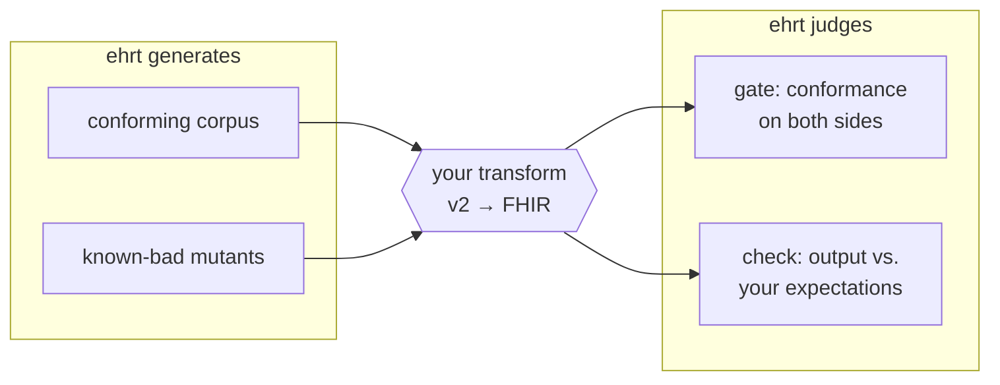

# ehr-testing-tools

[](https://github.com/pragsmike/ehr-testing-tools/actions/workflows/test.yml)

**`ehrt`, pronounced "e-heart."** Reproducible test data for EHR
integrations — generated, broken on purpose, and judged against the
standards it claims to follow.

Testing an EHR integration well takes three things most projects never
get budget for: realistic clinical test data at volume, deliberately
broken variants of that data to prove your validation actually catches
problems, and conformance checks that judge messages against HL7 v2 and
FHIR rules rather than your team's best recollection of them. Most
teams hand-roll all three, once per project, and the hand-rolled
versions are usually thin. This workspace builds all three, offline and
deterministic by construction: regenerate the same corpus byte for
byte, trace every broken file back to the exact defect planted in it,
and get plain FHIR JSON, HL7 v2 text, and machine-readable reports out
the other end — usable from Python, SQL, or anything else. Clojure
inside; no Clojure skills required.

## The workflow it exists for

Say you maintain a component that transforms EHR data from one format
to another — an HL7 v2 lab result becoming a FHIR Observation. How do
you know it works? You surround it:



Feed it data you can regenerate identically next month. Feed it data
broken in ways you chose, and confirm your pipeline catches each one.
Gate the inputs and the outputs against the standards. Compare what
came out with what you expected. Every step leaves a report you can
diff, script, and cite.

The same pieces compose into other workflows — cataloging and judging
a corpus somebody handed you, drift-detecting a vendor feed, building
a defect library for regression tests.
[`docs/use-cases.md`](docs/use-cases.md) walks through each one with
runnable commands.

## What you get

Break one required element in one generated patient, then watch the
gate catch exactly that:

```sh
bin/ehrt corpus mutate patient.json \
  --operator-id remove-required-element \
  --locator-path entry[0].resource.gender \
  --out-dir out/demo-mutants

bin/ehrt gate fhir out/demo-mutants
```

<!-- CAPTURE-BEFORE-LANDING: replace this block with real output from the
     quickstart fence run, per the captured-output convention -->
```
out/demo-mutants/patient.mutant.json  REJECTED
  Patient.gender: minimum required = 1, found 0
1 file judged, 1 rejected — exit 1
```

The rejection is the point: a gate that never fails is a gate you can't
trust. Every command also takes `--json` for piping into `jq`, and
`bin/ehrt show FILE` renders any v2 or FHIR file for a human. See
[`docs/formats.md`](docs/formats.md#reading-these-from-a-shell).

## Where to start

**I want to generate or judge test data** — you're the primary
audience. Start at [`docs/what-is-this.md`](docs/what-is-this.md), or
jump to the Quickstart below. If you'd rather have an AI assistant
install and drive this for you, [`SETUP.md`](SETUP.md) contains a
copy-paste prompt that walks it through everything.

**I want to maintain or extend this workspace** — start at
[`docs/dev/architecture.md`](docs/dev/architecture.md) and read
[`AGENTS.md`](AGENTS.md) before your first commit.

This workspace is the operational companion to
[`ehr-testing-guide`](https://github.com/pragsmike/ehr-testing-guide):
the guide teaches the testing method, this workspace makes it runnable.

## Quickstart

Prerequisites and full verification: [`SETUP.md`](SETUP.md). Every
command below is run for real and asserted by CI on every push — if
this section and reality ever drift, the build fails.

```sh
bin/ehrt help

bin/ehrt corpus generate
# runs the built-in hospital simulator -- needs nothing downloaded.
# generated corpora are byte-reproducible, so an existing output
# directory is never overwritten: remove out/corpus/sim-s1-p1 first,
# or pass --out-dir, to regenerate.

bin/ehrt artifact fetch --name synthea --version 4.0.0
bin/ehrt artifact fetch --name temurin-jdk --version 21.0.12+8

bin/ehrt corpus generate synthea
# the Synthea lane produces richer clinical histories; it needs the two
# artifacts fetched above. Same never-overwrite contract: remove
# out/corpus/synthea-s1-p5 first, or pass --out-dir, to regenerate.

PATIENT_FILE=$(ls out/corpus/synthea-s1-p5/fhir/*.json | grep -v -e hospitalInformation -e practitionerInformation | head -1)
bin/ehrt corpus mutate $PATIENT_FILE \
  --operator-id remove-required-element --locator-path entry[0].resource.gender \
  --out-dir out/demo-mutants

bin/ehrt artifact fetch --name fhir-validator-cli --version 6.9.12
bin/ehrt gate v2 components/corpus/test-fixtures/v2
# gate fhir exits 1 here -- a genuine defect in the mutant, correctly caught
bin/ehrt gate fhir out/demo-mutants --report out/demo-mutants-report.edn

bin/ehrt check out/corpus/synthea-s1-p5/fhir --expected out/corpus/synthea-s1-p5/fhir

bin/ehrt sim run --seed 100 --patients 1

clojure -M:poly test :all
```

`bin/ehrt help <group>` documents every command group and its flags
(`artifact`, `corpus`, `gate`, `check`, `version`, `doctor`, `sim`,
`show`).

## Maturity

Pre-release honesty is a feature here, not a hedge — these labels are
the actual contract with readers.

| Capability | Maturity | Evidence |
|---|---|---|
| **Generate** — deterministic synthetic corpora | **Usable** | [Byte-reproducibility proof](components/corpus/docs/experiments/EXP-A4-results.md) in a clean environment. |
| **Mutate** — controlled defect injection, FHIR and v2 | **Experimental** | [Mutation results](components/corpus/docs/experiments/EXP-B2-results.md); interfaces may still move. |
| **Intake** — cataloging corpora you didn't generate | **Experimental** | [Intake tests](components/corpus/test/ehrt/corpus/intake_test.clj); same content-hash lineage as generated corpora. |
| **Gate** — conformance judgment, v2 and FHIR | **Experimental** | Three tiers: structural v2, spec-level FHIR, and profile-level v2 conformance. [What each tier catches and misses](docs/judge-calibration.md); the profile tier currently runs against a stand-in profile, and no implementation guide is pinned yet. |
| **Check** — your data vs. your expectations | **Experimental** | [Check tests](components/corpus/test/ehrt/corpus/check_test.clj); golden equivalence plus per-file assertions. |

**Status: pre-release.** No version tag, nothing published to Clojars
or Maven Central, interfaces may still move.

## Scope

This workspace does **not** do:

- Semantic correctness checking — properties, metamorphic relations,
  and golden-case comparison remain the caller's own code, written
  against their own transforms.
- Full terminology validation against licensed vocabularies (e.g.
  complete SNOMED CT) — that imports licensing and distribution
  problems this project does not take on.
- Production message routing or integration-engine functionality —
  these are test-time tools, not runtime infrastructure.
- A hosted, public validation service — local deployment is the target.

See [`docs/what-is-this.md`](docs/what-is-this.md#scope--what-this-deliberately-does-not-do)
for the full problem statement.

## Contributing

Read [`AGENTS.md`](AGENTS.md) first — it is the canonical instruction
surface for agents and contributors alike, including the WSL-only git
rule that applies before your first commit.
[`CONTRIBUTING.md`](CONTRIBUTING.md) and
[`AUTHORS-GUIDE.md`](AUTHORS-GUIDE.md) go deeper on the workspace's own
session discipline.

## License

See [`LICENSE`](LICENSE).
