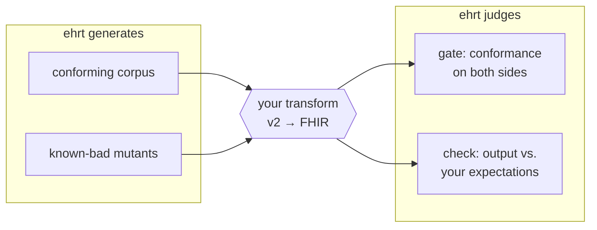

# ehr-testing-tools

[](https://github.com/pragsmike/ehr-testing-tools/actions/workflows/test.yml)

**`ehrt`, pronounced "e-heart."** Reproducible test data for EHR
integrations — generated, broken on purpose, and judged against the
standards it claims to follow.

Testing an EHR integration well takes three things most projects never
get budget for: realistic clinical test data at volume, deliberately
broken variants of that data to prove your validation actually catches
problems, and conformance checks that judge messages against HL7 v2 and
FHIR rules rather than your team's best recollection of them. Most
teams hand-roll all three, once per project, and the hand-rolled
versions are usually thin. This workspace builds all three, offline and
deterministic by construction: regenerate the same corpus byte for
byte, trace every broken file back to the exact defect planted in it,
and get plain FHIR JSON, HL7 v2 text, and machine-readable reports out
the other end — usable from Python, SQL, or anything else. Clojure
inside; no Clojure skills required.

## See it run

One emergency-department shift — 100 patients arriving into a scripted
ED, watched on a live bed board at an hour of hospital time per
wallclock second:

```bash
bin/ehrt corpus generate sim --seed 20260811 --patients 100 \
  --reference-date 2026-08-11 --churn \
  --config demos/scenarios/ed-tuesday/config.edn \
  --out-dir out/scenarios/ed-tuesday

bin/ehrt play out/scenarios/ed-tuesday --board 60 --rate 3600
```

Beds cycle rather than flip: a vacated room renders `(dirty)`, then
`(cleaning)`, and is not handed out again until it is ready — 15
`(dirty)` and 29 `(cleaning)` lines across the run's 579 snapshots.
The census is real — inpatients climb to a peak of 12 concurrent and
spill out of Emergency into Cardiology and Renal — and the counter
line under each snapshot moves with it, `discharged` climbing to 88.
No `Doe, Unknown` ever holds a bed at this seed, but `merged` does
tick 0 → 1: one of the run's unidentified arrivals is joined to the
record that person already had. And the board has two phases — its
last snapshot is dated 2046, not 2026, because the scripted shift is
the opening stretch and a twenty-year population tail follows it.
[`demos/scenarios/ed-tuesday/README.md`](demos/scenarios/ed-tuesday/README.md)
is where every one of those figures is witnessed, alongside the
1,269 ground-truth events and 1,554 HL7 v2 messages this run produces.

**And the longitudinal version.** Point the same engine at a decade
instead of a shift and you get
[`demos/scenarios/clinic-decade/`](demos/scenarios/clinic-decade/README.md):
200 patients, twenty-odd everyday ambulatory ailments, care that
unfolds as intake and follow-up across years. It is thin on a bed
board by construction and rich in longitudinal history, which is the
other thing an integration under test needs to see.

More scenarios and small, fully readable captured traces: `demos/`.

## The workflow it exists for

Say you maintain a component that transforms EHR data from one format
to another — an HL7 v2 lab result becoming a FHIR Observation. How do
you know it works? You surround it:



Feed it data you can regenerate identically next month. Feed it data
broken in ways you chose, and confirm your pipeline catches each one.
Gate the inputs and the outputs against the standards. Compare what
came out with what you expected. Every step leaves a report you can
diff, script, and cite.

The same pieces compose into other workflows — cataloging and judging
a corpus somebody handed you, drift-detecting a vendor feed, building
a defect library for regression tests.
[`docs/use-cases.md`](docs/use-cases.md) walks through each one with
runnable commands.

## What you get

A minimal, hand-authored FHIR fixture ships in this repo
(`test-fixtures/fhir/storefront-patient.json`) --
one `Patient`, no declared profile, gating clean against the real
official validator, nothing broken yet:

```bash
bin/ehrt gate fhir test-fixtures/fhir/storefront-patient.json
```

```clojure
{:status :ok,
 :payload
 {:run {:gate :fhir, :path "test-fixtures/fhir/storefront-patient.json"},
  :totals {:pass 1, :rejected 0, :indeterminate 0, :no-verdict 0},
  :by-code {"invariant" 1},
  :files
  [{:path "test-fixtures/fhir/storefront-patient.json",
    :verdict :pass,
    :finding-count 1,
    :findings
    [{:severity :warning, :code "invariant",
      :locator {:format :fhir, :path "Bundle.entry[0].resource"},
      :message "Constraint failed: dom-6: 'A resource should have narrative for robust management' (defined in http://hl7.org/fhir/StructureDefinition/DomainResource) (Best Practice Recommendation)",
      :disposition :pass, ...}]}]}}
```

Now introduce one defect -- delete the resource's own `resourceType`,
an element every FHIR resource genuinely requires (`Element.min >= 1`
in the base spec, not a profile add-on) -- and gate again:

```bash
bin/ehrt corpus mutate test-fixtures/fhir/storefront-patient.json \
  --operator-id remove-required-element \
  --locator-path entry[0].resource.resourceType \
  --out-dir out/demo-mutants

bin/ehrt gate fhir out/demo-mutants
```

```clojure
{:status :rejected, :category :gate-rejected,
 :payload
 {:run {:gate :fhir, :path "out/demo-mutants"},
  :totals {:pass 0, :rejected 1, :indeterminate 0, :no-verdict 0},
  :by-code {"invalid" 1, "invariant" 1},
  :files
  [{:path "out/demo-mutants/storefront-patient.json",
    :verdict :rejected,
    :finding-count 2,
    :findings
    [{:severity :fatal, :code "invalid",
      :locator {:format :fhir, :path "Bundle.entry[0].resource"},
      :message "Unable to find resourceType property",
      :disposition :rejected, ...}
     {:severity :error, :code "invariant",
      :locator {:format :fhir, :path "Bundle.entry[0]"},
      :message "Constraint failed: bdl-5: 'must be a resource unless there's a request or response'",
      :disposition :rejected, ...}]}]}}
```

That flip is earned by the mutation, and only the mutation: the clean
fixture above carries exactly one finding (a `:warning`-severity,
`:pass`-disposition best-practice note), and the mutant's two new
findings are both genuine rejections a validator reading the base
FHIR spec has to raise -- nothing inherited, nothing pre-existing.
`notes/adr/0091-storefront-fixture.md` walks the fixture's own design
(why `Patient` alone hosts every FHIR operator in the catalog, one
locator per operator, each one measured against a real judge run) and
`components/judge/resources/judge/pairing-registry.edn` is where each
measurement is pinned as data.

A realistically **generated** patient tells a different, equally
honest story: the Quickstart below mutates one straight out of
Synthea, and that gate run carries hundreds of pre-existing,
profile-driven findings before anything is broken on purpose --
picking a locator that's guaranteed to move the needle, and telling
new findings from inherited ones, are exactly what
[`docs/judge-calibration.md`](docs/judge-calibration.md) and
`--baseline` are for. Every command also takes `--json` for piping
into `jq`, and `bin/ehrt show FILE` renders any v2 or FHIR file for a
human. See [`docs/formats.md`](docs/formats.md#reading-these-from-a-shell).

## Where to start

**I want to generate or judge test data** — you're the primary
audience. Start at [`docs/what-is-this.md`](docs/what-is-this.md), or
jump to the Quickstart below. If you'd rather have an AI assistant
install and drive this for you, [`SETUP.md`](SETUP.md) contains a
copy-paste prompt that walks it through everything.

**I want simulated traffic in my own format** — a proprietary
interface, an internal schema, a vendor's flat file. Every message this
workspace emits is a projection of one **ground-truth event log**, and
that log is a published, versioned contract you can render yourself
instead of reverse-engineering our emitters. The shift the bed board
above plays, as its own event stream — byte-for-byte the `events.edn`
that same generate command already wrote beside its messages:

`bin/ehrt sim run --seed 20260811 --patients 100 --reference-date 2026-08-11 --churn --config demos/scenarios/ed-tuesday/config.edn --format ground-truth`

Seven of its 1,269 events, all one patient's, keys elided with `...`:

```clojure
{:home-ward "Emergency", ..., :active-mrn "MRN000001", ..., :reason "Minor laceration",
 :encounter-id "ENC-000000-00-4a75c0cb", :event :admission, :t 0,
 :location {:ward "Emergency", :bed "ED-H08", :placement :surge}, :forced false}

;; ... two more arrivals, then this patient's own discharge (5 events) ...

{:ward "Emergency", :participants [{:bed-id "ED-H08", :ward "Emergency", :role :subject}],
 :last-patient-id "PID-000000-1522c269", ..., :event :bed-status-change,
 :from :occupied, :bed "ED-H08", :t 2220, :to :dirty}

{:appointment-class :outpatient, ..., :active-mrn "MRN000001", ..., :reason "Follow-up",
 :event :appointment, :appointment-id "APT-000000-00-b82f275e", :t 2220,
 :scheduled-t 1384620}

{:event :bed-status-change, :t 3060, :bed "ED-H08", :ward "Emergency",
 :from :dirty, :to :cleaning, ...}

;; ... one arrival's registration ...

{:event :bed-status-change, :t 3480, :bed "ED-H08", :ward "Emergency",
 :from :cleaning, :to :ready, ...}

;; ... 686 events ...

{:participants [{:patient-id "PID-000000-1522c269", :role :subject}], :active-mrn "MRN000001",
 ..., :reason "Follow-up", :encounter-id "ENC-000000-01-2300e027",
 :event :outpatient-visit, :appointment-id "APT-000000-00-b82f275e", :t 1384620}

;; ... 126 events ...

{:cause :eligibility, ..., :prior-payer {:id "commercial-hmo", :name "Commercial HMO", :type :commercial},
 :active-mrn "MRN000001", :payer {:id "medicaid", :name "Medicaid", :type :medicaid},
 ..., :event :coverage-change, :t 101535041}
```

An admission, the bed going out of service behind it, a follow-up
booked at the discharge that emptied it, the visit that kept that
booking, and a coverage change on the same person long after. `:t` is
seconds from the run's own start, so the appointment is kept exactly
sixteen days after it was made and the insurance changes a little over
three years after that — one flat, timestamped vector, no message
format anywhere in it.
[`docs/consuming-ground-truth.md`](docs/consuming-ground-truth.md) is
the consumer contract for that vector — what is guaranteed, what is
not, and how to read it;
[`docs/use-cases/custom-emitter-from-the-event-log.md`](docs/use-cases/custom-emitter-from-the-event-log.md)
is the path end to end, with two worked example emitters that depend on
nothing in this repo;
[`docs/formats.md`](docs/formats.md#the-event-log) is the wire-level
shape, and it carries the counting rule with it — an event of the log
is an entry in the **top-level vector**, and the nested
`:pre-horizon-facts` a `:registered` event may carry are not events of
the log even though four of their names collide with real kinds, so a
tree-walking consumer counts a different number than this repository
does ([Read the top-level vector only](docs/formats.md#read-the-top-level-vector-only));
and the manual's
[Chapter 3](docs/manual/03-a-simulated-hospital.md#the-log-underneath-every-message)
tells it as a story.

How much wire traffic one event turns into depends on what you switch
on: at 10^5 events the HL7 v2 projection runs **1.3574 messages per
event** with all nine opt-in keys enabled and **0.643** with none of
them, which
[`docs/consuming-ground-truth.md`](docs/consuming-ground-truth.md#scale)
measures on one machine at one seed and asks to be read as an order of
magnitude rather than a benchmark.

**I want to maintain or extend this workspace** — start at
[`docs/dev/architecture.md`](docs/dev/architecture.md) and read
[`AGENTS.md`](AGENTS.md) before your first commit.

This workspace is the operational companion to
[`ehr-testing-guide`](https://github.com/pragsmike/ehr-testing-guide):
the guide teaches the testing method, this workspace makes it runnable.

## Quickstart

Prerequisites and full verification: [`SETUP.md`](SETUP.md). CI asserts
on every push that every command below and
[`bin/quickstart-demo`](bin/quickstart-demo) teach the identical
sequence, in the identical order — if this section and the script ever
drift apart, the build fails. Actually *running* the sequence for real
is `make quickstart`, a local/manual check today — no CI workflow
executes it yet.

```sh
bin/ehrt help

bin/ehrt corpus generate
# runs the built-in hospital simulator -- needs nothing downloaded.
# generated corpora are byte-reproducible, so an existing output
# directory is never overwritten: remove out/corpus/sim-s1-p1 first,
# or pass --out-dir, to regenerate.

bin/ehrt artifact fetch --name synthea --version 4.0.0
bin/ehrt artifact fetch --name temurin-jdk --version 21.0.12+8

bin/ehrt corpus generate synthea
# the Synthea lane produces richer clinical histories; it needs the two
# artifacts fetched above. Same never-overwrite contract: remove
# out/corpus/synthea-s1-p5 first, or pass --out-dir, to regenerate.

PATIENT_FILE=$(ls out/corpus/synthea-s1-p5/fhir/*.json | grep -v -e hospitalInformation -e practitionerInformation | head -1)
bin/ehrt corpus mutate $PATIENT_FILE \
  --operator-id remove-required-element --locator-path entry[0].resource.gender \
  --out-dir out/demo-mutants

bin/ehrt artifact fetch --name fhir-validator-cli --version 6.9.12
bin/ehrt gate v2 test-fixtures/v2
# gate fhir exits 1 here -- rejected, but not because of this mutation:
# a real Synthea patient already carries hundreds of legitimate profile
# findings before you break anything (Patient.gender isn't required in
# base FHIR) -- see docs/judge-calibration.md
bin/ehrt gate fhir out/demo-mutants --report out/demo-mutants-report.edn

bin/ehrt check out/corpus/synthea-s1-p5/fhir --expected out/corpus/synthea-s1-p5/fhir

bin/ehrt sim run --seed 100 --patients 1

clojure -M:poly test :all
```

`bin/ehrt help <group>` documents every command group and its flags
(`artifact`, `corpus`, `gate`, `check`, `version`, `doctor`, `sim`,
`show`).

## Maturity

Pre-release honesty is a feature here, not a hedge — these labels are
the actual contract with readers.

| Capability | Maturity | Evidence |
|---|---|---|
| **Generate** — deterministic synthetic corpora | **Usable** | [Byte-reproducibility proof](components/corpus/docs/experiments/EXP-A4-results.md) in a clean environment. |
| **Mutate** — controlled defect injection, FHIR and v2 | **Experimental** | [Mutation results](components/corpus/docs/experiments/EXP-B2-results.md); interfaces may still move. |
| **Intake** — cataloging corpora you didn't generate | **Experimental** | [Intake tests](components/corpus/test/ehrt/corpus/intake_test.clj); same content-hash lineage as generated corpora. |
| **Gate** — conformance judgment, v2 and FHIR | **Experimental** | Three tiers: structural v2, spec-level FHIR, and profile-level v2 conformance. [What each tier catches and misses](docs/judge-calibration.md); the profile tier currently runs against a stand-in profile, and no implementation guide is pinned yet. |
| **Check** — your data vs. your expectations | **Experimental** | [Check tests](components/corpus/test/ehrt/corpus/check_test.clj); golden equivalence plus per-file assertions. |

**Status: pre-release.** No version tag, nothing published to Clojars
or Maven Central, interfaces may still move.

**What it doesn't do yet:** [`docs/future-features.md`](docs/future-features.md)
is the menu of fault injection this workspace can't do today — wrong
bytes inside a message, wrong sequence, wrong framing — with the design
stance on each, so you can see what's missing without reading a backlog.

## Scope

This workspace does **not** do:

- Semantic correctness checking — properties, metamorphic relations,
  and golden-case comparison remain the caller's own code, written
  against their own transforms.
- Full terminology validation against licensed vocabularies (e.g.
  complete SNOMED CT) — that imports licensing and distribution
  problems this project does not take on.
- Production message routing or integration-engine functionality —
  these are test-time tools, not runtime infrastructure.
- A hosted, public validation service — local deployment is the target.

See [`docs/what-is-this.md`](docs/what-is-this.md#scope--what-this-deliberately-does-not-do)
for the full problem statement.

## Contributing

Read [`AGENTS.md`](AGENTS.md) first — it is the canonical instruction
surface for agents and contributors alike, including the WSL-only git
rule that applies before your first commit.
[`CONTRIBUTING.md`](CONTRIBUTING.md) and
[`AUTHORS-GUIDE.md`](AUTHORS-GUIDE.md) go deeper on the workspace's own
session discipline.

## License

See [`LICENSE`](LICENSE). Third-party license texts live in
[`LICENSES/`](LICENSES/).
