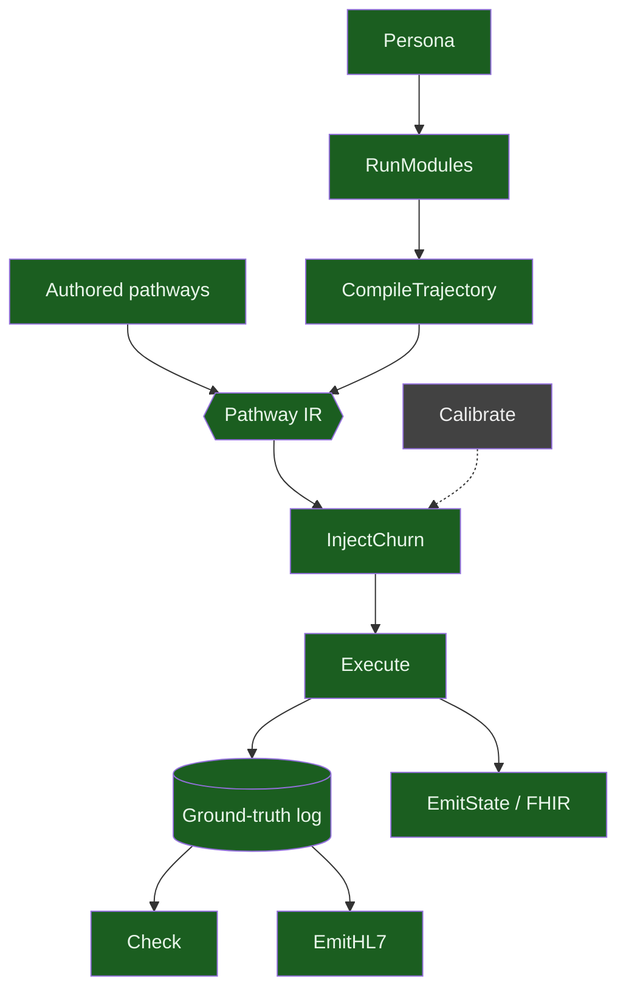

# ehr-testing-sim

Deterministic synthetic hospital traffic for testing EHR systems and
integrations: clinically coded, operationally messy, provably
coherent, and safe by construction. One config and one seed produce
an unbounded, byte-reproducible stream of HL7v2 messages — patients
with names, insurers, lab results, hallway waits, cancelled
transfers, and merged records — none of whom ever existed.

## The problem it solves

Teams testing EHR integrations are stuck between two bad options:
real production feeds (PHI, HIPAA, un-shareable, slow to obtain) and
hand-crafted test messages (sparse, static, unrealistically clean —
they exercise the happy path and miss everything that actually breaks
systems). This simulator is the third option: traffic with the
statistical texture and administrative messiness of a real feed, and
none of the risk. Because it contains no real person's data *by
construction* — deterministic rules over public tables, no real
records anywhere upstream — its output can be committed to repos,
attached to bug reports, and published.

## What a run looks like

```bash
clojure -M:cli run --seed 42 --patients 20 --churn --emit hl7
```

Excerpts from real seeded runs (composited across demos — complete
traces with their exact commands live in [docs/demos/](docs/demos/)):

```
MSH|^~\&|EHR-TESTING-SIM|SIM|||20240101000000||ADT^A01|...|P|2.3
PID|1||MRN000002||O'Brien\S\...                        ← escaped, per spec
PV1|1|I|ED^^ED-H01^general-hospital|...                ← admitted, boarding in an ED hallway slot
...
ADT^A03 (another patient discharges)  →  ADT^A02        ← the freed bed triggers the boarder's transfer
PV1|1|I|Renal^^RENAL-01^...|...|ED^^ED-H01^...          ← new bed; prior location derived from the log
...
OBX|1|NM|6690-2^Leukocytes [#/volume] in Blood^LN||4.1|K/uL|4.5-11.0|L   ← real LOINC, computed abnormal flag
ZPI|commercial-hmo|commercial|ALDRIC-PAYER-V1           ← only if YOUR site profile says so
```

The boarding→transfer coupling above was not scripted. It *emerged*:
the ward was full, the patient boarded in the hallway, and another
patient's discharge freed the bed. Capacity pressure produces
operational realism here the way it does in real hospitals — by
constraint, not by authorship.

## The pipeline

<!-- Hand-derived from docs/sim-theory.edn's :status fields and its
     ;; NEXT marker. Regenerate on milestone flips. Detail view:
     docs/sim-theory-diagram.md -->


Everything green is built and property-tested — **EmitState (FHIR R4
snapshots) landed at M6**; **Calibrate is the one stage left (next)**.
Full formal pipeline: [docs/sim-theory-diagram.md](docs/sim-theory-diagram.md);
plan: [.agents/plans/roadmap.md](.agents/plans/roadmap.md).

## What makes it different

**The event log is the truth; formats are renderings.** An immutable,
replayable event log is the single source; patient state is a fold of
it; HL7v2 messages render the events and FHIR resources render the
snapshots — mirroring what the standards themselves are (v2 feeds *are*
event streams; FHIR *is* the materialized view), and now property-tested
against each other, not merely asserted: replaying a run's own messages
reconstructs the same state its FHIR snapshot shows, at every message
boundary, over hundreds of randomized runs. See
[docs/event-sourcing.md](docs/event-sourcing.md), including its
honest scope: this architecture buys reproducibility, corrections,
and audit — clinical realism comes from content and calibration, not
storage design.

**Realism is emergent, not scripted.** Boarding, hallway placements,
outlier admissions, and bed-ready transfers arise from census
pressure against configured capacity — a dimension the incumbent
generators explicitly lack.

**Churn is first-class.** Cancellations, error-entries, bed swaps,
and record merges — the traffic that breaks real interfaces and that
hand-crafted test data never contains — are generated with correct
reversal semantics (derived from the log, not shadow bookkeeping).

**Clinical content has provenance.** Disease trajectories come from
Synthea's clinically reviewed, Apache-licensed module format,
executed by our interpreter; every code (SNOMED CT, LOINC, RxNorm) is
carried verbatim from inspectable module JSON and verified against
official sources — never invented. Every generated event cites the
module state that caused it.

**(config + seed) IS the corpus.** Byte-identical reproduction,
always. Ship a one-line manifest instead of 2 GB of messages;
regenerate on demand. Any interesting run is a permanent, pinnable
test case.

**It speaks your hospital's dialect.** Site profiles render the same
truth in different accents — local code values, MSH identity, HL7
version, Z-segments — with a property-tested guarantee that dialect
never alters ground truth. See
[docs/site-profiles.md](docs/site-profiles.md).

## Why you can trust it

- **It is never graded on its own homework.** A sibling repo
  (ehr-testing-tools) consumes the output as a real downstream
  system: contract-validating the manifests, running the messages
  through an independent conformance gate, tracking verdicts against
  reviewed baselines. This loop has caught real defects the
  simulator's own 850+ assertions missed — which is the point.
- **Laws are property-tested, not asserted.** Determinism,
  log↔state consistency, message↔truth derivability, occupancy
  coherence, churn's clinical-content preservation, and — as of
  Milestone M6 — emitter coherence itself (HL7v2 and FHIR agree at
  every message boundary, replayed independently from the wire) — each
  holds across hundreds of randomized runs per property, and these
  tests have repeatedly caught real bugs. Every theory stage but
  Calibrate is now both built and property-tested.
- **Claims carry receipts.** Versions, licenses, verified codes, and
  upstream findings live in a dated facts register; the docs include
  an independently sourced research review that *tempers* our own
  architectural claims, kept because corrections build more trust
  than endorsements.
- **Safety is structural.** No real records exist anywhere upstream
  of the generator, so no leakage is possible — a stronger statement
  than any de-identification process can make. The full validation
  program (seven claims, each with its proof strategy):
  [docs/problem-statement.md](docs/problem-statement.md).

## Quick start

```bash
clojure -X:test                                   # the suite
clojure -M:cli run --seed 42 --patients 5 --emit hl7
clojure -M:cli run --seed 42 --patients 5 --emit fhir              # FHIR R4 Bundle per patient (M6)
clojure -M:cli run --seed 42 --patients 5 | clojure -M:cli check   # self-check, exit 0
clojure -M:cli run --seed 7 --config my-site.edn --churn --emit hl7  # modules, profiles, churn
clojure -M:cli help
```

Worked examples with real output: [docs/demos/](docs/demos/), including
a same-seed HL7v2/FHIR pair (`docs/demos/emit-state/`) — one patient's
final v2 message next to their FHIR `Patient`/`Observation` resources
from the same instant, ids resolving across both. This project proves
its own internal laws (the emitter-coherence property, cross-emitter
ids, shape validation) and stops there, by design (ADR-0014): sim never
POSTs to any external server, so checking FHIR output against a real
FHIR server is the consumer's job — the same division of labor
v2 conformance already follows (NIST/HAPI round-tripping belongs to
`ehr-testing-tools`, never to this repo) — see the
[ehr-testing-tools](https://github.com/pragsmike/ehr-testing-tools)
sibling's managed `fhir-sink`.

Unfamiliar term (ours or the domain's):
[docs/GLOSSARY.md](docs/GLOSSARY.md). Which document to read for your
role: [docs/README.md](docs/README.md).

## The family, and a deliberate division of labor

Three sibling projects:
the [guide](https://github.com/pragsmike/ehr-testing-guide) teaches
the testing method; the
[tools](https://github.com/pragsmike/ehr-testing-tools) make it
runnable (corpus construction, conformance gating, mutation);
**this simulator generates the traffic.**

One boundary is worth stating plainly because it looks like a
limitation and is actually a guarantee: **this simulator always
produces plausible, coherent, time-ordered data.** Its laws forbid it
from emitting incoherence — every message derives from the
ground-truth log, in order, internally consistent. Adversarial
delivery conditions — out-of-order arrival, dropped messages, missing
fields, duplicates, mangled segments — are deliberately **not**
generated here; they are introduced downstream by
ehr-testing-tools' mutation operators, applied to a sim corpus with
full lineage records. You get both realisms — coherent-but-messy
truth from sim, damaged delivery from tools — and always know
exactly which faults were injected, because the pristine original is
one seed away.

## Status

Pre-release; MIT licensed; no PHI anywhere, by construction. The FHIR
emitter landed at Milestone M6, end to end through the emitter-coherence
property; a documentation alignment pass is next, then Calibrate — the
one theory stage left unbuilt. Design lineage and decision history:
[docs/](docs/), `notes/ADRs.md`, and `.agents/memory/architecture.md`.
