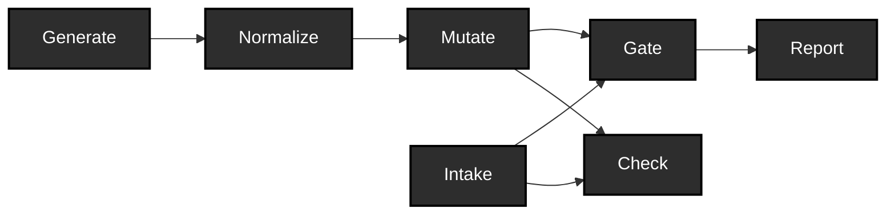

# ehr-testing-tools

**Reproducible test data for EHR integrations — generated, broken on purpose, and traceable end to end.**
> ehr-testing-tools builds the test data layer that EHR integration projects always need and never budget for: reproducible synthetic corpora, controlled defect injection with full lineage, and conformance gates (HL7 v2, FHIR) that catch what the defects break — experimental, base-tier, offline. Offline and deterministic by construction; plain FHIR JSON and EDN out the other end, so you can use the results from Python, SQL, or anything else. Clojure inside, no Clojure skills required.

Testing EHR integrations well needs three things most projects don't
have off the shelf: realistic clinical test data at volume, deliberately
broken variants of that data to prove your validation actually catches
problems, and conformance gates that check messages against the
standards they claim to follow. Most teams hand-roll all three, per
project, and the hand-rolled version is usually thin.

This gives you reproducible synthetic patient corpora — regenerate
the same corpus byte-for-byte from a manifest, proven in
[EXP-A4](../../components/tools/docs/experiments/EXP-A4-results.md) — plus controlled defect
injection with full lineage: every mutant traces back to its base
bundle, the operator that broke it, and the constraint it was built to
violate. Conformance gates against HL7 v2 and FHIR now exist —
base-structural (v2, over HAPI) and base-spec (FHIR, over the official
validator), offline verdict policy, no implementation guide pinned yet
though the machinery to pin one is built, plus baseline-relative mode
for real-world corpora that carry pre-existing findings — see
[`docs/judge-calibration.md`](../../components/tools/docs/judge-calibration.md) for exactly
which defects each tier catches and which it doesn't. Check, the
corpus's second judge alongside Gate, now exists too: golden
equivalence against an expected corpus plus a small per-file assertion
vocabulary. See [`docs/use-cases.md`](../../components/tools/docs/use-cases.md) for what you
can actually do with all of this, formally, and
[the plan](../../notes/tools/agents/plans/corpus-foundations.md) for what's next.

It's for the people who actually test EHR integrations day to day —
interface analysts, QA engineers, data engineers — not necessarily
Clojure programmers. The outputs are plain FHIR JSON and EDN manifests,
readable from Python or anything else. What you can
do with this, formally: [`docs/use-cases.md`](../../components/tools/docs/use-cases.md) —
generating conforming or controlled-fault data, judging your own
corpora, surrounding a black-box transform with conformance and
equivalence evidence, drift detection, and more, each anchored to the
actual resource equations it composes from.

Maintained by the author of
[`ehr-testing-guide`](https://github.com/pragsmike/ehr-testing-guide) as
the operational companion to that book: the guide explains why these
capabilities belong in a test plan, this repo makes them runnable. It's
pre-release — interfaces may still move — and the maturity table below
is the actual contract, not a formality.

## The pipeline

This is the whole shape before any detail: a Synthea configuration goes
in, a mutated, gate-ready corpus comes out.

Every stage above is built. Check is the corpus's second judge
alongside Gate: Gate checks a datum against a standard, Check verifies
it against a caller's own expectations. The full version — resource
equations, catalytic inputs, the diagram mechanically derived from them
— is [`docs/pipeline.md`](../../components/tools/docs/pipeline.md); [`docs/notation.md`](../../components/tools/docs/notation.md)
is the notation it's written in.

## Maturity

Pre-release honesty is a feature here, not a hedge — these labels are
the actual contract with readers, not a formality.

| Capability | Maturity | Evidence |
|---|---|---|
| **Generate** (`corpus.generate`) | **Usable** | Clean-environment byte-reproducibility proven — [EXP-A4](../../components/tools/docs/experiments/EXP-A4-results.md) |
| **Mutate** (`corpus.mutate`) | **Experimental** | FHIR and v2 both work (v2 landed P7: locator grammar, `corpus.er7` substrate, seed operators, contract-pairing proof against `judge.v2`); interfaces may still move — [EXP-B2](../../components/tools/docs/experiments/EXP-B2-results.md) |
| **Intake** (`corpus.intake`) | **Experimental** | Foreign-corpus cataloging; days old — same content-hash lineage as generated corpora |
| **Gate** (`judge.fhir` / `judge.v2`) | **Experimental** | Base-spec (FHIR, official validator) / base-structural (v2, HAPI); offline verdict policy; no implementation guide pinned yet; baseline-relative mode for real-world corpora — [EXP-C5](../../components/tools/docs/experiments/EXP-C5-results.md), [judge calibration](../../components/tools/docs/judge-calibration.md) |
| **Check** (`ehrt.tools.check`) | **Experimental** | Dataset-vs-expectations judge alongside Gate: golden equivalence against an expected corpus (canonicalizer-aware) plus a small per-file assertion vocabulary (present/absent/value/count/schema); days old, v1 vocabulary deliberately small |

**Status: pre-release.** Public (as of
[ADR-0008](../../notes/tools/ADRs.md)) but has not had a first release: no version
tag, nothing published to Clojars or Maven Central, interfaces may
still move. See [`docs/positioning.md`](../../components/tools/docs/positioning.md) for what
publication does and doesn't mean.

## Quickstart

See the workspace root [`README.md`](../../README.md#quickstart) — the
one canonical Quickstart fence, checked line-for-line against
`bin/quickstart-demo` by `ehrt.tools.quickstart-fresh`
(`components/tools/src/ehrt/tools/quickstart_fresh.clj`). This section
used to duplicate it; ADR-0005 (carve-loss recovery, 2026-07-28)
retired the duplicate once the workspace gained its own root README --
two independently-editable copies of the same taught sequence is
exactly the doc-rot shape DOC-5 exists to prevent, and having a root
README to point at removed the reason this file ever carried its own
copy (a stopgap from before the root README existed, ADR-0002).

Requires a JDK 17+ runtime for Synthea itself — resolved through this
repo's own artifact registry, not your `PATH` (see
[`docs/components.md`](../../components/tools/docs/components.md)).
Commands run through `bin/ehrt`, from the workspace root, `exec`ing
straight into the CLI so the exit code you see is the CLI's own 0/1/2/3
contract.

## Relationship to ehr-testing-guide

The two exist for different purposes: **the guide's companion code
exists to be read; the tools here exist to be run.** See
[`docs/positioning.md`](../../components/tools/docs/positioning.md) for the fuller map of how
the two projects relate, including why the guide doesn't cite this repo
yet (that waits for this repo's first release, not merely publication).

## Scope

This does **not** do:

- Semantic correctness checking — properties, metamorphic relations, and
  golden-case comparison remain the caller's own code, written against
  their own transforms.
- Full terminology validation against licensed vocabularies (e.g.
  complete SNOMED CT) — that imports licensing and distribution
  problems this project does not take on.
- Production message routing or integration-engine functionality — these
  are test-time tools, not runtime infrastructure.
- A hosted, public validation service — local deployment is the target.

See [`docs/ehr-testing-tools-problem-statement.md`](../../components/tools/docs/ehr-testing-tools-problem-statement.md)
for the full problem statement.

## How this works

Term definitions — judge, verdict, findings, gate, baseline, and the
rest of the conformance vocabulary shared with `ehr-testing-sim` — live
in [`docs/GLOSSARY.md`](../../components/tools/docs/GLOSSARY.md), the authoritative glossary
for this family.

Start at [`docs/README.md`](../../components/tools/docs/README.md) for the reading order
through everything under `docs/`. The short version: decisions live in
[`notes/tools/ADRs.md`](../../notes/tools/ADRs.md), externally verifiable facts get an
entry in [`notes/tools/facts-register.md`](../../notes/tools/facts-register.md), and
architecture claims are pinned by an experiment
([`docs/experiments.md`](../../components/tools/docs/experiments.md)) before they're trusted —
this discipline is part of what this repo is selling, not overhead
around it.
