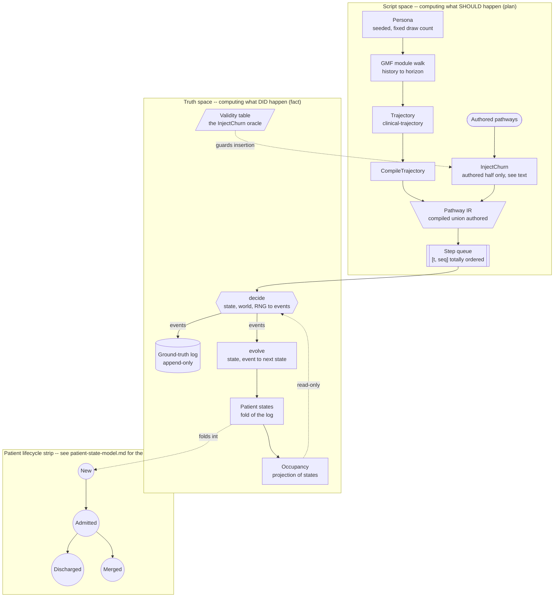

# How a patient trajectory is computed

This is the cross-cutting explainer for a question no single document
answers on its own: given a seed and a config, how does one patient's
worth of traffic actually get computed, step by step, from nothing to
a ground-truth log? [`patient-state-model.md`](../../sim/docs/patient-state-model.md),
[`event-sourcing.md`](../../sim/docs/event-sourcing.md), and
[`sim-theory.md`](../../sim/docs/sim-theory.md)/[`.edn`](../../sim/docs/sim-theory.edn) each hold a
piece of this — the accumulator's shape, the architectural argument for
why the log is primary, the pipeline as a formal resource theory. This
document is the synthesis that walks the pieces in the order execution
actually visits them, and it owns *only* that synthesis: cross-link
aggressively, duplicate nothing. Audience: engineers who need to trace
a bug back to its source, and informaticists who need to know which
parts of a trajectory are *authored intent* and which parts are
*what actually happened* — because those are, deliberately, computed by
two different mechanisms.

## 1. Two state machines, two spaces

Every patient this simulator generates traffic for is driven by two
state machines that must never be confused with each other, because
confusing them is the classic error this domain invites.

**The GMF module machine** — when a patient is assigned a disease
module — walks a MITRE-authored clinical script (`ConditionOnset`,
`Delay`, `Encounter`, …) under the run's single seeded RNG
(`ehrt.sim-trajectory.gmf-interpreter`). This is **script-space**: it
computes what a disease *should* do to a patient, in the abstract,
the way a screenwriter's draft says a character enters a room — never
which physical room, never which extra is standing in it.

**The patient lifecycle machine** is driven *only* by
`ehrt.sim.engine/evolve` folding ground-truth events
(ADR-0008, [`event-sourcing.md`](../../sim/docs/event-sourcing.md)). This is
**operational truth-space**: it computes what actually happened to a
real patient-id in a real, capacity-constrained hospital — which bed,
which attending, whether the transfer got cancelled.

The architecture makes the distinction structural, not a matter of
authorial discipline: **nothing in script-space can write truth.**
`ehrt.sim-trajectory.gmf-interpreter/step`/`walk-module`/`run-module`
never touch `ehrt.sim.engine/PatientState`, never call
`evolve`, and carry no reference to `world`. A module walk produces a
`clinical-trajectory` — plain data, a vector of cited events — and
that data has to pass through `CompileTrajectory` and then the
engine's own `decide`/`evolve` pair before it becomes a fact about a
patient. There is no shortcut from "a module said X happens" to "X is
now true of this patient" that skips the engine.

## 2. Script space — computing what SHOULD happen

Everything in this section is **plan**: an encounter *should* happen —
never which bed, which attending, whether the transfer later gets
cancelled. Those are truth-space questions, section 4.

**Persona** (seeded). At registration, `ehrt.sim.persona/persona`
samples a fixed 13 draws from the run's RNG — name, DOB, sex, address,
phone, an SSN-shaped id, and payer — regardless of which pool or
decade-bucket any weighted pick lands in
([`sim-theory.edn`](../../sim/docs/sim-theory.edn)'s own `:persona` stage law). This
happens inside the engine-internal `:registered` step every patient's
queue is prepended with (`ehrt.sim.engine/run`), which is also
where script-space begins for any patient carrying a module assignment.

**The module walk, in two phases** (`ehrt.sim-trajectory.gmf-interpreter/run-module`,
[`gmf-interpreter.md`](gmf-interpreter.md) section 3). Because this
project's own scope is an encounter horizon, not a lifetime
(ADR-0007 point 3), a module assigned to a 45-year-old patient can't
mean simulating 45 years of operational traffic. Instead, one
continuous walk runs from the persona's own DOB on a virtual clock
(an interpreter-internal epoch-day, not the engine's seconds):

- **History phase** (DOB → registration instant): the walk fast-forwards
  through the module's own state graph exactly as it would during the
  horizon phase — same RNG draws, same distributions, same condition
  evaluation — but `Delay` states collapse to their own sampled spans
  with no operational meaning of their own, and `Encounter`/`Procedure`/
  `Observation` crossed along the way mint no trajectory event for the
  encounter machinery itself. `ConditionOnset`/`ConditionEnd`/
  `MedicationOrder`/`MedicationEnd` crossed here still matter — they
  become **pre-horizon facts**, marked (never trimmed, the same
  "mark, don't trim" choice ADR-0011 already made for warm-up traffic)
  and, at `CompileTrajectory`, promoted into **registration-time
  facts** riding the patient's own `:registered` event rather than a
  pathway step (`ehrt.sim-trajectory.compile-trajectory`'s own
  `:registration-facts` output) — a condition or medication a patient
  already has *at* registration, with no operational event pretending
  it happened inside this run's own window.
- **Horizon phase** (registration instant → module completion or a
  bounded `:module-horizon-days` cutoff): every state crossed —
  including `Encounter`/`Procedure`/`Observation`/`MedicationOrder`
  now — emits a real `clinical-trajectory` event, cited `{:module
  :state}` (glass-box traceability) and carrying its own concept
  triplets verbatim (code passthrough).

**`CompileTrajectory`** (`ehrt.sim-trajectory.compile-trajectory`) turns
that trajectory into pathway IR, one state-type mapping at a time
([`gmf-interpreter.md`](gmf-interpreter.md) section 1's table — this
document does not repeat it): `Encounter`/`EncounterEnd` become
`:admission`/`:outpatient-visit` and their own closing step;
`Procedure`/`Observation`/`MedicationOrder`/`MedicationEnd` each
become their own new IR step; `ConditionOnset`/`ConditionEnd` become
an *annotation* on the enclosing encounter step, never a step of their
own. Every compiled step carries the **three-link provenance chain**
this stage exists to preserve: module state → trajectory event → IR
step, each link a `:citation` a reader can walk backward from a
rendered message all the way to the exact JSON state that produced it.

**The IR union with authored pathways.** `pathway-ir` is the declared
union of `compiled-pathway` and `authored-pathway`
([`sim-theory.md`](../../sim/docs/sim-theory.md)'s own reading of ADR-0002 clause 1,
algebraically) — once compiled module steps and hand-authored pathway
steps both sit in a patient's own step queue, the engine's `decide`
multimethod dispatches purely on a step's `:type`; nothing about a
`:procedure` step's own shape says whether a module or an author wrote
it. **One real sequencing nuance worth stating precisely, since it is
easy to over-read the word "union":** in the current M5b wiring, a
patient's authored/assigned pathway is resolved and (if a
`:churn-profile` is configured) run through `InjectChurn` *before*
`:registered`'s own `decide` call ever resolves and compiles that
patient's module, if one is assigned. The compiled module steps are
then spliced onto the **front** of the (already-churned) authored
steps at that point (`ehrt.sim.engine/run`'s own
`:prepend-steps` handling). The two pathways genuinely are just IR
entering one queue, as `.agents/plans/roadmap.md`'s own M5b entry
states — but `InjectChurn` itself only ever sees the authored half of
that union in this project's current sequencing; module-compiled
content enters unchurned. Nothing downstream (the engine's own
dispatch, `check.clj`'s invariant catalog) can tell the difference
once both are in the queue — the union is real at that point — but a
reader tracing *where* churn could have touched a given step should
know it never reaches compiled module content today.

**`InjectChurn`** (`ehrt.sim.churn`) is an IR→IR transform:
insertion of operational-noise steps (cancel-admit, cancel-transfer,
cancel-discharge, transfer-in-error, bed-swap, merge) into whatever
pathway it's handed, never a removal, reorder, or alteration of a
clinical step (property-tested, `components/sim/docs/sim-theory.edn`'s own
`:churn` laws). Its applicability oracle — where in a pathway a given
churn step is even legal to insert — is
[`patient-state-model.md`](../../sim/docs/patient-state-model.md)'s own event-validity
table, doing double duty (the same table `check.clj`'s invariant
catalog implements as a post-hoc check on what a run actually did).

## 3. The wall

The step queue is a `sorted-map` keyed by `[t seq-no]`
(`ehrt.sim.engine/pop-min`) — every patient's own queued steps,
merged into one global ordering. The `seq-no` tiebreak is what makes
this ordering *total*, not merely chronological: two steps due at the
same simulated instant still have one deterministic pop order. This is
the wall between the two spaces, not because anything stops a caller
from reading past it, but because everything downstream of it —
`decide`'s own RNG consumption, therefore every stochastic choice the
run makes from here on, therefore the run's entire byte-for-byte
output — is now fixed by that one ordering. Script-space's own job is
done the moment a patient's steps are enqueued; what happens next is
truth-space's alone.

## 4. Truth space — computing what DID happen

The loop's sacred asymmetry, restated for this document's own purpose
(the full argument is [`event-sourcing.md`](../../sim/docs/event-sourcing.md)'s):
**`decide` proposes, `evolve` disposes.**

`decide (rng, t, world, patient-id, step) → {:events :advance}`
(ADR-0008) reads the current fold of every patient's state (`world`'s
own `:patients` map — itself the running output of every `evolve` call
so far, never a second structure decide could disagree with), the RNG,
and, for allocation decisions, an occupancy projection built from that
same patient-state map (`ehrt.sim.facility/occupancy-board`) —
the thing that turns "this ward is full" into a boarding placement
rather than a crash. It emits events, or a **`:step-rejected`** event
when live world state doesn't support the attempted step (ADR-0012) —
a narrower, runtime-only check than the applicability oracle
`InjectChurn` already consulted statically before ever inserting the
step: the oracle can say a cancel-discharge's reinstatement is legal
in the abstract, and the live occupancy board can still say the bed it
would reinstate into has since been reclaimed by someone else's
admission. **`decide` never writes state** — not even implicitly; its
return value is facts, not a patch.

`evolve (patient-state, event) → patient-state'` is the **only**
function that ever produces a new patient state, by folding one event.
The consequence worth stating plainly: **the patient lifecycle is not
a mutated status field somewhere — it *is* the fold.** There is no
code path that assigns `:status :admitted` directly; the only way a
patient's status becomes `:admitted` is an `:admission` (or
`:outpatient-visit`) event passing through `evolve`. Sub-modes —
boarding (`:home-ward ≠ :location.ward`, ED-class), outpatient
(`:class :outpatient`), leave-of-absence once it lands — are **derived
conditions over folded state**, recomputed on every read, never stored
as their own flag
([`patient-state-model.md`](../../sim/docs/patient-state-model.md)'s own worked
example).

## 5. Two consequences worth the ceremony

**Drift between state and log is structurally impossible.** Because
`evolve` is the only producer of new state, and it is a pure fold over
exactly the events already in the log, "what happened" and "what is
true now" cannot silently disagree — there is only one function that
computes the second from the first. The property test
(`engine-test/patient-state-is-a-fold-of-the-log`) **witnesses** this
property at every event boundary of a run; it does not *defend* it —
nothing about the architecture needs the test to pass in order to hold
the guarantee, the way a mutable-state design would need continuous
vigilance to keep two things in sync. The test exists so the claim is
checkable, not so the claim is true.

**Patients couple only through projections.** When patient B's
`:discharge` fires, `decide` folds B's own event and, in the *same*
decide call, may also emit a `:transfer` event for a different,
already-boarding patient A whose home-ward just freed up
(`ehrt.sim.engine`'s own `:discharge` method, scanning `world`'s
patient-state map for the longest-waiting boarder). B's own state and
A's own state each still change only by folding an event through
`evolve`; the coupling between them is B's discharge *deciding* that
A's transfer is now warranted, by reading derived world state — never
one patient's code reaching into another patient's state directly.
This is also, precisely, why the two genuinely two-participant event
types this project has (`:bed-swap`, `:merge`, ADR-0010) needed no
architectural redesign to add: events were always the only channel a
fact about a patient could travel through, so a fact naming *two*
patients at once is just an event with a longer `:participants` vector,
not a new kind of coupling.

## 6. End to end, in one paragraph

A seed produces a persona; the persona, if a module is assigned, walks
a MITRE-authored disease graph through a fast-forwarded, compressed
lifetime and into this run's own operational window; what the module
walk produced is compiled into an *intent* — an encounter should
happen, a medication should be ordered — that is then, optionally,
roughed up with operational noise never touching its clinical content;
and only then does the one machine in this whole system allowed to say
what *actually* happened — `decide`, reading a live, capacity-bounded
hospital plus the run's own RNG — turn that intent into a fact, one
event at a time, each fact appended to the record and folded into the
exact state that shapes the very next decision.

## 7. The diagram

The pipeline-computation view — complementary to
[`sim-theory-diagram.md`](../../sim/docs/sim-theory-diagram.md)'s formal resource-theory
diagram (which stage consumes/produces which typed resource, mechanically
regenerated from [`sim-theory.edn`](../../sim/docs/sim-theory.edn)) and
[`patient-state-model.md`](../../sim/docs/patient-state-model.md)'s own lifecycle
`stateDiagram-v2` (the authoritative statuses and their transitions,
including its own honest note that `:expired` is designed but not yet
drawn there) — duplicating neither. Its own lifecycle strip below is
deliberately minimal for exactly that reason: for the full picture,
including sub-modes and the M2b churn family's transitions, follow the
link.

Two deliberate simplifications the diagram makes, named rather than
left for a reader to puzzle over: `Pathway IR` is drawn fed by both
`CompileTrajectory` and `Authored pathways`, exactly as the theory
states it — but `Authored pathways` routes through `InjectChurn`
*first*, while `CompileTrajectory`'s own output reaches `Pathway IR`
unchurned, drawing exactly the sequencing nuance section 2 states in
prose (churn touches only the authored half, before the compiled half
is even resolved — the union itself is real, the two halves just
arrive at it having taken different paths). And the lifecycle strip
shows only the three
landed, always-reachable statuses plus `Merged` (ADR-0010) —
`:expired` is deliberately omitted here, the same honest omission
[`patient-state-model.md`](../../sim/docs/patient-state-model.md)'s own diagram
already makes, because it is designed (`components/sim/docs/clinical-realities.md`'s
post-mortem entry, this document's own event-validity table) but not
yet a value `ehrt.sim.engine/PatientState`'s `:status` enum
actually carries.

## See also

[`patient-state-model.md`](../../sim/docs/patient-state-model.md) for the accumulator
`evolve` folds into, the full event-validity table, and the
authoritative lifecycle diagram. [`event-sourcing.md`](../../sim/docs/event-sourcing.md)
for the architectural argument this document's section 4 restates only
enough of to stay self-contained. [`sim-theory.md`](../../sim/docs/sim-theory.md) and
[`sim-theory.edn`](../../sim/docs/sim-theory.edn) for the formal stage-by-stage theory
this document's script-space section walks in execution order rather
than resource-theory order.
[`gmf-interpreter.md`](gmf-interpreter.md) for the interpreter's own
v1 semantics in full (state types, condition vocabulary, the
history/horizon design this document's section 2 only summarizes), and
[`gmf-source-model.md`](gmf-source-model.md) for where that content
comes from and why so much of it doesn't clear the loader yet.
