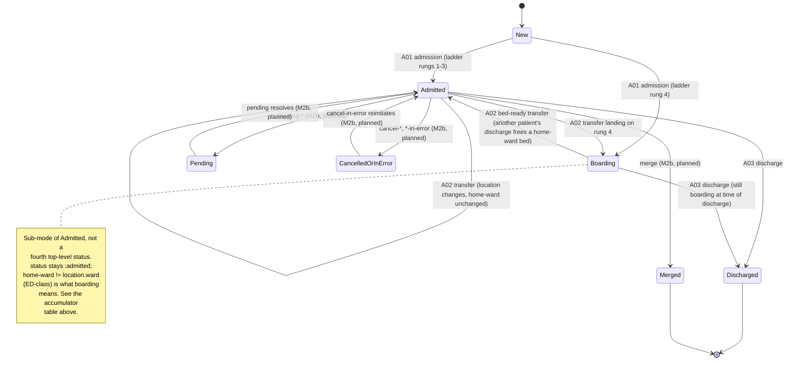

# Patient state model

This document specifies the patient lifecycle state machine: the shape
of the accumulator `ehrt.sim-engine.evolve/evolve` folds the
ground-truth log into (sim/ADR-0008), the states and transitions that
accumulator moves through, and the event-validity table that will
double as `check.clj`'s invariant skeleton now and `InjectChurn`'s
applicability oracle later (M2b). It formalizes what
[`docs/operational-models.md`](operational-models.md) describes in
prose — that document is authoritative on *policy* (the allocation
ladder, the taxonomy, the NPI decision); this one is authoritative on
the literal *shape* of the thing pathway generation and churn validity
will read and write.

## Durations rule (ratified)

All authored durations — pathway IR (`:delay`'s `:from`/`:to`) and
engine config (`:arrival-gap`, and any future churn-profile duration)
alike — are minutes; the engine's own clock is seconds (sim/ADR-0011);
conversion happens exactly once, at the boundary where a minute-
denominated draw becomes a clock advance (decide-time).

**M5b's own day clause, extending this same rule.** The GMF
interpreter's own virtual clock (`ehrt.patient-simulator.gmf-interpreter`) is a
THIRD unit again — an epoch DAY (`components/patient-simulator/docs/gmf-interpreter.md` section 7
item 4) — never authored minutes and never the engine's own seconds.
`ehrt.patient-simulator.compile-trajectory` is the one place a day-denominated
gap between two trajectory events becomes a compiled `:delay` step
(minutes, the SAME authored unit every hand-written pathway already
uses) — one conversion (`days * 1440`), at exactly one boundary,
the identical "convert once, at the seam between two clocks" discipline
this rule already states for minutes -> seconds. The full chain is now
three units deep, each converted exactly once, at its own single named
seam: authored minutes -> (CompileTrajectory) -> engine seconds, with
interpreter days feeding the first of those two seams, never the
second directly.

## Design inputs: mined from upstream

Before formalizing the schema, two upstream sources were read
specifically for how each represents patient state — Synthea's
`Person`/`Module` (Java) and Simulated Hospital's `ir.PatientInfo`
(Go), verified against source 2026-07-26. One validates this project's
existing architecture; the other is both a checklist of fields still
missing and a cautionary tale about what happens without an event log.

**Synthea validates the accumulator/cursor split, and adds two
requirements.** Synthea splits patient state into workflow cursors and
a fact blackboard: `Person.attributes` is an open `Map<String,Object>`
shared by every concurrently running GMF module, and each module
stores its own current-state cursor inside that map, keyed by module
name. Clinical facts accumulate in a separate `HealthRecord`. This
project's shape already mirrors that split — the queue-carried
remaining pathway steps are the cursor, the patient accumulator is the
blackboard-plus-record — so this is read as validation, not as a
reason to change anything. Two things Synthea does that this project
must still account for:

1. **GMF guards query state-*visit history***, not a duplicated log.
   Conditional transitions like "PriorState X, within window" walk
   `Person.history`, the person's recorded trail of visited module
   states — a mutable-world approximation of an event log. When M5
   ports the GMF interpreter, `PriorState` guards compile to queries
   over *our* ground-truth log — typed, timestamped, and already
   authoritative (sim/ADR-0008) — rather than to a second history
   structure. **The accumulator below does not carry its own visit
   history for this reason: the log is `Person.history` done right,
   and the interpreter reads the log directly when M5 lands.**
2. **An open `:attributes` sub-map is reserved now.** Synthea's
   modules coordinate through named blackboard attributes — one
   module sets a condition flag, another guards on it. This
   accumulator needs the same open extension point once the
   interpreter exists; it is reserved in the schema below
   (`:attributes`, `[:map-of :keyword :any]`) so nothing else claims
   the name between now and M5, even though nothing writes to it yet.

Also noted, for completeness rather than as a design constraint:
Synthea advances in fixed time ticks (roughly 7 days) because its
horizon is a lifetime. This project's encounter-horizon discrete-event
engine has no equivalent tick loop — GMF `Delay` states will compile
to scheduled wake-ups (M5), not ticks, when that milestone lands.

**Simulated Hospital's `ir.PatientInfo` is a field-by-field checklist,
and a cautionary tale about representing history without a log.**
Auditing this accumulator against `PatientInfo`'s fields surfaces real
gaps and one design lesson:

- **`Class`** (EMERGENCY / INPATIENT / OUTPATIENT / PREADMIT /
  RECURRING / OBSTETRICS, PV1-2) is tracked **separately from
  `Status`** in `PatientInfo`, and this accumulator does the same
  (`:class`, below) — lifecycle (`:status`: new/admitted/discharged)
  and registration category (`:class`) move independently. This is
  exactly the axis boarding needs: a boarding patient's `:class` is
  whatever it was at admission (typically `:inpatient`) throughout,
  regardless of which physical ward they're sitting in.
- **`VisitID`** per encounter (PV1-19) — **LANDED 2026-08-26**, arc 3b
  sweep 1 (`notes/adr/0174-*.md` section 2(a), rulings A1/B1/C1). It is
  `:encounter-id`, minted at every opener by
  `ehrt.sim-engine.streams/encounter-id-for` off every RNG stream,
  carried on every event of that encounter, rendered in PV1-19 and as
  the FHIR `Encounter.id`'s second half. It IS part of the schema
  below (`:encounter`/`:encounters`), behind the run-config opt-in
  `:encounters` — absent, this whole paragraph's original text still
  describes the run byte for byte. The paragraph that follows was the
  gap's evidence and is kept, because what it predicts is exactly what
  the opt-in now makes reachable. This gap was
  mining (`docs/research/SimHospital-Synthea-limitations-considered.md`
  §5.4) surfaces SimHospital's own in-code admission that a first
  pending encounter "will never be finished, since only the latest
  Encounter is checked" — direct proof that a single-current-encounter
  assumption breaks once multiple pending encounters can overlap.
  Encounters-as-first-class landed in three halves, and only two of
  them are done: visit ids and READMISSION are arc 3b sweep 1's own
  content, while *multiple concurrent pending* encounters are NOT --
  `admission-only-when-no-open-encounter` still permits exactly one
  OPEN encounter per patient, and an arrival landing inside one opens
  nothing (`decide :repeat-arrival`). That remaining half stays
  captured in `.agents/plans/roadmap.md`, to land with or immediately
  before whichever future milestone introduces `:pending-*` step
  types, for exactly this reason.
- **Pending locations and expected admit/discharge/transfer
  datetimes** (the A14/A15-family pending events) carry *expected*
  times, a field class this project's events don't have yet. Flagged
  for the M2b churn milestone (`pending-*` step types), not designed
  here.
- **`ReadmissionIndicator`, attending doctor, account status** — small,
  cheap PV1 fields once each is seen; no design burden.

**The cautionary tale, worth recording as the worked example of why
the log-is-primitive decision (sim/ADR-0008) pays for itself starting at
M2b, not "someday":** `PatientInfo`'s location alone is *six* fields —
`Location`, `PriorLocation`, `PriorLocationForCancelTransfer`,
`PendingLocation`, `PriorPendingLocation`, and a prior for that one
too. The in-code comment on the third explains why: normal flow clears
`PriorLocation` after a transfer completes, so later messages omit it
— but `CancelTransfer` has to reinstate the value that was just
cleared, so it needs its own shadow copy to undo the clearing. Every
cancellable mutation in that codebase grows a bespoke shadow field to
hold whatever it might later need to undo. That field zoo *is* the
mutable-state workaround for not having an event log: without one,
"what was true before the thing I need to cancel" has nowhere to live
except a hand-maintained prior-value field, one per cancellable
mutation.

In this project's event-sourced engine, `:transfer-in-error`'s (M2b)
`decide` reads the prior location by querying the log directly for
that patient's most recent location-setting event before the one being
cancelled, and the emitter derives PV1-6 (prior location) the same way
at message-build time. **One `:location` field in the accumulator,
plus a log query, replaces all six `PatientInfo` location fields.**
This is not a hoped-for benefit of sim/ADR-0008 — it is the concrete
reason M2b's cancel-family step types are expected to be cheap rather
than each growing their own shadow state.

## The accumulator

`ehrt.sim-engine.state/PatientState` (malli), the type
`evolve`'s fold produces and `decide` reads:

| Field | Type | Notes |
|---|---|---|
| `:patient-id` | `:string` | **Landed, M2a (sim/ADR-0010).** The fold key and work-queue key — replaces `:mrn` in that role. Internal, deterministic (a pure function of the run's seed and the patient's arrival ordinal — never an RNG draw, so identity generation adds no new stochastic consumption); never reassigned, never rebinds. |
| `:mrns` | `[:set :string]` | **Landed, M2a (sim/ADR-0010).** Every MRN this patient-id has ever answered to — a singleton set until M2b's merge exists to grow it. MRN is now *state*, not identity: a real hospital's MRN is exactly what merge changes. |
| `:active-mrn` | `:string` | **Landed, M2a (sim/ADR-0010).** Which member of `:mrns` is currently live; emitters render this everywhere PID/control-ids used to read a bare `:mrn`. Until M2b's merge lands, always the patient's one and only MRN. |
| `:status` | `[:enum :new :admitted :discharged :merged :expired]` | Lifecycle. Boarding is **not** a separate status — see below. `:expired` (candidate, M2b+ — see `docs/clinical-realities.md`'s post-mortem entry) is **clinically absorbing but operationally alive**: reached via a death event or an expired discharge disposition, it is not a synonym for `:discharged` — a patient can be transferred (to a morgue ward, `:class :morgue`) or undergo autopsy/donor-management events while `:status = :expired`, exactly the way an `:admitted` patient can, before a final disposition-20 `:discharge` moves them to `:discharged`. See the event validity table below for what's legal in `:expired`. |
| `:class` | `[:enum :inpatient :emergency :outpatient :preadmit :recurring :obstetrics]`, optional until admission | PV1-2. Tracked separately from `:status` per `ir.PatientInfo`'s own separation (mined above) — registration category, not lifecycle. Distinct from a *ward's* `:class` (`:inpatient`/`:ed`, `docs/operational-models.md`'s facility config) — same word, two different things: one is what kind of patient this is, the other is what a ward is designated for. Set at admission, unchanged by transfer within M1's scope. |
| `:home-ward` | `:string`, ward id, nil until admission | The ward the pathway named — clinical intent (`docs/operational-models.md`'s own term for the rung-1/2 target). Diverges from `:location`'s ward exactly on rungs 3 (outlier) and 4 (boarding) of the allocation ladder. |
| `:location` | `[:map [:ward :string] [:bed :string] [:placement [:enum :licensed :surge]]]`, nil until admission | The patient's actual **physical** location, always concrete — never nil-bed, even while boarding (see worked example below). `:placement` is exactly the two values `docs/operational-models.md` specifies; ladder rungs 3 and 4 are distinguished from 1 and 2 not by a third placement value but by `:location`'s ward differing from `:home-ward` (see the table below). |
| `:attending` | `:string`, provider id, nil until admission | References `docs/operational-models.md`'s provider pool by id; rendered PV1-7 as `id^family^given` at emit time, not stored denormalized. |
| `:persona` | `ehrt.sim.persona/Persona`, nil until the `:registered` event folds | **Landed, M4.** Name, DOB, sex, address, phone, an SSN-shaped id, and payer — ALL of it, sampled together by `ehrt.sim.persona/persona` and folded in by the engine-internal `:registered` event every patient's step queue is now prepended with (never authorable IR, the same treatment `:result-followup` already gets). This RETIRES the standalone `:payer` field this table used to carry: there was no code actually populating it (always nil, an aspiration this document itself named as an engine-patient-init stand-in), so retiring it is a schema simplification, not a behavior removal — payer now lives at `(:payer (:persona patient))`. Never re-sampled after — the attribute-pool contract (sim/ADR-0007) extended to every persona field, not just payer. |
| `:admitted-at` | `:int`, simulated **seconds** (was minutes pre-M2a — sim/ADR-0011), nil until admission | The moment this patient was admitted. Landed with Milestone M1 for exactly one purpose: breaking ties among multiple patients boarding for the same ward — the bed-ready transfer relieves the longest-waiting one first (earliest `:admitted-at`, `:patient-id` as a further tiebreak — `:patient-id`'s zero-padded ordinal prefix keeps this tiebreak's lexical-order property `:mrn` used to give it for free). Not a SimHospital-style shadow field — set once, never rewritten. |
| `:encounter` | `EncounterRecord`, nil between encounters | **Landed 2026-08-26, arc 3b sweep 1** (`notes/adr/0174-*.md` section 2(a)). THE OPEN encounter, and deliberately THIN: `:encounter-id` (the VisitID above), `:ordinal`, and the opener's own instant. The seven fields above it — `:status`, `:class`, `:home-ward`, `:location`, `:attending`, `:admitted-at`, `:discharged-at` — stay exactly where they are and ARE this encounter's projection while it is open, which is why no reader in either emitter, in `check.clj`, or in the corpus player had to move. Duplicating them here would create a second place a transfer must update. |
| `:encounters` | `[:vector EncounterRecord]`, default absent | **Landed 2026-08-26, arc 3b sweep 1.** Every CLOSED encounter, in the order they closed, accumulating exactly the way `:conditions` and `:care-plans` do. Each is that projection SNAPSHOT at its closer, taken after the closer's own field changes — so a discharged encounter's `:location` is nil, exactly as the discharged patient's is. A `:cancel-admit` leaves a record here marked `:cancelled` rather than dropping it, so an ordinal can never be handed out twice. This is what `evolve :discharge` now has somewhere to put instead of throwing away. |
| `:appointment` | `AppointmentRecord`, nil between appointments | **Landed 2026-08-27, arc 3b sweep 3** (`notes/adr/0174-*.md` section 2(b)). THE OPEN appointment — `:appointment-id`, `:ordinal`, `:booked-at`, `:scheduled-t`, `:appointment-class`, an optional `:reason`, and `:prior-scheduled-t` on one a reschedule moved. Deliberately the same two-layer shape as `:encounter`/`:encounters` above, because an appointment has the same life cycle: exactly one open at a time, and a closed one whose ordinal must never be reused. A `:reschedule` moves `:scheduled-t` and leaves the record OPEN, which is why it keeps its own id rather than minting a second. |
| `:appointments` | `[:vector AppointmentRecord]`, default absent | **Landed 2026-08-27, arc 3b sweep 3.** Every TERMINAL appointment, in the order it went terminal, each carrying exactly one `:outcome` — `:kept`, `:cancelled` or `:no-show`. In the engine these are bands of ONE uniform and so cannot co-occur; `appointment-reaches-at-most-one-terminal` is what says that over a log the engine did not necessarily write. UNLIKE `:encounter`/`:encounters` these two fold only where the events exist, and the asymmetry is deliberate: encounter openers exist in every run, so folding them unconditionally is what keeps `admission-only-when-no-open-encounter` a real predicate on a legacy log — an `:appointment` exists in no run that did not opt into `:scheduling`, so there is nothing to fold and no invariant that could go vacuous by not folding it. |
| `:merged-into` | `:string`, patient-id, absent unless `:status = :merged` | **Landed 2026-09-05 (`notes/adr/0179-*.md` R-queue).** The survivor this record was absorbed into, written by `evolve :merge`'s `:merged` arm and by nothing else. It exists for exactly one reader: `run`'s own M2b short-circuit, which holds the absorbed patient's STATE and not the merge EVENT, and needs the survivor's identity to re-queue a pending `:result-followup` onto them. Never emitted — the `:merge` event already names both participants by role, so this is accumulator convenience, not a new fact. |
| `:attributes` | `[:map-of :keyword :any]`, default `{}` | **The namespacing rule is live, M5a; the engine's own accumulator still doesn't populate this field until M5b.** The open blackboard Synthea's modules coordinate through (mined above): `ehrt.patient-simulator.gmf`'s loader now REALLY enforces module-namespaced keys (`components/patient-simulator/docs/gmf-interpreter.md` section 5 — a module's raw `SetAttribute`/`Symptom` name compiles to `:module-id/kebab-name`, never a bare keyword; a module writing a bare engine-reserved name, e.g. `donor`, is rejected at load time), and `ehrt.patient-simulator.gmf-interpreter`'s own `step` only ever writes through that exact transform — this is no longer a documented convention awaiting code, it is the shape the interpreter's own attribute-registry property test (`gmf-interpreter-test/attribute-writes-are-always-in-the-declared-registry`) checks directly. What's still M5b scope: folding a module instance's own attribute map INTO this accumulator field for a real, running patient (`RunModules` meeting `Execute`, `docs/sim-theory.edn`'s own `:trajectory` stage) — M5a's interpreter carries its own attributes map per module-instance, engine-adjacent but not yet engine-integrated. |

Deliberately absent, per the mining above: no visit-history field (the
log is the history — M5's interpreter queries it directly) and no
shadow prior-location fields (M2b's cancel-family reads priors from the
log). `VisitID` used to be listed here too, on the grounds that
encounters were not first-class; arc 3b sweep 1 made them first-class
and it moved into the table above as `:encounter`/`:encounters`
(2026-08-26). The visit-history exclusion is untouched by that and
still binds: `:encounters` holds each closed encounter's own placement
snapshot, never the events that happened during it.

**Landed.** `ehrt.sim-engine.state/PatientState` carries every field
in the table above, including `:location`'s `{:ward :bed :placement}`
map shape — the allocation ladder (`ehrt.sim.facility/allocate`)
populates it for real as of Milestone M1. One field this table didn't
originally name turned out to be necessary once the ladder's cross-
patient coupling was implemented: `:admitted-at` (the simulated moment
of admission), used only to break ties among multiple patients
boarding for the same ward — the longest-waiting one (earliest
`:admitted-at`, `:patient-id` as a further tiebreak) is the one a
bed-ready transfer relieves. It is not a shadow/undo field in the
SimHospital sense above (mined section): it is a plain fact recorded
once at admission and never rewritten, exactly like `:status` or
`:class`.

**Landed, M2a.** sim/ADR-0010's identity split (`:patient-id`/`:mrns`/
`:active-mrn`, above) and sim/ADR-0011's time model are both implemented,
not just designed: `ehrt.sim-engine.run/run`'s work queue and
`world :patients` map are keyed by `:patient-id`; every ground-truth
event carries a `:participants` vector (`[{:patient-id ... :role
:subject}]` for every event type today — the degenerate single-
participant case sim/ADR-0010 names) and a `:warm-up` boolean
(`t < :warm-up-seconds`, config default 0); every `:t` is seconds from
run start. **The pathway IR is unchanged by the seconds move:**
`:delay`'s `:from`/`:to` stay authored in minutes (authoring
ergonomics, `ehrt.sim.pathway`'s own docstring), and the engine
converts minutes to seconds at `decide`-time — the one place a
minute-denominated draw becomes a clock advance. `:arrival-gap` (an
engine-config input, not IR) took the same minutes-authored/seconds-
internal treatment for a concrete, discovered reason: leaving it in
raw seconds while dwell times scaled to minutes×60 clustered arrivals
far faster than patients discharged, exhausting `config/default-
facility`'s real usable capacity (16 concurrent — Cardiology's surge
sits unused when every patient's home-ward is Renal) at patient counts
the invariant-catalog property test already exercised.

**Boarding relief policy: FIFO by `:admitted-at`, ratified as the
default — not a law.** Relieving the longest-waiting boarder first is
this project's ratified default, chosen because it's the simplest
policy that `:admitted-at` alone can express without inventing
another field. It is deliberately **not** baked into the invariant
catalog as a correctness rule: real hospitals often relieve boarders
by acuity, service priority, or other clinical criteria, not strict
arrival order, and encoding FIFO as a law would make it impossible to
ever generate the (equally real) traffic of a hospital whose bed-ready
transfers *don't* follow arrival order. FIFO-by-`:admitted-at` is
therefore a **site-profile/Calibrate-territory config knob
candidate** — `docs/site-profiles.md` and the `Calibrate` stage
(`docs/sim-theory.edn`) are where an acuity-weighted or other
alternative relief policy would eventually be configured, the same
"policy, not law" treatment `docs/operational-models.md` already gives
the no-census-floor non-invariant for surge use.

**And WHEN the relief happens moved, arc 3b sweep 2**
(`notes/adr/0174-*.md` section 2(c)). Behind the run-config opt-in
`:bed-cycle`, a discharge no longer hands the bed over in the second it
is vacated. The bed goes `:dirty`, is `:cleaning` after d1, `:ready`
after d1+d2, and the bed-ready transfer is decided **at the `:ready`
instant** — against the board as it stands then, which is what makes
the relief decision reflect a world that has had time to change. The
FIFO-by-`:admitted-at` default above is unchanged; only the instant it
is applied at moved. With `:bed-cycle` absent, every word above holds
exactly as written.

**A bed's status is world-level state, and it is the one thing arc 3b
keeps that the log cannot re-derive from `patients`.** That asymmetry
is deliberate: `:occupied` *is* derivable (a bed is occupied iff some
patient's `:location` names it — `occupancy-board`'s own consistency
law, unchanged), while `:dirty`, `:cleaning` and `:ready` have no
patient to be derived from at all. The cycle is nevertheless emitted as
ground truth (`:bed-status-change`), because a cycle nothing can judge
is not a skeleton — and that is what widened `:participants` to admit a
**bed** subject alongside a patient one. Every patient-keyed reader
therefore filters participants on `:patient-id` being present.

(Pre-M1 staging note, kept for history: the session that first landed
`evolve`/`decide` — sim/ADR-0008 — shipped `PatientState` with every field
above present except `:location`, which stayed in its v0 bare-string
shape until this ladder existed to populate the map shape meaningfully.
That staging is now resolved.)

### Worked example: boarding, precisely

A patient admitted to Renal, but Renal (and its surge) are full, boards
in an ED surge slot:

```
:status     :admitted
:class      :inpatient
:home-ward  "renal"
:location   {:ward "ed" :bed "ED-H03" :placement :surge}
```

`:location` is always where the patient physically *is* — this
deliberately departs from an earlier hypothesis (nil `:bed` while
administrative ward carries the target) floated ahead of this
document, because `docs/operational-models.md` itself is unambiguous
that boarding means "the patient's state simply carries a location
that isn't Renal while its status says Renal" — i.e. `:location` holds
the physical fact, and the administrative fact lives in the separate
`:home-ward` field this document introduces to make that prose
literal. `:home-ward "renal" ≠ :location.ward "ed"` **is** boarding —
no separate boolean flag is needed. The same mismatch with the
*other* member of the pair distinguishes outlier placement (rung 3:
`:home-ward` ≠ `:location.ward`, but `:location.ward`'s configured
`:class` is `:inpatient`, i.e. a real other ward, not ED) from
boarding (rung 4: `:location.ward`'s `:class` is `:ed`). Rungs 1 and 2
are the base case, `:home-ward = :location.ward`, distinguished from
each other only by `:placement`.

| Ladder rung | `:placement` | `:home-ward` vs `:location.ward` |
|---|---|---|
| 1. Home-ward licensed | `:licensed` | equal |
| 2. Home-ward surge | `:surge` | equal |
| 3. Other-ward licensed (outlier) | `:licensed` | differ; `:location.ward` is `:inpatient`-class |
| 4. Boarding | `:surge` | differ; `:location.ward` is `:ed`-class |

## The deterministic event id (M2b)

Cancel-family events (`:cancel-admit`, `:cancel-transfer`,
`:cancel-discharge`) reference the event they cancel. Two shapes were
on the table: a stamped `[patient-id seq-no]` tuple on every event, or
using the event's own **ordinal position in the ground-truth log**
(its 0-based index) as the id, computed rather than stored.

**Decision: the log-position index, stamped on nothing.** The
ground-truth log is already an immutable, append-only, totally
ordered vector (sim/ADR-0008) — its own index IS a deterministic, unique,
stable identifier for every event it contains, for the lifetime of a
run, with zero schema change to existing event types. A cancel event
carries one new field of its own, `:cancels-event-id` (the target
event's index into `ground-truth`); the event being cancelled is
untouched. This was chosen over stamping an id onto every event
specifically to keep the M2a-pinned regression fixture
(`pinned_seed_42_patients_5.edn`) byte-identical: churn is opt-in
(ADR roadmap M2b), so a config with no churn steps must produce
*exactly* the same log it did before this milestone, and a global
`:event-id` field added to every event would perturb that fixture for
a reason that has nothing to do with churn actually running. Two-
participant events (`:bed-swap`, `:merge`) are identified the same
way — by their own log position — which is also what
`docs/patient-state-model.md`'s emitter-derivability law now keys on
for those types (a single MRN no longer uniquely identifies a
message, since both carry two).

`ehrt.sim-engine.decide/decide` methods that need this (the cancel
family, `:transfer-in-error`) read it off `world`'s new `:ground-truth`
key — a persistent mirror of the log-so-far threaded through `world`
specifically so `decide` can query it directly (`nth`/`filter`/
`keep-indexed`), the same "query the log, no shadow field" move
`:transfer-in-error`'s prior-location lookup already makes (see the
worked example below).

## Rejected steps (M2b-surfaced capture, sim/ADR-0012)

M2b's `InjectChurn` property-testing surfaced a gap in the log's own
claim to be authoritative (sim/ADR-0002, sim/ADR-0008): a step that is
statically legal per the applicability oracle above can still be
rejected at execution time by live world state the oracle had no
visibility into (e.g. a `:cancel-discharge` reinstatement targeting a
bed someone else's admission has since reclaimed). Today that
rejection is a bare no-op — no trace enters the log. [sim/ADR-0012](../../../notes/sim/ADRs.md)
records the decision to close this: a `:step-rejected` event
(`:participants`, the attempted step, a reason) enters the ground-truth
log on every such rejection. It is **truth about the run, never a
message-bearing event** — no `message-type-registry` entry, by design,
since no real ADT feed carries a message for an attempted action that
never became a real one — but `check.clj`'s invariant catalog and any
test harness reading the log directly may reference it, the same
glass-box-auditability rationale every other event type already
serves. sim/ADR-0012 also captures a v2 refinement: cancel-reinstatement
should route back through `ehrt.sim.facility/allocate`'s
existing ladder rather than dead-ending as a no-op, because a real
hospital doesn't fail a cancellation when the original bed is gone —
it finds the patient a different one. Both pieces are captured here as
design, scheduled M3-adjacent; no code lands with this session.

## The history phase (GMF-sourced patients, ADR-0042)

**Not to be confused with the "log is `Person.history` done right"
discussion above.** That section describes how a GMF `PriorState`
guard queries *this project's own ground-truth log* instead of a
duplicated Synthea-style visit trail — a compilation decision about
*queries*. What follows is a different thing entirely: an opt-in
*temporal phase* a GMF-sourced patient's own module walk can run
through, config-gated, landed at Wave H pre-roll
(`components/patient-simulator/docs/gmf-interpreter.md` §3's own dated
note; full mechanism `notes/ADRs.md` ADR-0042).

**Opt-in, DOB-anchored.** A run-config `:history` flag (absent by
default — every pre-existing run stays byte-identical) makes a
GMF-closure patient's module walk run as ONE continuous walk from the
patient's own DOB through `horizon-end-t`, rather than starting at
`:registered`-time. The walk crosses a phase boundary at
`registration-t`: everything before is the *history* phase,
everything from registration onward is the *horizon* phase — the
phase this project's ordinary laws (code passthrough, glass-box
traceability, `:steps` compilation) already govern.

**Phase-marked events, one interpreter, no fold-only mode.** History-
phase events are minted into the (uncompiled) clinical trajectory with
a `:phase :history` mark; they fold state effects (conditions,
medications, care plans, vitals, attributes, wellness state)
identically to horizon events — there is no second, fold-only
interpreter. `CompileTrajectory` drops every `:phase :history` event
uniformly at compile time, so none of it reaches this accumulator's
own `:conditions`/`:observations`/`:medication-orders`/`:care-plans`
fields or a compiled `:steps` sequence — but the full 45-year walk
stays inspectable in the uncompiled trajectory, the same glass-box
guarantee every other event type already carries.

**Encounter-anchored phase inheritance, not per-event timestamp.** An
event's own `:phase` is inherited from its *encounter's* opening
phase, not computed from the event's own `:t`. An encounter that opens
during history is history in full — its contents and its own close
event fold, never emit, regardless of where its close timestamp falls
— which is what keeps a straddling encounter (one that opens before
registration and closes after) from producing an orphaned close event
with nothing open to reference. The same principle extends one
`:references` hop further, ratified: a `:medication-end`/
`:care-plan-end`/`:condition-end` outside any encounter inherits
history phase from its own antecedent event when that antecedent was
itself dropped as history, so it never becomes an orphaned reference
either.

**What this accumulator sees.** With `:history` absent (today's
default), nothing here changes. With `:history` true, this
accumulator's own clinical-content fields
(`:conditions`/`:observations`/`:medication-orders`/`:care-plans`)
still only ever fold from OPERATIONAL (horizon-phase, compiled)
events — history-phase content never reaches them, by the drop rule
above. This is the SAME v1 scope boundary `:pre-horizon-facts`
already drew for the pre-existing (non-GMF) pre-horizon mechanism —
`:history` is a strict, config-gated extension of that same
"condense, don't fold" discipline over a full DOB-to-registration
span, not a second one.

## The vital-sign register (GMF Wave VS, ADR-0039)

**Not part of this accumulator.** GMF-sourced patients carry a
per-patient vital-sign register — `vital name → current value`
(doubles) — but it lives at the GMF interpreter's own walk context
(`ehrt.patient-simulator.gmf-interpreter`'s `ctx`, its `:vital-signs`
key), the same interpreter-scoped, not-yet-engine-integrated treatment
this table's own `:attributes` row already carries: written by the
`VitalSign` state, read by the `:vital-sign` condition, GLOBAL over
the whole walk (never module-namespaced the way `:attributes` is,
since a vital sign is a single physiological fact, not a per-module
blackboard entry). Folding it into this accumulator, if a future
milestone needs to, is the same open item `:attributes`' own table row
already names.

**Sample-once.** Unlike upstream's own re-sampling-on-every-read
generator, this project samples a vital ONCE at `VitalSign`-state
execution (an authored exact value draws nothing; a range or
distribution draws once via the samplers GMF coverage Wave F0
established) and stores the value — a `:vital-sign` condition reads
the stored value, never re-drawing. The register starts pre-seeded
from an authored baseline table
(`components/patient-simulator/resources/patient-simulator/vital-sign-baselines.edn`)
at patient creation, zero draws — flat, clinically-unremarkable adult
constants, documented as calibration knobs (AR-3's own ruling), never
a claim of clinical fidelity or a ported physiology curve. A
`VitalSign` state's later write simply overwrites its own name's
register entry, the same "later write wins" semantics `SetAttribute`
already establishes for `:attributes`.

**Honest absence.** A `:vital-sign` condition against a name the
baseline table omits and no `VitalSign` state has yet written resolves
to a recorded walk error — the same `honest-absence` precedent
`ehrt.patient-simulator.gmf`'s lookup-table/persona-field resolution
already established (`components/patient-simulator/docs/gmf-interpreter.md`
§2), never a silent false or an upstream-style crash.

## States and transitions



Boarding is drawn as its own box only because a diagram needs a node
to hang the bed-ready-transfer transition on; per the accumulator
table, it is **not** a fourth value of `:status` — it is the
`:home-ward ≠ :location.ward` (ED-class) condition holding while
`:status` is `:admitted`. `Pending`, `CancelledOrInError`, and `Merged`
are M2b's churn family, shown so this diagram doesn't need a redraw
when M2b lands additively — only new edges, no restructuring of what's
here.

**Not yet drawn, recorded in prose rather than redrawing the diagram
this session (docs-only session; the diagram redraw is a small,
mechanical follow-on):** `Admitted --> Expired` on a death event or an
expired discharge disposition, and `Expired --> Discharged` on the
final disposition-20 discharge. `Expired` would be its own top-level
status box, unlike `Boarding` — it is a real fourth value of `:status`
(see the accumulator table), not a condition over the existing three,
because a patient in `:expired` is neither `:admitted` in the ordinary
therapeutic sense nor `:discharged` yet. `docs/clinical-realities.md`'s
post-mortem entry motivates the status; the event validity table below
formalizes what's legal while in it.

## Event validity table

For each event type, the patient states in which the event is legal to
occur. This table does **double duty**, deliberately: it is the
skeleton `check.clj`'s invariant catalog implements directly (each row
becomes "event X's patient was in a legal state at the time," a
co-landing invariant per `AGENTS.md`), and it is the applicability
oracle `InjectChurn` (M2b) will consult to decide where a churn event
can be legally inserted into an existing pathway — the same predicate
answers "was this legal when it happened" and "would this be legal to
insert here," because both ask the same question about the same
state.

**Declared shape: status × event-class × attribute-conditions, not
status × event-type alone.** The table below started as a per-event-
*type* mapping (one row per `:admission`, `:transfer`, ...), which is
enough while every event type's legality depends only on `:status`. The
post-mortem entry (`docs/clinical-realities.md`) breaks that
assumption: whether an event is legal in `:expired` depends on what
*class* of event it is (therapeutic-intent vs. administrative/post-
mortem), and one of those classes is itself gated on a patient
*attribute* (`:donor`), not on status alone. The table's real shape is
therefore a predicate over three axes — `(status, event-class,
attribute-conditions) -> legal?` — and rows below are grouped by event-
class wherever a single event type doesn't map to a single class.

| Event / event-class | Legal when (status) | Attribute condition | Illegal example |
|---|---|---|---|
| `:admission` | no OPEN encounter, and `:status` not `:merged`/`:expired` | — | Admitting a patient whose encounter is still open, or one past either absorbing terminal. **CHANGED 2026-08-26** by arc 3b sweep 1 (`notes/adr/0174-*.md` section 2(a) item 3): the precondition was `:status = :new`, which WAS this project's single-encounter horizon (`sim/ADR-0007` point 3) expressed as a validity row — a patient got one encounter, ever, because `evolve :discharge` never returned them to `:new`. Re-admitting a DISCHARGED patient is now legal and is the point; the two terminals stay absorbing. |
| `:outpatient-visit` (M5b) | the SAME precondition, judged by the SAME invariant | — | Visiting a patient whose encounter is still open. The two rows were always one rule written twice, and `outpatient-visit-only-when-new` was absorbed into `admission-only-when-no-open-encounter` in the same change. |
| `:discharge`/`:outpatient-visit-end`, per-encounter | an encounter is OPEN | — | A closer with nothing to close. **NEW 2026-08-26**, `discharge-closes-an-open-encounter`: this is where `discharge-follows-admission`'s own long-standing *"and not twice"* finally lands, that clause having been in its docstring and never in its code. |
| `:outpatient-visit-end` (M5b) | `:status = :admitted`, `:class = :outpatient` | — | Ending a visit for a patient who was never admitted as outpatient, or ending twice. |
| `:transfer` (incl. bed-ready) | `:status = :admitted` (Admitted or Boarding) | — | Transferring a patient who hasn't been admitted yet, or who's already discharged. |
| Encounter/therapeutic-intent classes' own `:location` field — **CONDITIONAL ROW (item 6, `components/patient-simulator/docs/gmf-interpreter.md` section 4)** | `:location = nil` is **legal** exactly when `:class = :outpatient`, for the events an outpatient visit spans; **illegal** (the ordinary "never nil-bed while admitted" rule) otherwise | gated on the `:class :outpatient` attribute | A `:transfer`/`:admission`-family event whose patient's `:class` is NOT `:outpatient` but whose `:location` is nil anyway — the pre-M5b rule, now stated as this table's own conditional-row mechanism (the same status × event-class × attribute-condition shape the post-mortem/donor rows below already use) rather than a plain, unconditional sentence. |
| `:discharge` | `:status = :admitted` (Admitted or Boarding) | — | Discharging a patient not currently admitted, or discharging twice. |
| `:appointment` (**landed 2026-08-27**, arc 3b sweep 3) | no restriction on `:status` at all — a booking is not an encounter and reads none of the encounter fields. Its own precondition is that this patient has no OPEN appointment, which the engine guarantees by construction (each is minted behind one gated step, and the previous one has gone terminal by the time a second is booked). | — | Two open appointments at once. Not reachable from the engine; the STATE is what forbids it, and rows 1–4 of `notes/adr/0174-*.md` section 2(b) are what judge a log the engine did not write. |
| `:reschedule` (**landed 2026-08-27**) | the named appointment is OPEN in this patient's own log — never terminal, never another patient's | — | Moving an appointment already cancelled, no-showed or kept (`scheduled-encounter-follows-its-appointment` for the kept case, `appointment-reference-resolves` for a dangling or cross-patient id). Deliberately NOT terminal: it moves `:scheduled-t` and the id is KEPT, because SCH-1/SCH-2 are stable placer/filler ids across the SIU family. |
| `:appointment-cancel` / `:no-show` (**landed 2026-08-27**) | the named appointment is OPEN in this patient's own log | — | Two terminals on one appointment, or a terminal plus a kept encounter — `appointment-reaches-at-most-one-terminal`, the row `notes/adr/0174-*.md` marks OWED precisely because rows 1–3 are each satisfiable by such a log. A `:no-show` is emitted AT `:scheduled-t` and opens nothing, which is why an appointment cannot be retro-derived from an encounter: a no-show is exactly an appointment with no encounter to derive it from. |
| An opener's own `:appointment-id` field (**landed 2026-08-27**) | present exactly when this encounter was KEPT against a booking; absent on every walk-in | — | An opener naming an appointment that is terminal, that belongs to another patient, or whose `:scheduled-t` is still in the future. The field is what makes `scheduled-encounter-follows-its-appointment` non-vacuous — and it is non-vacuous only because sweep 1's encounter horizon landed, since without a SECOND encounter every appointment would trivially precede its patient's first and only visit. |
| `:pending-*` (M2b, planned) | `:status = :admitted`, not already pending | — | Double-pending; pending a non-admitted patient. |
| `:cancel-*` / `:*-in-error` (M2b, **landed**) | The event class being cancelled must exist in this patient's log and not already be cancelled; AND, for the two REINSTATING cancels (`:cancel-transfer`, `:cancel-discharge`), the subject's state must not already have been superseded by a later event — the status the cancelled event left behind must still be the status the subject is in (`:admitted` for a transfer, `:discharged` for a discharge). **Added 2026-08-29 (TS-5)**, and the asymmetry is the whole of it: the `:discharged` that makes a `:cancel-transfer` illegal is exactly what makes a `:cancel-discharge` legal. **Extended 2026-09-03 (A1, ADR-0177)**: `:new` — a subject whose admission a `:cancel-admit` corrected away — supersedes a `:cancel-transfer` too, because that cancel reinstates only location/home-ward and would leave a non-patient holding a bed; it deliberately does NOT supersede a `:cancel-discharge`, whose undo reinstates `:admitted` + bed + `:class` as a coherent whole. | — | Cancelling an event that never happened, or cancelling twice — or reinstating a bed onto a patient who has since been discharged, died, or been merged away — or, for `:cancel-transfer` only, whose record a `:cancel-admit` has since reverted to `:new` (`:illegal-cancel-transfer-subject-superseded`, `:illegal-cancel-discharge-subject-superseded`; the rejection's `:rejected` map names the superseding status). |
| `:merge` (M2b, **landed**) | Both patient-ids exist (sim/ADR-0010) and are distinct; the ABSORBED patient-id is neither `:new` nor already `:merged` (`decide :merge`'s own `never-mergeable?`, plus its `already-merged?` scan of the log so far). **CORRECTED 2026-09-05**: this cell read “at least the surviving patient-id is `:admitted` or reachable”, which no code enforced — the gate is on the absorbed partner, not the survivor. | — | Merging into/from a patient-id that was never admitted, or a double merge. **TRANSFER SEMANTICS, 2026-09-05 (`notes/adr/0179-*.md`)**: the `:merged` arm now clears `:location` and `:home-ward` (R-bed) — an absorbed record stops holding a bed the instant it stops being a patient, closing the census ghost `no-double-occupancy` and `occupancy-within-capacity` both used to count. And a `:result-followup` still queued for the absorbed patient-id re-queues on the SURVIVOR at the same `:t`, with `:active-mrn` and the `:subject` participant rewritten (R-queue); every OTHER queued step of theirs is still abandoned, which is what `no-events-after-merged-terminal` reads. The result's own `:location`/`:attending` stay order-time (R-loc). The bed is NOT returned to housekeeping — `:merge` is not in `bed-correction-event-types`, so it stays `:occupied` and is never re-allocated; ADR-0179 records that as open. |
| `:order` (M3, **landed**) | `:status = :admitted` | — | Ordering labs for a patient not currently admitted (`ehrt.sim-check.check/order-only-when-admitted`). |
| `:result-available` (M3, **landed**) | No status restriction of its own — a result is asynchronous to the rest of the patient's own pathway (auto-paired at a profile-sampled turnaround, not blocking authored steps like `:discharge`) and may legitimately arrive after discharge; **pending labs at discharge is real clinical traffic, not a bug** — a case this milestone's own integration test surfaced before this row was narrowed to match it. Its own constraint is referential, not status-based: it must name a real, preceding `:order-placed` event for the same patient (`ehrt.sim-check.check/result-references-existing-order-and-follows-it-in-time`). | — | A result whose `:order-event-id` doesn't resolve to a real prior `:order-placed` event for the same patient, or that precedes it in time. |
| Therapeutic-intent classes (orders, meds, procedures with clinical intent) | **Illegal** when `:status = :expired` | — | An order or medication timestamped after a death event — the classic post-mortem rejection case (`docs/clinical-realities.md`). `:order` is this class's first LANDED instance (row above); the `:expired` half of this row is not yet checkable in code, since `:expired` isn't a landed `:status` value yet (see the accumulator table's own `:status` note) — `order-only-when-admitted` is written as the strict generalization ("legal only when `:admitted`") that already covers it once `:expired` lands, without inventing an unfalsifiable invariant against a status no event can yet produce. |
| Morgue/funeral-home transfer | Legal when `:status = :expired` (also legal pre-expiry as an ordinary `:transfer`) | — | A morgue transfer for a patient who is not `:expired`. |
| Autopsy / specimen events | Legal when `:status = :expired` | — | An autopsy event for a patient who is not `:expired`. |
| Donor-management / organ-procurement events | Legal when `:status = :expired` | **gated on `:donor` = true** in `:attributes` | A procurement event for a patient whose `:attributes` doesn't carry `:donor true` — the gate that makes this row conditional rather than a plain status check. |
| Leave-of-absence, A21/A22 (candidate, M2b+ stub) | `:status = :admitted`, not already on leave — a sub-mode of Admitted parallel to Boarding (`docs/clinical-realities.md`) | — | Returning from leave (A22) for a patient who was never marked on leave (A21). |
| Class-flip, A06/A07 (candidate, M2b+ stub) | `:status = :admitted` (Admitted or Boarding); `:class` changes, `:status` doesn't | — | A class-flip event for a patient who isn't currently admitted. |

**Facility config gains a `:class :morgue` ward.** The morgue/funeral-
home and autopsy rows above presuppose a real *location* a decedent can
be transferred to — `docs/clinical-realities.md`'s own wire-truth
section notes a genuine ADT^A02 transfers the decedent to MORGUE before
the final A03. `docs/operational-models.md`'s facility config
(`{:id :name :beds ... :class :inpatient|:ed}`) gains `:class :morgue`
as a third documented ward class — **config documentation only, no
code this session**; a morgue "ward" is a real occupancy-tracked
location by the existing exclusive-resource model (sim/ADR-0007), it simply
never boards or admits in the ordinary sense.

The current `check.clj` catalog (`timestamps-monotone`,
`discharge-follows-admission`) already encodes the `:discharge` row's
constraint in a more specific form (admission strictly precedes
discharge, not merely "some admission exists"); M1 formalizes the
`:admission` and `:transfer` rows as new invariants in the same change
that lands the `:transfer` step type (`AGENTS.md`'s co-landing
convention). The post-mortem, leave-of-absence, and class-flip rows are
candidates for M2b (or immediately after, per `docs/clinical-
realities.md`'s own milestone notes) — recorded here as the applicability
oracle's target shape, not yet implemented in `check.clj`.

**Landed, M2a: two structural invariants over `:participants`, plus
the warm-up mark.** `check.clj`'s catalog gains
`every-event-has-participants` (every event names at least one
participant) and `participant-ids-exist-in-run` (every patient-id named
anywhere in `:participants` traces back to an `:admission` event
somewhere in the same log — catching a stray or mistyped id a future
churn-injection step could otherwise introduce), per sim/ADR-0010. A third,
separately-parameterized invariant, `warm-up-mark-matches-window`
(sim/ADR-0011), checks the pure predicate `:warm-up = (t < warm-up-
seconds)` against the run's own configured window — `check/check-all`
grew a third optional arg (`warm-up-seconds`, default 0) alongside the
existing `facility-config` one, both following the same "needs more
than just the log" pattern. (This landed choice — mark the log,
never silently trim it — is exactly the failure mode Synthea's own
export-window confusion warns against: content that appears to vanish
from a generated history with no marker explaining why, issues #1465
and #1040 per `docs/research/SimHospital-Synthea-limitations-
considered.md` §4.1/§4.2. A consumer here can always tell warm-up
traffic from steady-state traffic by querying `:warm-up`, rather than
wondering where events went.)
