<!-- GENERATED by `make use-cases` from docs/use-cases.edn -- do not hand-edit.
     Edit docs/use-cases.edn and regenerate instead. -->

# Use Cases

What you can do with this repo, formally: one entry per use case, each anchored to the resource equations (`docs/notation.md`) it actually composes from `docs/pipeline.edn`'s own built stages. An `{external: true}` stage in a case's equations names a black-box component the use case's own author fills in -- code this repo doesn't implement and makes no claim about; a `{spider: funnel}` merge node is a union resource (`docs/notation.md`) wherever a case's sources genuinely vary. Maturity here is a per-use-case honesty label distinct from `README.md`'s per-capability table -- see the header comment of `docs/use-cases.edn` for what each label means.

Each case answers **what do I type** as well as what you get. Every command in a **You type:** strip was run, once, locally, before it was committed here -- see the commit that added it for the dated evidence. Where a case has no strip, it is because this repo genuinely doesn't drive that case end to end (an `{external: true}` stage is yours to run, or the case is `planned`); those cases say so rather than showing an invocation that has never run. Strips use the same `bin/ehr ...` convention as [README.md](../README.md)'s Quickstart, and `$UPPERCASE` names mark values you supply. For what a flag does see [cli.md](cli.md) (or `ehr help <group>`), for operator ids [operators.md](operators.md), for locator syntax [locators.md](locators.md), for reading a verdict [judge-calibration.md](judge-calibration.md), and for the shape of what lands on disk [formats.md](formats.md).

## Generate conforming synthetic data

**Audience:** Teams needing realistic FHIR test data without hand-authoring it, for any downstream use they choose.

**You bring:** A Synthea configuration (population size, seed, clinician seed, reference date).

**You get:** A byte-reproducible synthetic corpus, from a manifest that regenerates it byte-for-byte (EXP-A4).

**Maturity:** usable

**You type:**

```sh
# One-time: the pinned Synthea distribution and the JDK it runs on,
# into the local artifact cache (~/.cache/ehr-testing-tools/artifacts).
bin/ehr artifact fetch --name synthea --version 4.0.0
bin/ehr artifact fetch --name temurin-jdk --version 21.0.12+8

# Generate. Every value here is pinned on purpose: --seed and
# --clinician-seed fix Synthea's two RNGs, --reference-date fixes what
# "now" means. Leave any of them out and the corpus stops being
# reproducible.
bin/ehr corpus generate --config-path config/synthea/synthea.properties \
  --seed 100 --clinician-seed 555 --population 10 \
  --reference-date 20260101 --out-dir out/demo-corpus

# What you got: FHIR R4 bundles, and the manifest that regenerates them.
ls out/demo-corpus/fhir
cat out/demo-corpus/manifest.edn
```

Flags and their defaults: [cli.md](cli.md#ehr-corpus-generate), or `ehr help corpus` at the shell. What each manifest field means: [formats.md](formats.md#the-corpus-manifest). Regenerating this corpus later *from* that manifest is its own case -- [Reproduction packages](#reproduction-packages).

```
synthea-config × synthea-artifact × jdk-runtime × config-hash → raw-corpus  [Generate]  {catalytic: synthea-artifact, jdk-runtime, config-hash}
raw-corpus → canonical-fhir-datum  [Normalize]
```

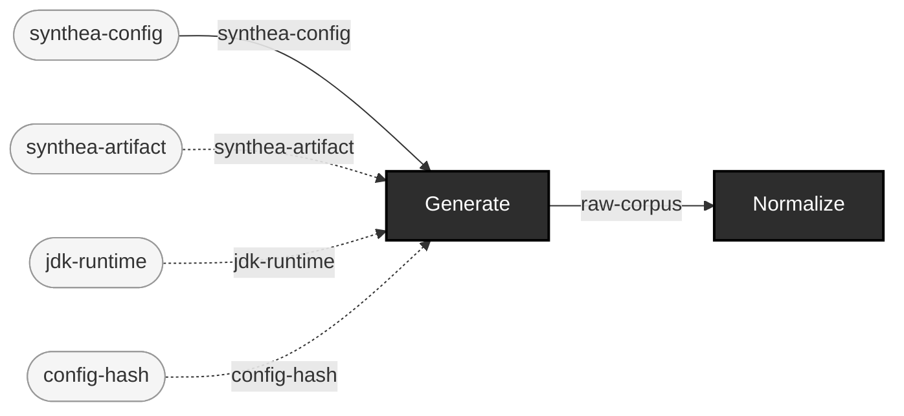

## Generate controlled-fault data

**Audience:** Teams needing deliberately broken data for any downstream use, with full traceability back to what was broken and why.

**You bring:** A base corpus (generated or intaken) plus a chosen defect operator and locator.

**You get:** A mutant with a lineage record naming the exact base-spec constraint it violates -- never produced without one -- plus an operation-manifest.edn naming the whole batch's own producer and per-item lineage (SS-4b).

**Maturity:** experimental

**You type:**

```sh
# The catalog you are choosing from: every operator, and the
# constraint its output violates.
bin/ehr corpus operators --format fhir

# A base corpus to break, if you don't already have one.
bin/ehr corpus generate --config-path config/synthea/synthea.properties \
  --seed 100 --clinician-seed 555 --population 10 \
  --reference-date 20260101 --out-dir out/demo-corpus

# Pick one patient bundle. --path takes a file, or a directory of
# files sharing one locator's shape; a generated corpus also holds two
# non-patient bundles, so this picks a patient file specifically.
PATIENT_FILE=$(ls out/demo-corpus/fhir/*.json | grep -v -e hospitalInformation -e practitionerInformation | head -1)

# Break exactly one element, at exactly one locator.
bin/ehr corpus mutate --path $PATIENT_FILE \
  --operator-id remove-required-element --locator-path entry[0].resource.gender \
  --out-dir out/demo-mutants

# The mutant is never written without this: the lineage record naming
# the operator, the locator, and the constraint the result violates.
cat out/demo-mutants/lineage/*.lineage.edn

# The batch's own self-description, written last, after every mutant
# and lineage sidecar above -- the same producer/per-item-lineage shape
# `ehr corpus intake` recognizes automatically (SS-4b, formats.md).
cat out/demo-mutants/operation-manifest.edn
```

Operator ids and what each one edits: [operators.md](operators.md). Locator syntax for both formats: [locators.md](locators.md). The lineage record's own fields: [formats.md](formats.md#the-lineage-record). Whether a given gate actually *convicts* a given mutant is a measured property rather than a promise -- [judge-calibration.md](judge-calibration.md) is where a surprising gate result gets explained.

```
canonical-fhir-datum × operator-catalog → mutant-fhir-datum + lineage-record  [Mutate]  {catalytic: operator-catalog}
```


## Test a validator/gate with generated + mutated data

**Audience:** Anyone standing up a new gate/validator who needs to prove it actually detects what it claims to check for, not just trust the vendor's claim.

**You bring:** Nothing beyond the pinned artifacts -- this repo generates and mutates its own test data.

**You get:** Contract pairing: for each defect operator, proof that the gate produces a new, locator-matching finding -- the exemplar is P5's own contract-pairing suite (projects/integration/test/ehrt/tools/contract_pairing_test.clj) against the real official FHIR validator.

**Maturity:** usable

**You type:**

```sh
# The exemplar, run for real: five FHIR defect operators, each
# mutated into a real Synthea bundle, each gated through the real
# official validator as a subprocess. Needs the three pinned
# artifacts first; takes minutes, not seconds.
bin/ehr artifact fetch --name synthea --version 4.0.0
bin/ehr artifact fetch --name temurin-jdk --version 21.0.12+8
bin/ehr artifact fetch --name fhir-validator-cli --version 6.9.12
make integration

# The same shape by hand, for a gate of your own: take the mutant
# you made in "Generate controlled-fault data" above and gate it.
bin/ehr gate fhir out/demo-mutants --report out/demo-mutants-report.edn
```

What makes this *contract pairing* rather than "the gate went red": the assertion is on a specific **new** finding whose locator matches the mutation, never on the file's aggregate verdict. [EXP-C5](experiments/EXP-C5-results.md) found every baseline file in this corpus already carries hundreds of profile-driven errors (the validator auto-loads US Core from Synthea's own declared `meta.profile`), so an aggregate verdict cannot discriminate a mutant from its own base file. The exemplar is [`projects/integration/test/ehrt/tools/contract_pairing_test.clj`](../../../projects/integration/test/ehrt/tools/contract_pairing_test.clj) -- read it rather than reimplementing it. Note which locator it uses and why: the by-hand mutant above breaks `entry[0].resource.gender`, which EXP-C5 found the validator does **not** convict (`gender` is min-cardinality 0 in base FHIR, so removing it violates nothing), which is exactly why the suite itself uses `resourceType`. That asymmetry is the point of calibrating a gate instead of trusting it -- [judge-calibration.md](judge-calibration.md). `make integration` is the nightly tier and never a per-push gate; it lives on the `test-integration/` path, which is a path split rather than a tag filter (see `AGENTS.md`).

```
synthea-config × synthea-artifact × jdk-runtime × config-hash → raw-corpus  [Generate]  {catalytic: synthea-artifact, jdk-runtime, config-hash}
raw-corpus → canonical-fhir-datum  [Normalize]
canonical-fhir-datum × operator-catalog → mutant-fhir-datum + lineage-record  [Mutate]  {catalytic: operator-catalog}
canonical-fhir-datum × mutant-fhir-datum × foreign-file → datum  [UnionDatum]  {spider: funnel}
datum × validator-artifact × runtime × hapi-hl7v2-dep × profile-artifact → pass + rejected + indeterminate  [Gate]  {catalytic: validator-artifact, runtime, hapi-hl7v2-dep, profile-artifact}
```

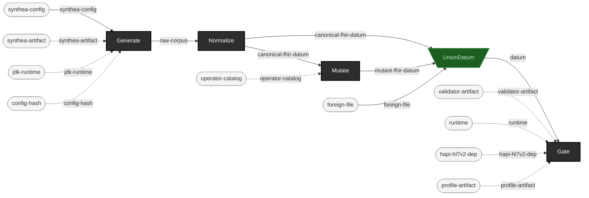

## Judge user-supplied data: intake -> gate -> report

**Audience:** Anyone gating a corpus they didn't generate themselves -- an ingestion pipeline's own output, a partner's export, anything foreign.

**You bring:** Your own corpus (foreign files, any origin).

**You get:** A conformance report: verdicts plus findings, normalized to the shared finding envelope. Real-world, profile-stamped corpora carry pre-existing findings (EXP-C5) -- reach for --baseline mode (docs/judge-calibration.md) when file-level verdict alone can't discriminate old noise from a new problem.

**Maturity:** usable

**You type:**

```sh
# Point this at your own corpus. This repo vendors one you can try
# it on: five HL7 v2 messages, plus a synthetic 1,013-message corpus
# under simhospital/ (ADR-0011).
YOUR_CORPUS=components/tools/test-fixtures/v2

# Catalog it first. Intake recurses and records EVERY file it finds
# -- content hash, sniffed format, source label, received date -- so
# a file it can't sniff is recorded as :unknown, never skipped.
bin/ehr corpus intake --path $YOUR_CORPUS \
  --label partner-export --out out/partner/intake
cat out/partner/intake/intake-record.edn

# Gate it. `gate v2` reads *.hl7 in the directory you name (not
# recursively); `gate fhir` is the same shape for FHIR JSON.
bin/ehr gate v2 $YOUR_CORPUS --report out/partner/gate-report.edn
```

What the report contains, field by field: [formats.md](formats.md#the-report); the stdout envelope and the `--report` file are deliberately different shapes. If your corpus is real-world and profile-stamped, read [judge-calibration.md](judge-calibration.md#baseline-relative-gating-2026-07-25-p6) before you trust a red verdict, and reach for `--baseline` ([Regression baselining / drift detection](#regression-baselining--drift-detection)). A workflow can branch on the gate's exit code directly: `bin/ehr` carries the 0/1/2/3 contract ([cli.md](cli.md#exit-codes)).

```
foreign-file → catalog-entry + intake-record  [Intake]
canonical-fhir-datum × mutant-fhir-datum × foreign-file → datum  [UnionDatum]  {spider: funnel}
datum × validator-artifact × runtime × hapi-hl7v2-dep × profile-artifact → pass + rejected + indeterminate  [Gate]  {catalytic: validator-artifact, runtime, hapi-hl7v2-dep, profile-artifact}
pass × rejected × indeterminate → report  [Report]
```

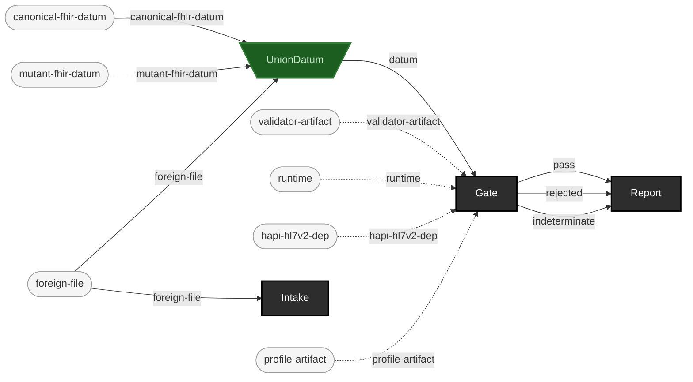

## Black-box transform surround

**Audience:** Teams whose actual system under test is a transform (an ingestion/mapping/ETL step) this repo doesn't implement and shouldn't have to.

**You bring:** Your own transform, run outside this repo's own pipeline.

**You get:** Conformance evidence (Gate) and equivalence evidence (Check, against an expected corpus) surrounding a black box you never have to instrument -- only its declared inputs/outputs.

**Maturity:** illustrative

**You type:** no strip -- this repo doesn't drive this use case end to end, so there is no command sequence to copy. You bring: Your own transform, run outside this repo's own pipeline. Its `Transform` stage is `{external: true}`: the system under test is your own transform, which this repo neither runs nor instruments. The shipped halves it surrounds do have strips -- producing the input corpus is [Generate conforming synthetic data](#generate-conforming-synthetic-data), gating the output is [Judge user-supplied data: intake -> gate -> report](#judge-user-supplied-data-intake---gate---report), and `ehr check` compares that output against an expected corpus ([cli.md](cli.md#ehr-check)). What no strip can write for you is the line in the middle that runs your transform.

```
synthea-config × synthea-artifact × jdk-runtime × config-hash → raw-corpus  [Generate]  {catalytic: synthea-artifact, jdk-runtime, config-hash}
raw-corpus → canonical-fhir-datum  [Normalize]
canonical-fhir-datum → transform-output  [Transform]  {external: true}
transform-output × validator-artifact × runtime × hapi-hl7v2-dep × profile-artifact → pass + rejected + indeterminate  [Gate]  {catalytic: validator-artifact, runtime, hapi-hl7v2-dep, profile-artifact}
transform-output × expected-corpus × assertion-set × canonicalizer-set → pass + rejected  [Check]  {catalytic: expected-corpus, assertion-set, canonicalizer-set}
```

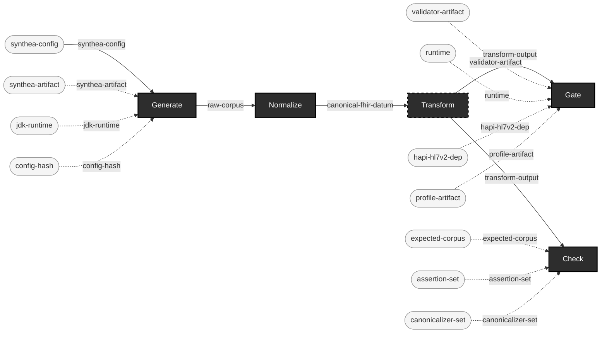

## Mutation-adequacy of the user's own checks

**Audience:** Teams who already have their own validation logic and want to know how good it actually is, not just that it exists.

**You bring:** Your own validation logic (external to this repo) plus a corpus.

**You get:** An adequacy score: of the defects this repo's operators inject, how many does your own validation actually catch? A validation suite that never rejects a mutant is exactly as informative as one that always does.

**Maturity:** illustrative

**You type:** no strip -- this repo doesn't drive this use case end to end, so there is no command sequence to copy. You bring: Your own validation logic (external to this repo) plus a corpus. Its `YourValidation` stage is `{external: true}`: the adequacy score is a property of validation logic this repo doesn't have and makes no claim about. The half this repo does drive -- producing the labeled mutants you score against -- has a strip at [Generate controlled-fault data](#generate-controlled-fault-data); the scoring loop around your own validator is yours to write.

```
canonical-fhir-datum × operator-catalog → mutant-fhir-datum + lineage-record  [Mutate]  {catalytic: operator-catalog}
mutant-fhir-datum → your-validation-verdict  [YourValidation]  {external: true}
```

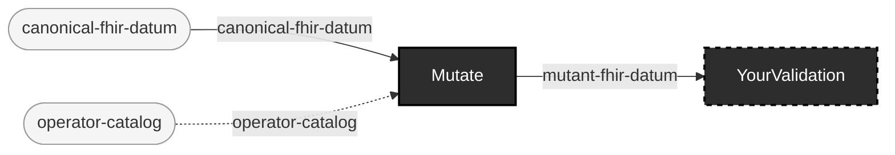

## Regression baselining / drift detection

**Audience:** Teams gating the same corpus (or corpus shape) repeatedly over time -- CI runs, periodic re-validation of a stable pipeline.

**You bring:** A corpus you gate repeatedly, and the report from the last run you trusted.

**You get:** What changed: judge.report/diff-reports compares two full reports (every changed verdict, added/removed file, appeared/disappeared code); --baseline mode (docs/judge-calibration.md) answers the narrower did-anything-NEW-appear question for a single run against a captured baseline.

**Maturity:** usable

**You type:**

```sh
# The run you trust becomes the baseline. Keep this file.
bin/ehr gate v2 components/tools/test-fixtures/v2 --report out/regression/baseline.edn

# ...later, the same corpus again -- but judged relative to that
# baseline: a finding counts toward rejection only if its
# {severity, code, locator-path} isn't already in the baseline for
# that same file. The exit code follows the relative view, so a
# corpus that is identically noisy to its baseline still exits 0.
bin/ehr gate v2 components/tools/test-fixtures/v2 \
  --report out/regression/today.edn \
  --baseline out/regression/baseline.edn
```

In `--baseline` mode the payload becomes `{:absolute :relative}` rather than a bare report -- `:absolute` still carries every finding, `:relative` is the filtered view the exit code follows ([formats.md](formats.md#baseline-mode-changes-the-payloads-shape), [judge-calibration.md](judge-calibration.md#baseline-relative-gating-2026-07-25-p6)). Baseline matching is by file path, so this answers *did anything new appear in this corpus*. The wider question -- every changed verdict, added/removed file, appeared/disappeared code between two arbitrary reports -- is `ehrt.tools.judge.report/diff-reports`, a library function today, not a CLI verb.

```
datum × validator-artifact × runtime × hapi-hl7v2-dep × profile-artifact → pass + rejected + indeterminate  [Gate]  {catalytic: validator-artifact, runtime, hapi-hl7v2-dep, profile-artifact}
pass × rejected × indeterminate → report  [Report]
```

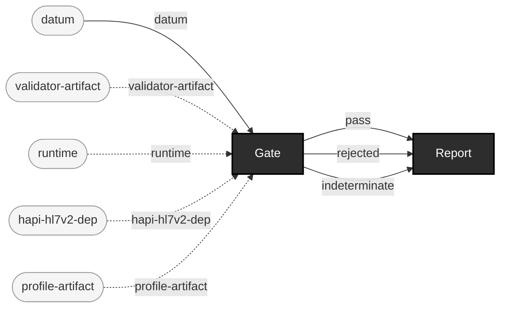

## Differential A/B of two transform versions

**Audience:** Teams upgrading their own transform/mapping step who need to know exactly where the new version's output diverges from the old.

**You bring:** The same input corpus, run through two versions of your own transform.

**You get:** An equivalence report from Check: the old version's output as the expected corpus, the new version's output as the candidate -- every divergence reported with a locator path.

**Maturity:** illustrative

**You type:** no strip -- this repo doesn't drive this use case end to end, so there is no command sequence to copy. You bring: The same input corpus, run through two versions of your own transform. Both `OldTransform` and `NewTransform` are `{external: true}` -- this repo never runs either version of your transform, so there is no invocation to show for the part that matters. Once their two output corpora exist, `ehr check --expected` compares them ([cli.md](cli.md#ehr-check)) and reports each divergence with a locator path.

```
canonical-fhir-datum → expected-corpus  [OldTransform]  {external: true}
canonical-fhir-datum → new-transform-output  [NewTransform]  {external: true}
new-transform-output × expected-corpus × assertion-set × canonicalizer-set → pass + rejected  [Check]  {catalytic: expected-corpus, assertion-set, canonicalizer-set}
```

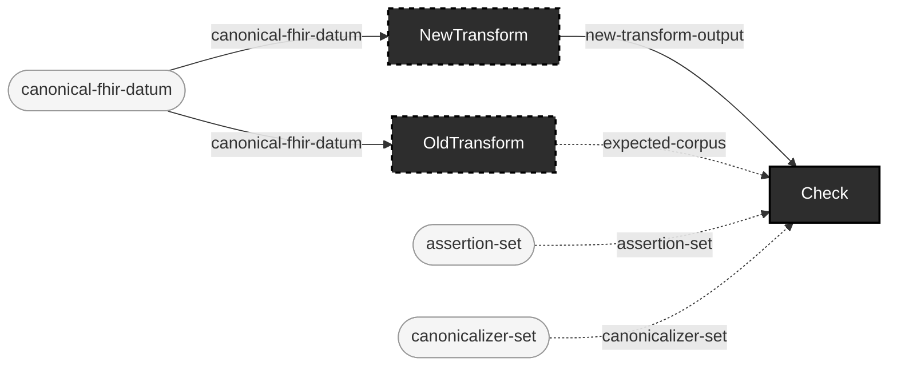

## Acceptance QA of delivered/vendor corpora

**Audience:** Teams accepting a delivered corpus from a vendor or partner before it enters their own pipeline.

**You bring:** A vendor-delivered corpus.

**You get:** Cataloging (Intake, with content-hash provenance) plus a gate verdict, before you accept delivery -- an acceptance decision backed by evidence, not a spot check.

**Maturity:** usable

**You type:**

```sh
# The delivered corpus, as received.
VENDOR_CORPUS=components/tools/test-fixtures/v2

# 1. Catalog before you accept: a content hash per file, and one
#    batch record naming the source and the date you received it.
bin/ehr corpus intake --path $VENDOR_CORPUS \
  --label acme-delivery --received 2026-07-26 \
  --out out/acceptance/intake
cat out/acceptance/intake/intake-record.edn

# 2. Gate it, and keep the report: that is the evidence behind the
#    acceptance decision, rather than a spot check.
bin/ehr gate v2 $VENDOR_CORPUS --report out/acceptance/gate-report.edn
```

The intake record's `:catalog-hash` is the sha256 of the catalog file's own bytes, so "this is the delivery I accepted" is later checkable against the record rather than against memory ([formats.md](formats.md)). The gate's exit code is the acceptance decision in machine-readable form -- 0 accept, 1 rejected, 3 the aggregate contains `:no-verdict` and you have not said how to treat it ([cli.md](cli.md#exit-codes)).

```
foreign-file → catalog-entry + intake-record  [Intake]
canonical-fhir-datum × mutant-fhir-datum × foreign-file → datum  [UnionDatum]  {spider: funnel}
datum × validator-artifact × runtime × hapi-hl7v2-dep × profile-artifact → pass + rejected + indeterminate  [Gate]  {catalytic: validator-artifact, runtime, hapi-hl7v2-dep, profile-artifact}
```

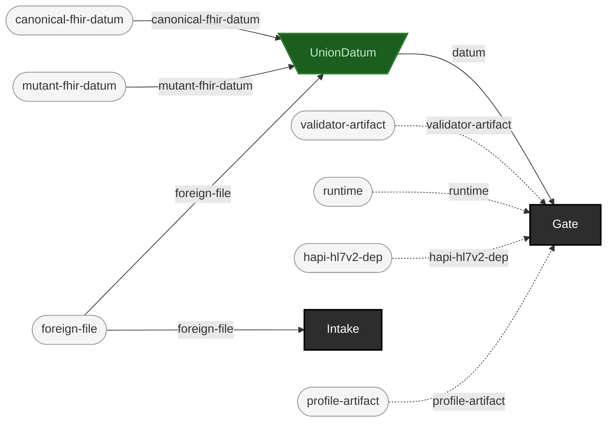

## Reproduction packages

**Audience:** Anyone who needs to hand someone else (a teammate, a reviewer, a future self) something that regenerates an exact corpus, not just the corpus itself.

**You bring:** Nothing beyond the pinned artifacts -- the manifest already names everything else.

**You get:** A manifest (config hash, seeds, artifact hashes, forced environment) that reproduces the exact corpus byte-for-byte, proven in EXP-A4 from a freshly emptied artifact cache.

**Maturity:** usable

**You type:**

```sh
# Generate once.
bin/ehr corpus generate --config-path config/synthea/synthea.properties \
  --seed 100 --clinician-seed 555 --population 10 \
  --reference-date 20260101 --out-dir out/repro-a

# The manifest IS the reproduction package: config hash, both seeds,
# the sha256 of the Synthea jar and of the JDK, the forced locale and
# timezone. Hand someone this file rather than the corpus.
cat out/repro-a/manifest.edn

# There is no regenerate-from-manifest verb: you read the settings
# back out of the manifest and pass them in again -- later, elsewhere,
# from an empty artifact cache.
bin/ehr corpus generate --config-path config/synthea/synthea.properties \
  --seed 100 --clinician-seed 555 --population 10 \
  --reference-date 20260101 --out-dir out/repro-b

# Same corpus? Ask this repo's own equivalence judge, pairing files
# by content hash.
bin/ehr check out/repro-b/fhir --expected out/repro-a/fhir --pair-by hash
```

Why `--pair-by hash` rather than `diff -r`: two of Synthea's own output filenames (`hospitalInformation<timestamp>.json`, `practitionerInformation<timestamp>.json`) embed a wall-clock export timestamp no seed can pin, while their *contents* are identical run over run. [EXP-A4](experiments/EXP-A4-results.md) found exactly this and registered `:strip-run-timestamp-suffix` as a canonicalizer for it -- so the byte-identity claim is byte-identity *modulo* recorded canonicalizations, and pairing by content hash is the shell-level way to ask the same question. `check`'s flags: [cli.md](cli.md#ehr-check).

```
synthea-config × synthea-artifact × jdk-runtime × config-hash → raw-corpus  [Generate]  {catalytic: synthea-artifact, jdk-runtime, config-hash}
```

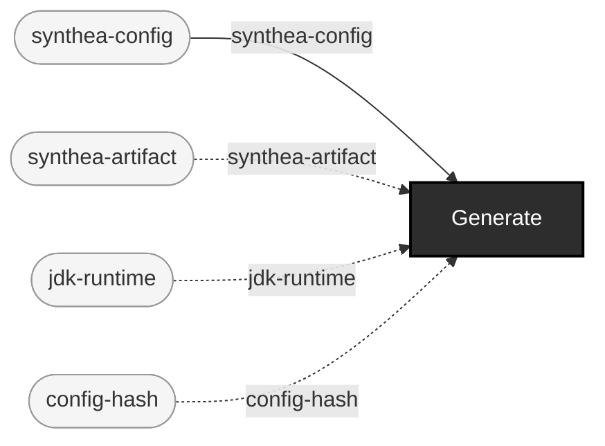

## Audit/regulatory evidence trail

**Audience:** Teams needing to show, after the fact, exactly what test data was used, what was deliberately broken, and what a gate found -- an audit or regulatory review, not just an internal sanity check.

**You bring:** A corpus that's been through generation, mutation, and gating.

**You get:** A hash-linked, self-verifying provenance chain: lineage records (Merkle-style, correction-only-by-new-record), manifests, and reports, each independently checkable -- assembling these into one shareable evidence package is future work, not yet a single command.

**Maturity:** experimental

**You type:**

```sh
# The trail is not one command: it is what the ordinary commands
# leave behind, each artifact independently checkable.

# Generate -- the manifest is the first link.
bin/ehr corpus generate --config-path config/synthea/synthea.properties \
  --seed 100 --clinician-seed 555 --population 10 \
  --reference-date 20260101 --out-dir out/audit/corpus
PATIENT_FILE=$(ls out/audit/corpus/fhir/*.json | grep -v -e hospitalInformation -e practitionerInformation | head -1)

# Mutate -- the lineage record is the second: hash-linked to the
# file it came from, corrected only by a new record, never by
# editing this one.
bin/ehr corpus mutate --path $PATIENT_FILE \
  --operator-id remove-required-element --locator-path entry[0].resource.resourceType \
  --out-dir out/audit/mutants

# Gate -- the report is the third, and it is finding-level, not
# just a verdict. The gate legitimately rejects here: that is the
# evidence, not a failure of the run.
bin/ehr artifact fetch --name fhir-validator-cli --version 6.9.12
bin/ehr gate fhir out/audit/mutants --report out/audit/gate-report.edn

# The three links, side by side.
ls out/audit/corpus/manifest.edn \
   out/audit/mutants/lineage/*.lineage.edn \
   out/audit/gate-report.edn
```

There is no `ehr audit package` verb: assembling these three into one shareable evidence bundle is future work, as *You get* above already says. What ships is that each artifact is independently checkable -- a lineage record's `:id` is the hash of its own remaining fields, a manifest names the sha256 of every artifact that produced the corpus, and the report carries findings rather than verdicts alone ([formats.md](formats.md)). Expect the gate to reject and therefore expect a non-zero exit -- 1, the rejection code ([cli.md](cli.md#exit-codes)). `gate fhir` runs the real validator as a subprocess and takes minutes, not seconds.

```
canonical-fhir-datum × operator-catalog → mutant-fhir-datum + lineage-record  [Mutate]  {catalytic: operator-catalog}
pass × rejected × indeterminate → report  [Report]
```

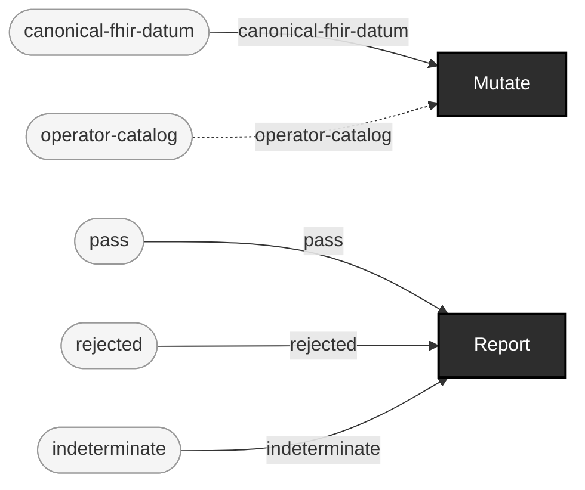

## Judge-tier calibration studies

**Audience:** Anyone who needs to know, precisely and with evidence, what a given judge tier actually catches before they trust a green run against it.

**You bring:** A set of defect operators and a judge tier you want characterized.

**You get:** A per-{operator, locator} classification of what that tier detects, misses, or can only partially resolve -- docs/judge-calibration.md is exactly this, the first instance, derived from EXP-C5's own method.

**Maturity:** usable

**You type:**

```sh
# The tier you are characterizing (v2 here; `gate fhir` is the
# other), and the operators you are characterizing it against.
bin/ehr corpus operators --format v2

# Baseline: what does this tier say about the file BEFORE you
# break it? On a real-world corpus this is not a formality.
bin/ehr gate v2 components/tools/test-fixtures/v2/adt-a01-admit.hl7 \
  --report out/calibration/before.edn

# One mutant per {operator, locator} cell you want filled in.
bin/ehr corpus mutate --path components/tools/test-fixtures/v2/adt-a01-admit.hl7 \
  --operator-id blank-required-field --locator-path MSH-9 \
  --out-dir out/calibration/blank-required-field

# Gate the mutant at the same tier. The verdict, and the finding
# code it carries, are that cell of the table.
bin/ehr gate v2 out/calibration/blank-required-field \
  --report out/calibration/after.edn

# before: {:pass 1 ...} / after: {:rejected 1 ...} with
# :by-code {"hl7-exception" 1} -- that difference is the result.
cat out/calibration/before.edn out/calibration/after.edn
```

Three cells are worth knowing before you start: a `:rejected` verdict is trustworthy, a `:pass` is a claim about what was checked rather than about correctness, and `:no-verdict` means the judge couldn't fully apply its criterion at all -- [judge-calibration.md](judge-calibration.md#reading-this-table) is the first instance of exactly this study, run over both tiers, and [operators.md](operators.md#what-this-catalog-does-not-tell-you) explains why conviction is measured rather than declared. Locator syntax, including the MSH conventions this example depends on: [locators.md](locators.md#hl7-v2-locators).

```
canonical-fhir-datum × operator-catalog → mutant-fhir-datum + lineage-record  [Mutate]  {catalytic: operator-catalog}
datum × validator-artifact × runtime × hapi-hl7v2-dep × profile-artifact → pass + rejected + indeterminate  [Gate]  {catalytic: validator-artifact, runtime, hapi-hl7v2-dep, profile-artifact}
```

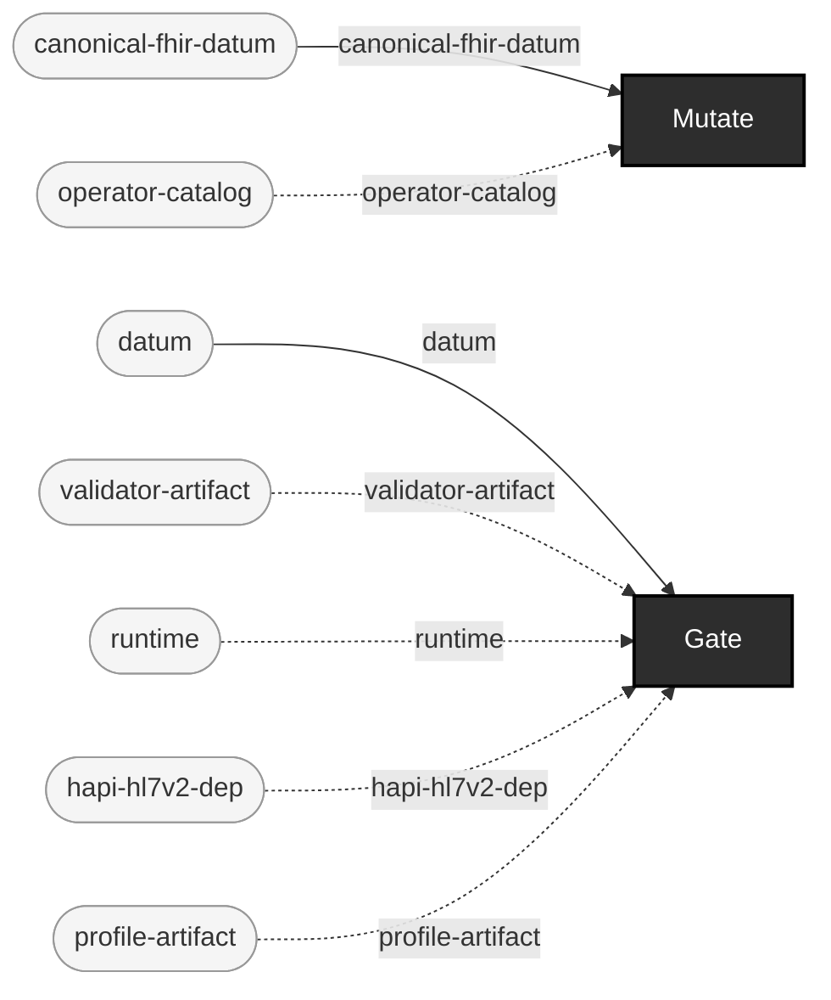

## Training material

**Audience:** Anyone teaching what a given defect class looks like -- onboarding, a workshop, a documentation example.

**You bring:** Nothing -- generate a small corpus and mutate it with known operators.

**You get:** Labeled before/after pairs: each lineage record names the exact base-spec constraint its mutant violates, ready to use as a worked example.

**Maturity:** illustrative

**You type:**

```sh
# A small corpus to teach from.
bin/ehr corpus generate --config-path config/synthea/synthea.properties \
  --seed 100 --clinician-seed 555 --population 5 \
  --reference-date 20260101 --out-dir out/teaching-corpus
PATIENT_FILE=$(ls out/teaching-corpus/fhir/*.json | grep -v -e hospitalInformation -e practitionerInformation | head -1)

# One run per defect class you want to show. Each writes a mutant
# plus a lineage record; that pair is the worked example.
bin/ehr corpus mutate --path $PATIENT_FILE \
  --operator-id malformed-date --locator-path entry[0].resource.birthDate \
  --out-dir out/teaching/malformed-date
bin/ehr corpus mutate --path $PATIENT_FILE \
  --operator-id invalid-code-value --locator-path entry[0].resource.gender \
  --out-dir out/teaching/invalid-code-value

# The label: what was broken, where, and which constraint that violates.
cat out/teaching/malformed-date/lineage/*.lineage.edn

# The value itself, before and after.
grep -o '"birthDate"[^,]*' "$PATIENT_FILE" | head -1
grep -o '"birthDate"[^,]*' out/teaching/malformed-date/*.json | head -1
```

A mutant is written as canonical JSON (one line); Synthea's own output is pretty-printed. A raw `diff` between the two is therefore ~60,000 lines of reformatting and not the teaching artifact -- the lineage record and the one changed value are. Operator ids: [operators.md](operators.md); locator syntax: [locators.md](locators.md); the lineage record's fields: [formats.md](formats.md#the-lineage-record). This case is `illustrative` because no shipped example pipeline runs it end to end, not because the commands don't run: these were run, 2026-07-26.

```
canonical-fhir-datum × operator-catalog → mutant-fhir-datum + lineage-record  [Mutate]  {catalytic: operator-catalog}
```

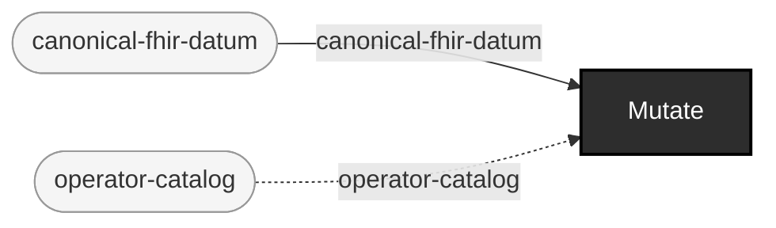

## Bring-your-own-generator augmentation

**Audience:** Teams with their own generator (or none at all, just a foreign corpus) who want this repo's mutation, lineage, and gating on top, without reimplementing generation.

**You bring:** A corpus from a generator this repo doesn't implement.

**You get:** This repo's own mutation/lineage/gate machinery applied to a foreign corpus -- today this requires the foreign corpus to already be canonical-fhir-datum-shaped (FHIR JSON matching corpus.mutate's own substrate); a general foreign-format adapter into Mutate is future work, stated honestly rather than implied.

**Maturity:** planned

**You type:** no strip -- this repo doesn't drive this use case end to end, so there is no command sequence to copy. You bring: A corpus from a generator this repo doesn't implement. `Intake` ships, and has a strip at [Acceptance QA of delivered/vendor corpora](#acceptance-qa-of-deliveredvendor-corpora). But the `Mutate` stage in this case's equations consumes `foreign-file` directly, and that works today only if your corpus is already `canonical-fhir-datum`-shaped (FHIR JSON matching `corpus.mutate`'s own substrate); the general foreign-format adapter into Mutate is future work, and no plan wave schedules it yet. Inventing an invocation for it here is exactly the dishonesty this page avoids. If your corpus is already FHIR JSON, [Judge user-supplied data: intake -> gate -> report](#judge-user-supplied-data-intake---gate---report) is the case that runs today.

```
foreign-file → catalog-entry + intake-record  [Intake]
foreign-file × operator-catalog → mutant-fhir-datum + lineage-record  [Mutate]  {catalytic: operator-catalog}
```

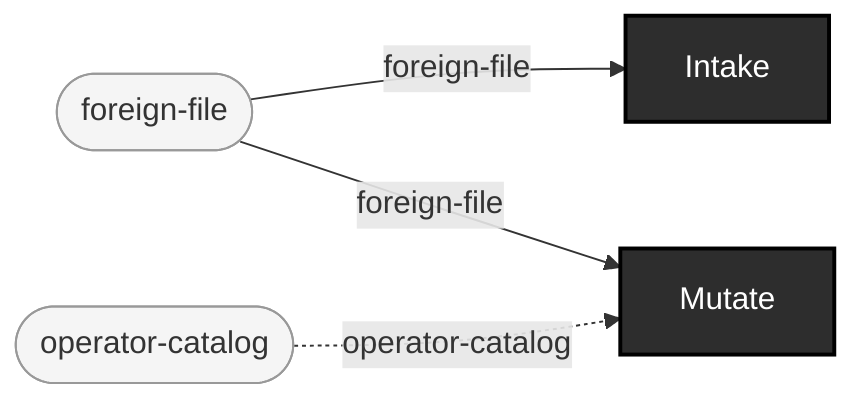

## Simulator (sim) traffic as an intake source, in one command

**Audience:** Teams wanting deterministic, seeded HL7v2 hospital traffic (boarding, churn, cancellations, merges) as a corpus, without a separate generate-then-catalog step.

**You bring:** A seed. ehr-testing-sim (a sibling project, github.com/pragsmike/ehr-testing-sim) checked out alongside this repo (../ehr-testing-sim) -- subprocess-only, per ADR-0013; this repo never bundles or depends on it.

**You get:** A cataloged v2 corpus: HL7v2 messages plus sim's own manifest.edn sidecar, its provenance (generator name/version/sha256, seeds) attached to every catalog entry (ADR-0014) -- generated fresh at your own seed, in one command (SS-2, the generator registry).

**Maturity:** usable

**You type:**

```sh
# Requires the ehr-testing-sim sibling checkout (../ehr-testing-sim,
# subprocess-only -- ADR-0013; clone it alongside this repo to run this).
bin/ehr corpus intake 'sim:?seed=42&patients=5&emit=hl7' \
  --label sim-traffic --out out/sim-intake
cat out/sim-intake/intake-record.edn

# Every catalog entry carries sim's own real provenance (ADR-0014).
cat out/sim-intake/catalog.edn
```

Generator-URL params (seed, patients, churn, emit, reference-date, config) are sim's own `run` verb's flags; a bare `sim:` with no query string still works, at sim's own pinned one-patient/hl7 default (the determinism law of defaults, D8). Gate the result the same way any intaken corpus gates -- [Judge user-supplied data: intake -> gate -> report](#judge-user-supplied-data-intake---gate---report). Synthea's own equivalent one-command path is `bin/ehr corpus intake 'synthea:?seed=1&population=5'`, over the SAME generator registry (docs/source-sink-design.md); `ehr corpus generate` itself is unchanged and remains the Synthea-only, more-flag-heavy path (OPEN-4 in the design doc records whether that changes later).

```
generator-config × sim-subprocess → generated-corpus  [EngineExecute]
generated-corpus → catalog-entry + intake-record  [Intake]
```

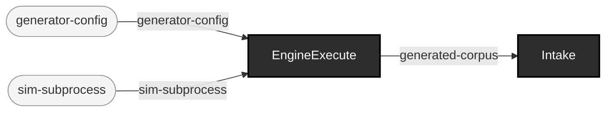

## Piped multi-message HL7v2 traffic as an intake source (stdin)

**Audience:** Teams with an existing HL7v2 feed (a file of many MSH-delimited messages, or anything nc/a real interface engine can pipe as bytes) who want it cataloged as a corpus without a separate file-splitting step.

**You bring:** A byte stream framed as one of the SS-3 framing kinds (er7-multi here; ndjson/mllp/bundle-entries work the same way) -- this example pipes an excerpt of the vendored SimHospital corpus (components/tools/test-fixtures/v2/simhospital/messages.out, ADR-0011), but any MSH-multi-message file or a real nc pipe works identically.

**You get:** A cataloged v2 corpus: one file per message (the spool, docs/source-sink-design.md Part I.2/D2), plus capture-manifest.edn recording when it was captured, its declared origin, framing, format, item count, and per-item sha256s -- generated in one command, no manual message-splitting step (SS-3).

**Maturity:** usable

**You type:**

```sh
# A 3-message excerpt of the vendored SimHospital fixture, piped
# straight into intake -- the framing (er7-multi: MSH-led messages
# separated by a blank line) is decoded and spooled, one file per
# message, before anything is cataloged.
head -c 2464 components/tools/test-fixtures/v2/simhospital/messages.out | \
  bin/ehr corpus intake 'stdin:?format=v2-er7&framing=er7-multi' \
  --label simhospital-excerpt --out out/demo-stdin-intake

# What you got: one file per message, plus the spool's own capture
# manifest -- every catalog entry below carries the label as :origin.
ls out/demo-stdin-intake
cat out/demo-stdin-intake/intake-record.edn
```

Any of the four multi-item framing kinds work the same way: `?framing=ndjson`, `?framing=mllp`, or `?framing=bundle-entries` (for a piped FHIR Bundle) instead of `er7-multi` -- see [source-sink-design.md](source-sink-design.md) Part II for what each one assumes about its bytes. A real interface engine's own feed pipes in exactly the same way this excerpt does (`nc ... | bin/ehr corpus intake 'stdin:?framing=mllp&format=v2-er7' ...`) -- `nc` (or any transport) is the one piece outside this repo's scope (D2); everything on this repo's side of the pipe is real. The spool's own capture-manifest.edn is a distinct schema from ADR-0014's manifest.edn (captured-at/origin/framing/format/item-count/per-item sha256s, not a generator's provenance record), so it is not treated as a provenance sidecar -- it gets cataloged like any other foreign file, which is why the catalog above has one more entry than there are messages. Gate the result the same way any intaken corpus gates -- [Judge user-supplied data: intake -> gate -> report](#judge-user-supplied-data-intake---gate---report).

```
framed-stream × size-cap → spooled-corpus  [Spool]  {catalytic: framing-codec}
spooled-corpus → catalog-entry + intake-record  [Intake]
```

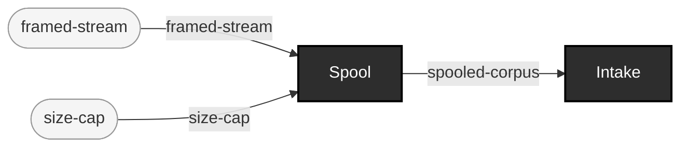

## Mutate's own output, piped straight into intake -- no intermediate directory

**Audience:** Teams generating mutant corpora as part of a larger pipeline who don't want a scratch directory in between two of this repo's own commands, and anyone wanting to see the composability law (every sink's output is a valid source, docs/source-sink-design.md Part III) exercised end to end rather than merely asserted.

**You bring:** A base v2 corpus (a directory of .hl7 files) and a chosen defect operator/locator -- exactly what [Generate controlled-fault data](#generate-controlled-fault-data) already brings; the difference is only where the mutants go.

**You get:** A cataloged mutant corpus, produced by chaining two `ehr` invocations through a real OS pipe: `corpus mutate` batches every mutant, frames them (MLLP here; er7-multi/ndjson work the same way), and writes the framed bytes to its own stdout instead of a directory; `corpus intake` reads them from its own stdin, spools one file per mutant, and catalogs the result -- no scratch files land on disk in between (SS-4).

**Maturity:** usable

**You type:**

```sh
# Same operator/locator as the plain directory-output case; only
# --out-dir changes, to a stdout: designator instead of a path.
bin/ehr corpus mutate in/v2-corpus \
  --operator-id blank-required-field --locator-path MSH-9 \
  --out-dir 'stdout:?format=v2-er7&framing=mllp' \
  | bin/ehr corpus intake 'stdin:?format=v2-er7&framing=mllp' \
    --label mutate-loopback --out out/mutate-loopback-intake

# What you got: one file per mutant, cataloged -- no directory of
# mutant files or lineage sidecars ever touched disk on the way.
cat out/mutate-loopback-intake/intake-record.edn
```

Named scope decision, not an oversight: a stdout destination writes no lineage sidecar (`--out-dir/lineage/*.lineage.edn`, [Generate controlled-fault data](#generate-controlled-fault-data)'s own directory case) -- there is no directory to drop one into. A run that needs lineage writes to a directory, exactly as before; this pipe is for batching mutants straight into another consumer, not for the lineage-preserving path. Any of the framing kinds that concatenate soundly work here (`mllp`/`er7-multi`/`ndjson`) -- see [source-sink-design.md](source-sink-design.md) Part III for the sink side and Part II for what each framing assumes about its bytes.

```
mutant-v2-datum × stdout-sink-map → sink-bytes  [Write]
sink-bytes → framed-stream  [EncodeFraming]  {catalytic: framing-codec}
framed-stream × size-cap → spooled-corpus  [Spool]  {catalytic: framing-codec}
spooled-corpus → catalog-entry + intake-record  [Intake]
```

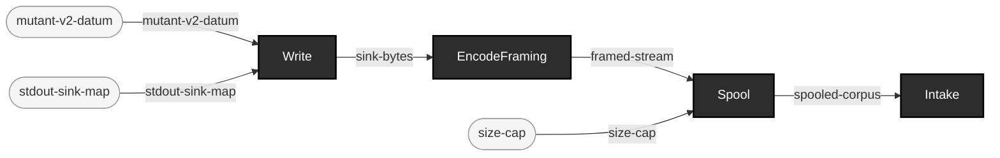
