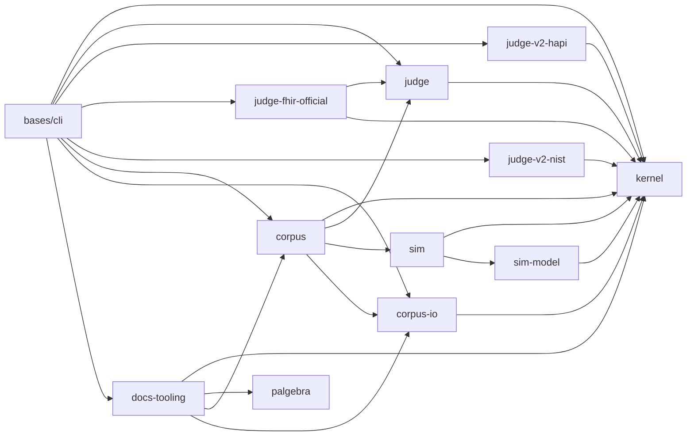

# Architecture

The workspace map, for a maintainer who has never seen this repo
before. If you're using the built CLI, you don't need this page — see
the root [`README.md`](../../README.md) and [`docs/`](../). This page
exists because that's true: nothing here is needed to *use* this
workspace, only to *change* it.

## Polylith, in one paragraph

This is a [Polylith](https://polylith.gitbook.io/polylith) monorepo:
one source tree, one development REPL, several deployable artifacts.
Code lives in **components** (a chunk of domain behind one `interface`
namespace) and **bases** (a thin entry point to the outside world — CLI
dispatch, here). **Projects** are the sets of bricks that make up one
deployable, wired by `:local/root` in a project-local `deps.edn`. The
root `deps.edn`'s `:dev`/`:test` aliases see every brick at once — the
one REPL the whole workspace shares. See
[`migration/polylith-brief.md`](migration/polylith-brief.md) for the
fuller reference this migration was planned against, and
`notes/ADRs.md` ADR-0001 for what was actually decided and why.

## The bricks

| Brick | Kind | What it is |
|---|---|---|
| `components/kernel` | component | The foundation layer judge and corpus share: `result`, `digest`, `artifact`, `canonical`, `locator`, `invocation`. Extracted from `components/tools` (ADR-0002 R14's named hole H4, closed by ADR-0008) once census showed which root-layer namespaces two or more of {judge, corpus, cli} actually depended on. |
| `components/judge` | component | The verdict vocabulary and shared machinery every gate engine produces into: `ehrt.judge.report`, `.finding`, `.verdict-cache`. Extracted alongside kernel (ADR-0008); narrowed again (ADR-0011) when the two gate engines themselves moved out to their own components. Depends on kernel only. |
| `components/judge-v2-hapi` | component | The HAPI-backed HL7 v2 base-structural conformance engine (`ehrt.judge-v2-hapi.v2`, in-process, no subprocess). Extracted from `components/judge` (ADR-0011, the per-engine judge split). Depends on kernel only. |
| `components/judge-fhir-official` | component | The official HL7 FHIR validator engine (`ehrt.judge-fhir-official.fhir`, pinned subprocess). Extracted from `components/judge` (ADR-0011). Depends on `judge` (the verdict vocabulary's `worst-of` and the shared verdict-cache) and kernel. |
| `components/judge-v2-nist` | component | The third gate engine: profile-aware NIST HL7 v2 validation (`ehrt.judge-v2-nist.v2`), landed ADR-0012 (2026-07-30) into the same per-engine seam ADR-0011 established. Depends on kernel only. |
| `components/corpus` | component | The corpus domain — generation, mutation, intake, check, golden comparison, display/player, the operator/generator registries, and the `ehrt sim` adapter (`ehrt.corpus.sim-adapter`). The former `components/tools`, renamed and retired-as-façade at split stage 3 (2026-07-31, `notes/ADRs.md` ADR-0018): `ehrt.corpus.interface` is designed from live consumers (38 defs from the façade's 64 — the kernel/judge/engine relays dissolved, their consumers repointed to the owning interfaces; `Assertion` deleted with grep evidence). Depends on kernel, judge (verdict vocabulary for `check`), corpus-io, and sim — no judge-engine edge at all. |
| `components/corpus-io` | component | The corpus transport/IO seam: sources, sinks, spooling, framing codecs (`framing`, `er7`, `spool`, `spool-source`, `source-sink`, `source-sink-url`, `sink-write`, `operation-manifest`, `canonicalizers`) — no domain logic. Extracted out of the domain component (2026-07-31, refactoring-review stage 2 of 3, `notes/ADRs.md` ADR-0017). Depends on kernel only; never depends on corpus, docs-tooling, or any judge component (the directional rule stage 2 was ruled on) — `corpus`' own domain namespaces and `docs-tooling.lint` depend on it instead. |
| `components/docs-tooling` | component | Dev-time-only doc/lint tooling: `docsgen` (docs/cli.md's renderer), `usecases`, `pipeline`, `quickstart-fresh`, `lint`. Extracted out of the domain component (2026-07-31, refactoring-review stage 1 of 3, `notes/2026-07-30-refactoring-review.md` §5.1a). Never in any shipped project's runtime path — the Makefile's own docsgen/lint-pipeline/quickstart-fresh targets invoke it via `-X`, not through `bin/ehrt`; the one real cross-brick caller is `bases/cli/help.clj`, which requires its interface directly for `write-cli-md!` (never a domain relay — see ADR-0016's circular-dependency finding). `lint.clj` reaches `corpus` (operator/check-schema registry lookups) and `corpus-io` (framing) directly. |
| `components/palgebra` | component | String-diagram tooling (resource-equation → Mermaid) this workspace uses to document its own data-flow pipelines (`pipeline.md`, `use-cases.md`, sim's own theory docs). Self-contained — never requires corpus, docs-tooling, or sim. |
| `components/sim-model` | component | Pathway/facility/persona/config: the schema-and-sampling ground truth every other sim namespace consumes (`ehrt.sim-model.interface`). Extracted from `components/sim` (sim split S1, 2026-08-02, `.agents/plans/2026-08-02-sim-split-plan.md`, `notes/ADRs.md` ADR-0025) — a pure move, no logic change; interface width derived from grep evidence of `components/sim`'s own real callers, same discipline the fat `ehrt.sim.interface` itself was built with. Depends on kernel only; forbidden-forever from depending on `components/sim` or anything corpus-derived. |
| `components/sim` | component | The simulation engine: deterministic, seeded hospital traffic (patients, encounters, GMF-driven pathways, churn, HL7 v2/FHIR emission). Depends on kernel (`ehrt.kernel.result`, adopted 2026-08-01, `notes/ADRs.md` ADR-0022 — retired its own copied result-not-throw envelope) and, since sim split S1 (2026-08-02, ADR-0025), `sim-model`; never depends on anything corpus-derived — the one dependency-direction rule that predates this workspace and is now poly-enforced rather than merely a convention (two separate repos used to make it structural; `poly check` does now). |
| `bases/cli` | base | Thin CLI dispatch — the `ehrt` command (ADR-0009; renamed from `ehr`, which stays reserved for future payload-EHR tooling). Composes component interfaces directly since stage 3 (kernel's result/artifact/locator vocabulary, judge's report vocabulary, each gate engine, corpus, corpus-io, docs-tooling — no façade between). `ehrt sim run`/`check`/`identifiers`/`version` dispatch straight into `components/sim`, in-process, no subprocess (the `ehrt sim` mount, ADR-0005; the latter three verbs mounted P3-6, 2026-08-01, closing the sim-cli retirement's own parity gap). |

## The projects

| Project | Composes | What it deploys |
|---|---|---|
| `projects/ehrt-cli` | kernel, judge, judge-v2-hapi, judge-fhir-official, judge-v2-nist, corpus, corpus-io, docs-tooling, palgebra, cli, sim, sim-model | The published CLI artifact (`bin/ehrt` runs `poly/cli` via root `deps.edn`'s own `:ehrt` alias, not this project directly — see below). Named for the deployable, `ehrt` (R35). |
| `projects/conformance` | sim, sim-model, corpus, corpus-io, docs-tooling, palgebra, all three judge engines (test-only) | Base-less: exercises sim + corpus + corpus-io + docs-tooling + palgebra together, workspace-internal suites only — the per-push lane's own cross-brick integration coverage; also hosts docs-tooling's own moved tests (2026-07-31 split, AR-3 placement) and corpus-io's own moved tests (2026-07-31 split stage 2, same placement rule). The judge engines are consumed directly by its own parity/gate-loop suites since stage 3 (no façade relay). |
| `projects/integration` | sim, sim-model, corpus, corpus-io, judge-v2-hapi, judge-fhir-official (test-only) | Base-less: the artifact-fetch-dependent suites (real Synthea, the real FHIR validator) — nightly/on-demand only, never per-push (`notes/ADRs.md` ADR-0004). Does not include docs-tooling or palgebra (2026-07-31 re-derivation), and dropped judge-v2-nist at stage 3 (ADR-0018: it was only ever here because the retired façade required every engine). judge-v2-hapi stays — the corpus brick's own contract-pairing test requires it, and poly runs a declared brick's tests in every composing project (its drop was tried and reverted when the integration lane itself went red, see ADR-0018's deviation record). |
| *(root `deps.edn`)* | every brick | Not a `projects/` directory — the root `deps.edn`'s `:dev`/`:test` aliases are the development project, seeing every brick at once for one REPL. Its `:ehrt` alias is `bin/ehrt`'s own real invocation path (kernel, judge, judge-v2-hapi, judge-fhir-official, judge-v2-nist, corpus, corpus-io, docs-tooling, palgebra, cli, sim, sim-model — not through `projects/ehrt-cli`, which exists for coverage/publishing tooling, not the CLI's own runtime). |

**Dependency wiring lives at the project level, not the component
level** — no component `deps.edn` anywhere in this workspace carries a
`poly/X :local/root` entry for a sibling brick, only external Maven
coordinates. Brick-to-brick wiring is done once per project/dev-alias,
flat and explicit (confirmed by reading every `deps.edn` before the
kernel/judge extraction touched any of them — ADR-0008's own deviation
record; reconfirmed before the per-engine judge split, ADR-0011).
Adding a new cross-brick `:require` means adding the corresponding
`poly/X` entry to every project whose classpath needs to compile it,
not just the one you're editing.

## Where the theory docs live

Every stage this workspace runs is, underneath, a resource equation in
a shared notation (`docs/dev/notation.md`) — a pipeline stage names
its inputs, outputs, and the catalytic resources it uses without
consuming, and `components/palgebra` renders that notation to Mermaid
diagrams mechanically, not by hand-drawn illustration. The two places
this shows up:

- **The tools pipeline** — `components/corpus/docs/pipeline.edn`
  (hand-authored source, component-adjacent) → `docs/dev/pipeline.md`
  (generated, `make pipeline`). What `Generate → Mutate → Gate → Check`
  actually composes from, stage by stage.
- **Sim's own theory** — `components/sim/docs/sim-theory.edn` →
  `sim-theory.md`/`sim-theory-diagram.mermaid` (component-adjacent;
  sim's own engine internals, not migrated to `docs/dev/` — a
  maintainer working on sim's own modules reads these alongside its
  code, not as workspace-wide architecture).

`docs/dev/AUDIENCES.md` and `docs/dev/source-sink-design.md` are the
two long-form design references beyond the equation notation itself —
AUDIENCES.md maps this workspace against the guide and its audiences;
source-sink-design is the fuller rationale for the intake/mutate/sink
seam (`ruling 7`, `Part I`–`Part IX`, cited throughout source).

## Documentation doctrine

`docs/` (this file's own parent's parent) is the complete, audience-
forked user path — no Polylith, no `components/` paths, no repository
history required to read it (`notes/ADRs.md` ADR-0010). `docs/dev/`
(where you're reading this) is the maintainer path. Component-adjacent
docs (`components/*/docs/*.md` not listed in either path above) stay
where they are: material a contributor to that specific component's
own code needs, that a user or a general workspace maintainer never
does — the full disposition of every doc this workspace carries is
`notes/docs-audit.md`. A new doc declares which of these three rows it
belongs to before it's written, not after.

## Where to go next

- Contributing for the first time: `AGENTS.md`, then `AUTHORS-GUIDE.md`.
- The full decision history: `notes/ADRs.md` (this workspace's own,
  fresh at ADR-0001) and, for pre-merge decisions, `notes/sim/ADRs.md`/
  `notes/tools/ADRs.md` (frozen provenance, cited origin-qualified).
- What's landed so far, in prose: `AGENTS.md`'s own "Landed so far"
  section — kept current, unlike this page's own bricks table, which
  is accurate as of ADR-0018 (2026-07-31, split stage 3: tools renamed corpus and retired as a façade) and will
  drift; trust `poly ws get:components:keys` over either when they
  disagree.
