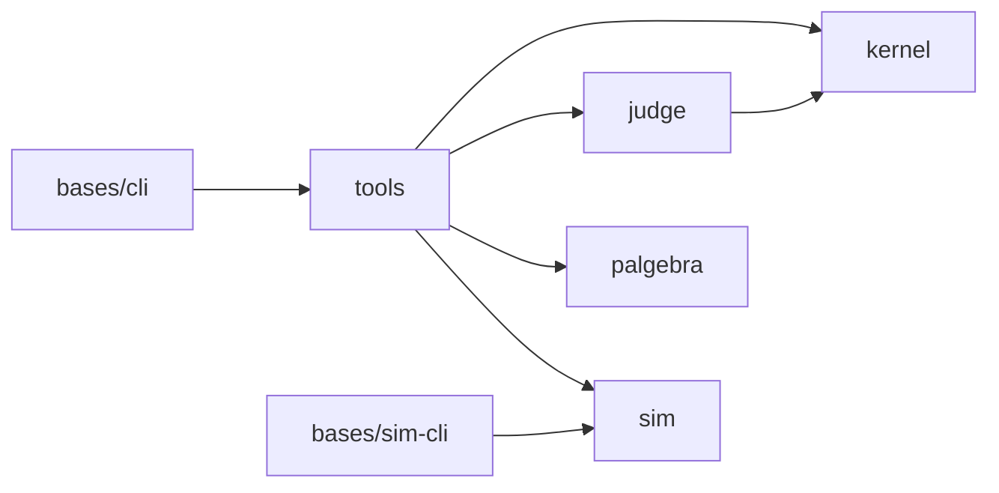

# Architecture

The workspace map, for a maintainer who has never seen this repo
before. If you're using the built CLI, you don't need this page — see
the root [`README.md`](../../README.md) and [`docs/`](../). This page
exists because that's true: nothing here is needed to *use* this
workspace, only to *change* it.

## Polylith, in one paragraph

This is a [Polylith](https://polylith.gitbook.io/polylith) monorepo:
one source tree, one development REPL, several deployable artifacts.
Code lives in **components** (a chunk of domain behind one `interface`
namespace) and **bases** (a thin entry point to the outside world — CLI
dispatch, here). **Projects** are the sets of bricks that make up one
deployable, wired by `:local/root` in a project-local `deps.edn`. The
root `deps.edn`'s `:dev`/`:test` aliases see every brick at once — the
one REPL the whole workspace shares. See
[`migration/polylith-brief.md`](migration/polylith-brief.md) for the
fuller reference this migration was planned against, and
`notes/ADRs.md` ADR-0001 for what was actually decided and why.

## The bricks

| Brick | Kind | What it is |
|---|---|---|
| `components/kernel` | component | The foundation layer judge and corpus share: `result`, `digest`, `artifact`, `canonical`, `locator`, `invocation`. Extracted from `components/tools` (ADR-0002 R14's named hole H4, closed by ADR-0008) once census showed which root-layer namespaces two or more of {judge, corpus, cli} actually depended on. |
| `components/judge` | component | FHIR and HL7 v2 conformance judging (`ehrt.judge.fhir`, `.v2`, `.report`, `.finding`, `.verdict-cache`). Extracted alongside kernel, ADR-0008. Depends on kernel only — never back on tools. |
| `components/tools` | component | Corpus generation, mutation, intake, and the residual pipeline plumbing (docsgen, lint, the `ehrt sim` adapter). Narrowed by the kernel/judge extraction; still the fattest component, and its own `ehrt.tools.interface` still re-exports corpus.* wholesale — narrowing that further is a future, author-ruled call (see `AGENTS.md`'s fat-component disclosure). |
| `components/palgebra` | component | String-diagram tooling (resource-equation → Mermaid) this workspace uses to document its own data-flow pipelines (`pipeline.md`, `use-cases.md`, sim's own theory docs). Self-contained — never requires tools or sim. |
| `components/sim` | component | The simulation engine: deterministic, seeded hospital traffic (patients, encounters, GMF-driven pathways, churn, HL7 v2/FHIR emission). Never depends on anything tools-derived — the one dependency-direction rule that predates this workspace and is now poly-enforced rather than merely a convention (two separate repos used to make it structural; `poly check` does now). |
| `bases/cli` | base | Thin CLI dispatch for tools — the `ehrt` command (ADR-0009; renamed from `ehr`, which stays reserved for future payload-EHR tooling). `ehrt sim run` dispatches straight into `components/sim`, in-process, no subprocess (the `ehrt sim` mount, ADR-0005). |
| `bases/sim-cli` | base | Sim's own standalone CLI, DEPRECATED (R33, ADR-0009) — kept working and tested, but no user-facing doc teaches it; `bin/ehrt sim run` is the presented surface. Retirement trigger (dated, not scheduled): retire when a review finds no use outside its own tests — `notes/facts-register.md` F2. |

## The projects

| Project | Composes | What it deploys |
|---|---|---|
| `projects/ehrt-cli` | kernel, judge, tools, palgebra, cli, sim | The published CLI artifact (`bin/ehrt` runs `poly/cli` via root `deps.edn`'s own `:ehrt` alias, not this project directly — see below). Named for the deployable, `ehrt` (R35). |
| `projects/sim` | sim | Sim's own standalone artifact (`bases/sim-cli`'s composing project). |
| `projects/conformance` | sim, tools, palgebra (test-only) | Base-less: exercises sim + tools + palgebra together, workspace-internal suites only — the per-push lane's own cross-brick integration coverage. |
| `projects/integration` | sim, tools, palgebra (test-only) | Base-less: the artifact-fetch-dependent suites (real Synthea, the real FHIR validator) — nightly/on-demand only, never per-push (`notes/ADRs.md` ADR-0004). |
| *(root `deps.edn`)* | every brick | Not a `projects/` directory — the root `deps.edn`'s `:dev`/`:test` aliases are the development project, seeing every brick at once for one REPL. Its `:ehrt` alias is `bin/ehrt`'s own real invocation path (kernel, judge, tools, palgebra, cli, sim — not through `projects/ehrt-cli`, which exists for coverage/publishing tooling, not the CLI's own runtime). |

**Dependency wiring lives at the project level, not the component
level** — no component `deps.edn` anywhere in this workspace carries a
`poly/X :local/root` entry for a sibling brick, only external Maven
coordinates. Brick-to-brick wiring is done once per project/dev-alias,
flat and explicit (confirmed by reading every `deps.edn` before the
kernel/judge extraction touched any of them — ADR-0008's own deviation
record). Adding a new cross-brick `:require` means adding the
corresponding `poly/X` entry to every project whose classpath needs to
compile it, not just the one you're editing.

## Where the theory docs live

Every stage this workspace runs is, underneath, a resource equation in
a shared notation (`docs/dev/notation.md`) — a pipeline stage names
its inputs, outputs, and the catalytic resources it uses without
consuming, and `components/palgebra` renders that notation to Mermaid
diagrams mechanically, not by hand-drawn illustration. The two places
this shows up:

- **The tools pipeline** — `components/tools/docs/pipeline.edn`
  (hand-authored source, component-adjacent) → `docs/dev/pipeline.md`
  (generated, `make pipeline`). What `Generate → Mutate → Gate → Check`
  actually composes from, stage by stage.
- **Sim's own theory** — `components/sim/docs/sim-theory.edn` →
  `sim-theory.md`/`sim-theory-diagram.mermaid` (component-adjacent;
  sim's own engine internals, not migrated to `docs/dev/` — a
  maintainer working on sim's own modules reads these alongside its
  code, not as workspace-wide architecture).

`docs/dev/positioning.md` and `docs/dev/source-sink-design.md` are the
two long-form design references beyond the equation notation itself —
positioning maps this workspace against the guide and its audiences;
source-sink-design is the fuller rationale for the intake/mutate/sink
seam (`ruling 7`, `Part I`–`Part IX`, cited throughout source).

## Documentation doctrine

`docs/` (this file's own parent's parent) is the complete, audience-
forked user path — no Polylith, no `components/` paths, no repository
history required to read it (`notes/ADRs.md` ADR-0010). `docs/dev/`
(where you're reading this) is the maintainer path. Component-adjacent
docs (`components/*/docs/*.md` not listed in either path above) stay
where they are: material a contributor to that specific component's
own code needs, that a user or a general workspace maintainer never
does — the full disposition of every doc this workspace carries is
`notes/docs-audit.md`. A new doc declares which of these three rows it
belongs to before it's written, not after.

## Where to go next

- Contributing for the first time: `AGENTS.md`, then `AUTHORS-GUIDE.md`.
- The full decision history: `notes/ADRs.md` (this workspace's own,
  fresh at ADR-0001) and, for pre-merge decisions, `notes/sim/ADRs.md`/
  `notes/tools/ADRs.md` (frozen provenance, cited origin-qualified).
- What's landed so far, in prose: `AGENTS.md`'s own "Landed so far"
  section — kept current, unlike this page's own bricks table, which
  is accurate as of ADR-0010 and will drift; trust `poly ws
  get:components:keys` over either when they disagree.
