<!-- GENERATED by `make pipeline` from components/corpus/docs/pipeline.edn -- do not hand-edit.
     Edit components/corpus/docs/pipeline.edn and regenerate instead. -->

# Pipeline

This is the pipeline this repo builds: a fixed sequence of stages that turns a Synthea configuration into a mutated, gate-ready corpus. Each stage below is a resource equation -- inputs consumed, outputs produced, and a `{catalytic: ...}` set naming resources the stage uses without consuming (an engine artifact, a runtime, a versioned operator catalog); see [notation.md](notation.md) for what that notation means before reading the equations cold.

The equations are the source of truth: [components/corpus/docs/pipeline.edn](../../components/corpus/docs/pipeline.edn). A stage marked `# planned` below is designed but not yet built -- its equation and law are fixed, its implementation isn't.

## Equations

```
synthea-config × synthea-artifact × jdk-runtime × config-hash → raw-corpus  [Generate]  {catalytic: synthea-artifact, jdk-runtime, config-hash}
raw-corpus → canonical-fhir-datum  [Normalize]
canonical-fhir-datum × operator-catalog → mutant-fhir-datum + lineage-record  [Mutate]  {catalytic: operator-catalog}
foreign-file → catalog-entry + intake-record  [Intake]
datum × validator-artifact × runtime × hapi-hl7v2-dep × profile-artifact → pass + rejected + indeterminate  [Gate]  {catalytic: validator-artifact, runtime, hapi-hl7v2-dep, profile-artifact}
pass × rejected × indeterminate → report  [Report]
event-log × invariant-catalog → pass + rejected  [Sim check]
datum × expected-corpus × assertion-set × canonicalizer-set → pass + rejected  [Check]  {catalytic: expected-corpus, assertion-set, canonicalizer-set}
canonical-fhir-datum × mutant-fhir-datum × foreign-file → datum  [UnionDatum]  {spider: funnel}
```

## Diagram

```mermaid
%% GENERATED by components/palgebra/tools/resource_equations_to_mermaid.py
%% from target/pipeline-equations.txt -- do not hand-edit this block.
%% Regenerate with `make docsgen`; a change to the converter moves
%% every diagram it renders, which is why it is named here.
flowchart LR

    %% --- Source types (raw inputs, not produced by any operation) ---
    assertion_set(["assertion-set"])
    canonicalizer_set(["canonicalizer-set"])
    config_hash(["config-hash"])
    event_log(["event-log"])
    expected_corpus(["expected-corpus"])
    foreign_file(["foreign-file"])
    hapi_hl7v2_dep(["hapi-hl7v2-dep"])
    invariant_catalog(["invariant-catalog"])
    jdk_runtime(["jdk-runtime"])
    operator_catalog(["operator-catalog"])
    profile_artifact(["profile-artifact"])
    runtime(["runtime"])
    synthea_artifact(["synthea-artifact"])
    synthea_config(["synthea-config"])
    validator_artifact(["validator-artifact"])

    %% --- Operations (boxes; spiders use distinct shapes) ---
    Generate["Generate"]
    Normalize["Normalize"]
    Mutate["Mutate"]
    Intake["Intake"]
    Gate["Gate"]
    Report["Report"]
    Sim_check["Sim check"]
    Check["Check"]
    UnionDatum[\"UnionDatum"/]

    %% --- Result types (terminal outputs) ---
    catalog_entry_out(["catalog-entry"])
    intake_record_out(["intake-record"])
    lineage_record_out(["lineage-record"])
    report_out(["report"])

    %% --- Wires (typed connections) ---
    %% Arrow 1: Generate
    synthea_config -- synthea-config --> Generate
    synthea_artifact -. synthea-artifact .-> Generate
    jdk_runtime -. jdk-runtime .-> Generate
    config_hash -. config-hash .-> Generate

    %% Arrow 2: Normalize
    Generate -- raw-corpus --> Normalize

    %% Arrow 3: Mutate
    Normalize -- canonical-fhir-datum --> Mutate
    operator_catalog -. operator-catalog .-> Mutate
    Mutate -- "lineage-record" --> lineage_record_out

    %% Arrow 4: Intake
    foreign_file -- foreign-file --> Intake
    Intake -- "catalog-entry" --> catalog_entry_out
    Intake -- "intake-record" --> intake_record_out

    %% Arrow 5: Gate
    UnionDatum -- datum --> Gate
    validator_artifact -. validator-artifact .-> Gate
    runtime -. runtime .-> Gate
    hapi_hl7v2_dep -. hapi-hl7v2-dep .-> Gate
    profile_artifact -. profile-artifact .-> Gate

    %% Arrow 6: Report
    Check -- pass --> Report
    Check -- rejected --> Report
    Gate -- indeterminate --> Report
    Report -- "report" --> report_out

    %% Arrow 7: Sim check
    event_log -- event-log --> Sim_check
    invariant_catalog -- invariant-catalog --> Sim_check

    %% Arrow 8: Check
    UnionDatum -- datum --> Check
    expected_corpus -. expected-corpus .-> Check
    assertion_set -. assertion-set .-> Check
    canonicalizer_set -. canonicalizer-set .-> Check

    %% Arrow 9: UnionDatum
    Normalize -- canonical-fhir-datum --> UnionDatum
    Mutate -- mutant-fhir-datum --> UnionDatum
    foreign_file -- foreign-file --> UnionDatum

    %% --- Styling ---

    %% Operations: dark boxes (fan=blue, funnel=green, enrichment=outlined, gate=purple, external=dashed)
    style Generate fill:#2d2d2d,stroke:#000,color:#fff,stroke-width:2px
    style Normalize fill:#2d2d2d,stroke:#000,color:#fff,stroke-width:2px
    style Mutate fill:#2d2d2d,stroke:#000,color:#fff,stroke-width:2px
    style Intake fill:#2d2d2d,stroke:#000,color:#fff,stroke-width:2px
    style Gate fill:#2d2d2d,stroke:#000,color:#fff,stroke-width:2px
    style Report fill:#2d2d2d,stroke:#000,color:#fff,stroke-width:2px
    style Sim_check fill:#2d2d2d,stroke:#000,color:#fff,stroke-width:2px
    style Check fill:#2d2d2d,stroke:#000,color:#fff,stroke-width:2px
    style UnionDatum fill:#1b5e20,stroke:#2e7d32,color:#c8e6c9,stroke-width:2px

    %% Source types: light rounded
    style assertion_set fill:#f5f5f5,stroke:#999,color:#333
    style canonicalizer_set fill:#f5f5f5,stroke:#999,color:#333
    style config_hash fill:#f5f5f5,stroke:#999,color:#333
    style event_log fill:#f5f5f5,stroke:#999,color:#333
    style expected_corpus fill:#f5f5f5,stroke:#999,color:#333
    style foreign_file fill:#f5f5f5,stroke:#999,color:#333
    style hapi_hl7v2_dep fill:#f5f5f5,stroke:#999,color:#333
    style invariant_catalog fill:#f5f5f5,stroke:#999,color:#333
    style jdk_runtime fill:#f5f5f5,stroke:#999,color:#333
    style operator_catalog fill:#f5f5f5,stroke:#999,color:#333
    style profile_artifact fill:#f5f5f5,stroke:#999,color:#333
    style runtime fill:#f5f5f5,stroke:#999,color:#333
    style synthea_artifact fill:#f5f5f5,stroke:#999,color:#333
    style synthea_config fill:#f5f5f5,stroke:#999,color:#333
    style validator_artifact fill:#f5f5f5,stroke:#999,color:#333

    %% Result types (terminal outputs): green rounded
    style catalog_entry_out fill:#e8f5e9,stroke:#2e7d32,color:#1b5e20
    style intake_record_out fill:#e8f5e9,stroke:#2e7d32,color:#1b5e20
    style lineage_record_out fill:#e8f5e9,stroke:#2e7d32,color:#1b5e20
    style report_out fill:#e8f5e9,stroke:#2e7d32,color:#1b5e20
```


