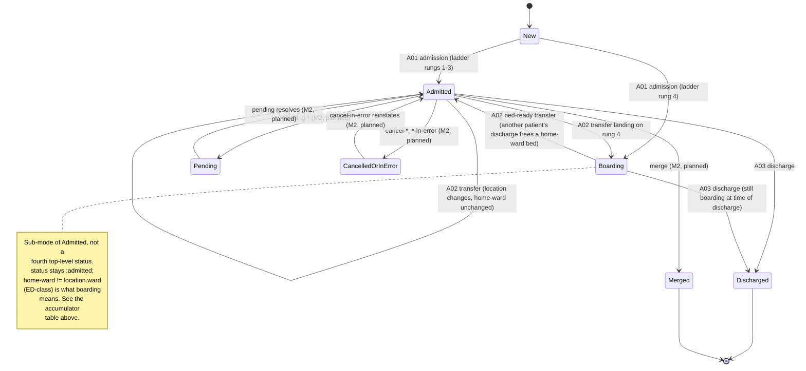

# Patient state model

This document specifies the patient lifecycle state machine: the shape
of the accumulator `ehr-testing-sim.engine/evolve` folds the
ground-truth log into (ADR-0008), the states and transitions that
accumulator moves through, and the event-validity table that will
double as `check.clj`'s invariant skeleton now and `InjectChurn`'s
applicability oracle later (M2). It formalizes what
[`docs/operational-models.md`](operational-models.md) describes in
prose — that document is authoritative on *policy* (the allocation
ladder, the taxonomy, the NPI decision); this one is authoritative on
the literal *shape* of the thing pathway generation and churn validity
will read and write.

## Design inputs: mined from upstream

Before formalizing the schema, two upstream sources were read
specifically for how each represents patient state — Synthea's
`Person`/`Module` (Java) and Simulated Hospital's `ir.PatientInfo`
(Go), verified against source 2026-07-26. One validates this project's
existing architecture; the other is both a checklist of fields still
missing and a cautionary tale about what happens without an event log.

**Synthea validates the accumulator/cursor split, and adds two
requirements.** Synthea splits patient state into workflow cursors and
a fact blackboard: `Person.attributes` is an open `Map<String,Object>`
shared by every concurrently running GMF module, and each module
stores its own current-state cursor inside that map, keyed by module
name. Clinical facts accumulate in a separate `HealthRecord`. This
project's shape already mirrors that split — the queue-carried
remaining pathway steps are the cursor, the patient accumulator is the
blackboard-plus-record — so this is read as validation, not as a
reason to change anything. Two things Synthea does that this project
must still account for:

1. **GMF guards query state-*visit history***, not a duplicated log.
   Conditional transitions like "PriorState X, within window" walk
   `Person.history`, the person's recorded trail of visited module
   states — a mutable-world approximation of an event log. When M5
   ports the GMF interpreter, `PriorState` guards compile to queries
   over *our* ground-truth log — typed, timestamped, and already
   authoritative (ADR-0008) — rather than to a second history
   structure. **The accumulator below does not carry its own visit
   history for this reason: the log is `Person.history` done right,
   and the interpreter reads the log directly when M5 lands.**
2. **An open `:attributes` sub-map is reserved now.** Synthea's
   modules coordinate through named blackboard attributes — one
   module sets a condition flag, another guards on it. This
   accumulator needs the same open extension point once the
   interpreter exists; it is reserved in the schema below
   (`:attributes`, `[:map-of :keyword :any]`) so nothing else claims
   the name between now and M5, even though nothing writes to it yet.

Also noted, for completeness rather than as a design constraint:
Synthea advances in fixed time ticks (roughly 7 days) because its
horizon is a lifetime. This project's encounter-horizon discrete-event
engine has no equivalent tick loop — GMF `Delay` states will compile
to scheduled wake-ups (M5), not ticks, when that milestone lands.

**Simulated Hospital's `ir.PatientInfo` is a field-by-field checklist,
and a cautionary tale about representing history without a log.**
Auditing this accumulator against `PatientInfo`'s fields surfaces real
gaps and one design lesson:

- **`Class`** (EMERGENCY / INPATIENT / OUTPATIENT / PREADMIT /
  RECURRING / OBSTETRICS, PV1-2) is tracked **separately from
  `Status`** in `PatientInfo`, and this accumulator does the same
  (`:class`, below) — lifecycle (`:status`: new/admitted/discharged)
  and registration category (`:class`) move independently. This is
  exactly the axis boarding needs: a boarding patient's `:class` is
  whatever it was at admission (typically `:inpatient`) throughout,
  regardless of which physical ward they're sitting in.
- **`VisitID`** per encounter (PV1-19) — not landed yet; flagged for
  whenever encounters become first-class (readmission scenarios, M2
  or later). Not part of the schema below.
- **Pending locations and expected admit/discharge/transfer
  datetimes** (the A14/A15-family pending events) carry *expected*
  times, a field class this project's events don't have yet. Flagged
  for the M2 churn milestone (`pending-*` step types), not designed
  here.
- **`ReadmissionIndicator`, attending doctor, account status** — small,
  cheap PV1 fields once each is seen; no design burden.

**The cautionary tale, worth recording as the worked example of why
the log-is-primitive decision (ADR-0008) pays for itself starting at
M2, not "someday":** `PatientInfo`'s location alone is *six* fields —
`Location`, `PriorLocation`, `PriorLocationForCancelTransfer`,
`PendingLocation`, `PriorPendingLocation`, and a prior for that one
too. The in-code comment on the third explains why: normal flow clears
`PriorLocation` after a transfer completes, so later messages omit it
— but `CancelTransfer` has to reinstate the value that was just
cleared, so it needs its own shadow copy to undo the clearing. Every
cancellable mutation in that codebase grows a bespoke shadow field to
hold whatever it might later need to undo. That field zoo *is* the
mutable-state workaround for not having an event log: without one,
"what was true before the thing I need to cancel" has nowhere to live
except a hand-maintained prior-value field, one per cancellable
mutation.

In this project's event-sourced engine, `:transfer-in-error`'s (M2)
`decide` reads the prior location by querying the log directly for
that patient's most recent location-setting event before the one being
cancelled, and the emitter derives PV1-6 (prior location) the same way
at message-build time. **One `:location` field in the accumulator,
plus a log query, replaces all six `PatientInfo` location fields.**
This is not a hoped-for benefit of ADR-0008 — it is the concrete
reason M2's cancel-family step types are expected to be cheap rather
than each growing their own shadow state.

## The accumulator

`ehr-testing-sim.engine/PatientState` (malli), the type
`evolve`'s fold produces and `decide` reads:

| Field | Type | Notes |
|---|---|---|
| `:mrn` | `:string` | Stable patient identifier; never reassigned. |
| `:status` | `[:enum :new :admitted :discharged]` | Lifecycle. Boarding is **not** a fourth status — see below. |
| `:class` | `[:enum :inpatient :emergency :outpatient :preadmit :recurring :obstetrics]`, optional until admission | PV1-2. Tracked separately from `:status` per `ir.PatientInfo`'s own separation (mined above) — registration category, not lifecycle. Distinct from a *ward's* `:class` (`:inpatient`/`:ed`, `docs/operational-models.md`'s facility config) — same word, two different things: one is what kind of patient this is, the other is what a ward is designated for. Set at admission, unchanged by transfer within M1's scope. |
| `:home-ward` | `:string`, ward id, nil until admission | The ward the pathway named — clinical intent (`docs/operational-models.md`'s own term for the rung-1/2 target). Diverges from `:location`'s ward exactly on rungs 3 (outlier) and 4 (boarding) of the allocation ladder. |
| `:location` | `[:map [:ward :string] [:bed :string] [:placement [:enum :licensed :surge]]]`, nil until admission | The patient's actual **physical** location, always concrete — never nil-bed, even while boarding (see worked example below). `:placement` is exactly the two values `docs/operational-models.md` specifies; ladder rungs 3 and 4 are distinguished from 1 and 2 not by a third placement value but by `:location`'s ward differing from `:home-ward` (see the table below). |
| `:attending` | `:string`, provider id, nil until admission | References `docs/operational-models.md`'s provider pool by id; rendered PV1-7 as `id^family^given` at emit time, not stored denormalized. |
| `:payer` | `:string`, payer id, nil until sampled | References the payer pool by id (Persona's job once it lands; engine patient-init until then, per `docs/operational-models.md`). Never re-sampled — the attribute-pool contract. |
| `:attributes` | `[:map-of :keyword :any]`, default `{}` | **Reserved, unused until M5.** The open blackboard Synthea's modules coordinate through (mined above) — named now so nothing else claims the key before the GMF interpreter lands. |

Deliberately absent, per the mining above: no visit-history field (the
log is the history — M5's interpreter queries it directly), no
`VisitID` (encounters aren't first-class yet), no shadow prior-location
fields (M2's cancel-family reads priors from the log).

**Staging note.** This table is the M1 target shape. The session that
lands `evolve`/`decide` (ADR-0008) ships `PatientState` with `:class`,
`:home-ward`, `:attending`, `:payer`, and `:attributes` present as
described here, but `:location` still in its pre-M1 shape — a bare
ward-name string, matching the v0 step set's own `:location` event
field — because the `{:ward :bed :placement}` structure only becomes
real alongside Milestone M1's allocation ladder. `:location` upgrades
to the map shape when that ladder lands, in the same change (the same
co-landing discipline as everywhere else in this project: a field
shape and the code that populates it meaningfully land together, not
ahead of each other).

### Worked example: boarding, precisely

A patient admitted to Renal, but Renal (and its surge) are full, boards
in an ED surge slot:

```
:status     :admitted
:class      :inpatient
:home-ward  "renal"
:location   {:ward "ed" :bed "ED-H03" :placement :surge}
```

`:location` is always where the patient physically *is* — this
deliberately departs from an earlier hypothesis (nil `:bed` while
administrative ward carries the target) floated ahead of this
document, because `docs/operational-models.md` itself is unambiguous
that boarding means "the patient's state simply carries a location
that isn't Renal while its status says Renal" — i.e. `:location` holds
the physical fact, and the administrative fact lives in the separate
`:home-ward` field this document introduces to make that prose
literal. `:home-ward "renal" ≠ :location.ward "ed"` **is** boarding —
no separate boolean flag is needed. The same mismatch with the
*other* member of the pair distinguishes outlier placement (rung 3:
`:home-ward` ≠ `:location.ward`, but `:location.ward`'s configured
`:class` is `:inpatient`, i.e. a real other ward, not ED) from
boarding (rung 4: `:location.ward`'s `:class` is `:ed`). Rungs 1 and 2
are the base case, `:home-ward = :location.ward`, distinguished from
each other only by `:placement`.

| Ladder rung | `:placement` | `:home-ward` vs `:location.ward` |
|---|---|---|
| 1. Home-ward licensed | `:licensed` | equal |
| 2. Home-ward surge | `:surge` | equal |
| 3. Other-ward licensed (outlier) | `:licensed` | differ; `:location.ward` is `:inpatient`-class |
| 4. Boarding | `:surge` | differ; `:location.ward` is `:ed`-class |

## States and transitions



Boarding is drawn as its own box only because a diagram needs a node
to hang the bed-ready-transfer transition on; per the accumulator
table, it is **not** a fourth value of `:status` — it is the
`:home-ward ≠ :location.ward` (ED-class) condition holding while
`:status` is `:admitted`. `Pending`, `CancelledOrInError`, and `Merged`
are M2's churn family, shown so this diagram doesn't need a redraw
when M2 lands additively — only new edges, no restructuring of what's
here.

## Event validity table

For each event type, the patient states in which the event is legal to
occur. This table does **double duty**, deliberately: it is the
skeleton `check.clj`'s invariant catalog implements directly (each row
becomes "event X's patient was in a legal state at the time," a
co-landing invariant per `AGENTS.md`), and it is the applicability
oracle `InjectChurn` (M2) will consult to decide where a churn event
can be legally inserted into an existing pathway — the same predicate
answers "was this legal when it happened" and "would this be legal to
insert here," because both ask the same question about the same
state.

| Event | Legal when | Illegal example |
|---|---|---|
| `:admission` | `:status = :new` | Admitting an already-admitted or already-discharged patient. |
| `:transfer` (incl. bed-ready) | `:status = :admitted` (Admitted or Boarding) | Transferring a patient who hasn't been admitted yet, or who's already discharged. |
| `:discharge` | `:status = :admitted` (Admitted or Boarding) | Discharging a patient not currently admitted, or discharging twice. |
| `:pending-*` (M2, planned) | `:status = :admitted`, not already pending | Double-pending; pending a non-admitted patient. |
| `:cancel-*` / `:*-in-error` (M2, planned) | The event class being cancelled must exist in this patient's log and not already be cancelled | Cancelling an event that never happened, or cancelling twice. |
| `:merge` (M2, planned) | Both MRNs exist; at least the surviving MRN is `:admitted` or reachable | Merging into/from an MRN that was never admitted, or a double merge. |

The current `check.clj` catalog (`timestamps-monotone`,
`discharge-follows-admission`) already encodes the `:discharge` row's
constraint in a more specific form (admission strictly precedes
discharge, not merely "some admission exists"); M1 formalizes the
`:admission` and `:transfer` rows as new invariants in the same change
that lands the `:transfer` step type (`AGENTS.md`'s co-landing
convention).
