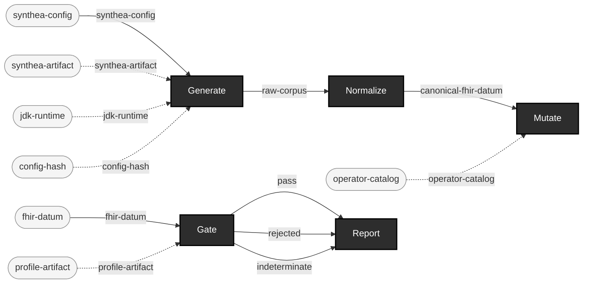

<!-- GENERATED by `make pipeline` from docs/pipeline.edn -- do not hand-edit.
     Edit docs/pipeline.edn and regenerate instead. -->

# Pipeline

This is the pipeline this repo builds: a fixed sequence of stages that turns a Synthea configuration into a mutated, gate-ready corpus. Each stage below is a resource equation -- inputs consumed, outputs produced, and a `{catalytic: ...}` set naming resources the stage uses without consuming (an engine artifact, a runtime, a versioned operator catalog); see [docs/notation.md](notation.md) for what that notation means before reading the equations cold.

The equations are the source of truth: [docs/pipeline.edn](pipeline.edn). A stage marked `# planned` below is designed but not yet built -- its equation and law are fixed, its implementation isn't.

## Equations

```
synthea-config × synthea-artifact × jdk-runtime × config-hash → raw-corpus  [Generate]  {catalytic: synthea-artifact, jdk-runtime, config-hash}
raw-corpus → canonical-fhir-datum  [Normalize]
canonical-fhir-datum × operator-catalog → mutant-fhir-datum + lineage-record  [Mutate]  {catalytic: operator-catalog}
# planned: Gate
fhir-datum × profile-artifact → pass + rejected + indeterminate  [Gate]  {catalytic: profile-artifact}
# planned: Report
pass × rejected × indeterminate → report  [Report]
```

## Diagram


