<!-- GENERATED by the string-diagram skill from docs/sim-theory-equations.txt
     (itself hand-derived from docs/sim-theory.edn -- see that file's own
     header for why no Clojure translator does this mechanically here, unlike
     ehr-testing-tools' `make pipeline`). Do not hand-edit the mermaid block
     below except as noted here. Regenerate with:

       python ../ehr-testing-tools/palgebra/tools/resource_equations_to_mermaid.py \
         docs/sim-theory-equations.txt -o docs/sim-theory-diagram.mermaid

     then paste the output back in below.

     MILESTONE M4 NOTE: this session's environment had no Python
     interpreter available, so the mermaid block's `payer-pool` wire
     (Persona's equation gained `payer-pool` as a real catalytic input,
     docs/sim-theory-equations.txt) was applied BY HAND, following the
     converter's own established conventions exactly (source-type node
     declaration, `.-> ` dashed catalytic wire syntax, light-rounded
     source styling) rather than mechanically regenerated. A future
     session with Python available should re-run the converter and
     diff against this block to confirm the hand-applied change matches
     what the tool itself would have produced -- recorded here so this
     isn't silently assumed identical. -->

# The simulator's resource theory — diagram

The whole *want* from [`sim-theory.edn`](sim-theory.edn) / [`sim-theory.md`](sim-theory.md), rendered as a Mermaid string diagram via the `string-diagram` skill (`.agents/skills/string-diagram/SKILL.md`) over [`sim-theory-equations.txt`](sim-theory-equations.txt), the equations file's own companion representation (skill Step 3: always deliver both).

Verified in this render:

- **The `pathway-ir` union renders as a funnel/merge node** — `UnionPathwayIr`, green inverted-trapezoid, wiring both `compiled-pathway` and `authored-pathway` in and `pathway-ir` out — exactly ehr-testing-tools' own established convention for a union resource (`docs/notation.md`, `ehr-testing-tools.pipeline/union-resource->equation-line`), reused here rather than invented.
- **`SystemUnderTest` and `ToolsCorpusIntake` render dashed** — both carry `{external: true}`, the same device tools' own external stages use.

```mermaid
flowchart LR

    %% --- Source types (raw inputs, not produced by any operation) ---
    authored_pathway(["authored-pathway"])
    demographics_tables(["demographics-tables"])
    feed_statistics(["feed-statistics"])
    gmf_interpreter(["gmf-interpreter"])
    gmf_module_set(["gmf-module-set"])
    hl7_parser_dep(["hl7-parser-dep"])
    invariant_catalog(["invariant-catalog"])
    message_type_registry(["message-type-registry"])
    order_profiles(["order-profiles"])
    payer_pool(["payer-pool"])
    provider_pool(["provider-pool"])
    sim_config(["sim-config"])
    snomed_icd10_map(["snomed-icd10-map"])

    %% --- Operations (boxes; spiders use distinct shapes) ---
    Persona["Persona"]
    RunModules["RunModules"]
    CompileTrajectory["CompileTrajectory"]
    InjectChurn["InjectChurn"]
    Execute["Execute"]
    Check["Check"]
    EmitHL7["EmitHL7"]
    EmitState["EmitState"]
    Package["Package"]
    Calibrate["Calibrate"]
    UnionPathwayIr[\"UnionPathwayIr"/]
    SystemUnderTest["SystemUnderTest"]
    ToolsCorpusIntake["ToolsCorpusIntake"]

    %% --- Wires (typed connections) ---
    %% Arrow 20: Persona
    sim_config -- sim-config --> Persona
    demographics_tables -. demographics-tables .-> Persona
    payer_pool -. payer-pool .-> Persona

    %% Arrow 23: RunModules
    Persona -- persona --> RunModules
    gmf_module_set -. gmf-module-set .-> RunModules
    gmf_interpreter -. gmf-interpreter .-> RunModules

    %% Arrow 26: CompileTrajectory
    RunModules -- clinical-trajectory --> CompileTrajectory

    %% Arrow 28: InjectChurn
    UnionPathwayIr -- pathway-ir --> InjectChurn
    Calibrate -- churn-profile --> InjectChurn

    %% Arrow 30: Execute
    InjectChurn -- operational-pathway --> Execute
    provider_pool -. provider-pool .-> Execute
    order_profiles -. order-profiles .-> Execute

    %% Arrow 32: Check
    Execute -- ground-truth-log --> Check
    invariant_catalog -. invariant-catalog .-> Check

    %% Arrow 34: EmitHL7
    Execute -- ground-truth-log --> EmitHL7
    hl7_parser_dep -. hl7-parser-dep .-> EmitHL7
    message_type_registry -. message-type-registry .-> EmitHL7
    snomed_icd10_map -. snomed-icd10-map .-> EmitHL7

    %% Arrow 37: EmitState
    Execute -- state-history --> EmitState

    %% Arrow 40: Package
    EmitHL7 -- hl7v2-stream --> Package
    Execute -- ground-truth-log --> Package

    %% Arrow 43: Calibrate
    Package -- sim-corpus --> Calibrate
    feed_statistics -- feed-statistics --> Calibrate
    Calibrate -- churn-profile --> Calibrate
    Calibrate -- churn-profile --> churn_profile

    %% Arrow 46: UnionPathwayIr
    CompileTrajectory -- compiled-pathway --> UnionPathwayIr
    authored_pathway -- authored-pathway --> UnionPathwayIr

    %% Arrow 49: SystemUnderTest
    EmitHL7 -- hl7v2-stream --> SystemUnderTest

    %% Arrow 50: ToolsCorpusIntake
    Package -- sim-corpus --> ToolsCorpusIntake

    %% --- Styling ---

    %% Operations: dark boxes (fan=blue, funnel=green, enrichment=outlined, gate=purple, external=dashed)
    style Persona fill:#2d2d2d,stroke:#000,color:#fff,stroke-width:2px
    style RunModules fill:#2d2d2d,stroke:#000,color:#fff,stroke-width:2px
    style CompileTrajectory fill:#2d2d2d,stroke:#000,color:#fff,stroke-width:2px
    style InjectChurn fill:#2d2d2d,stroke:#000,color:#fff,stroke-width:2px
    style Execute fill:#2d2d2d,stroke:#000,color:#fff,stroke-width:2px
    style Check fill:#2d2d2d,stroke:#000,color:#fff,stroke-width:2px
    style EmitHL7 fill:#2d2d2d,stroke:#000,color:#fff,stroke-width:2px
    style EmitState fill:#2d2d2d,stroke:#000,color:#fff,stroke-width:2px
    style Package fill:#2d2d2d,stroke:#000,color:#fff,stroke-width:2px
    style Calibrate fill:#2d2d2d,stroke:#000,color:#fff,stroke-width:2px
    style UnionPathwayIr fill:#1b5e20,stroke:#2e7d32,color:#c8e6c9,stroke-width:2px
    style SystemUnderTest fill:#2d2d2d,stroke:#000,color:#fff,stroke-width:2px,stroke-dasharray: 5 5
    style ToolsCorpusIntake fill:#2d2d2d,stroke:#000,color:#fff,stroke-width:2px,stroke-dasharray: 5 5

    %% Source types: light rounded
    style authored_pathway fill:#f5f5f5,stroke:#999,color:#333
    style demographics_tables fill:#f5f5f5,stroke:#999,color:#333
    style feed_statistics fill:#f5f5f5,stroke:#999,color:#333
    style gmf_interpreter fill:#f5f5f5,stroke:#999,color:#333
    style gmf_module_set fill:#f5f5f5,stroke:#999,color:#333
    style hl7_parser_dep fill:#f5f5f5,stroke:#999,color:#333
    style invariant_catalog fill:#f5f5f5,stroke:#999,color:#333
    style message_type_registry fill:#f5f5f5,stroke:#999,color:#333
    style order_profiles fill:#f5f5f5,stroke:#999,color:#333
    style payer_pool fill:#f5f5f5,stroke:#999,color:#333
    style provider_pool fill:#f5f5f5,stroke:#999,color:#333
    style sim_config fill:#f5f5f5,stroke:#999,color:#333
    style snomed_icd10_map fill:#f5f5f5,stroke:#999,color:#333
```

- **Gap, reported rather than faked:** the converter has no visual axis for `:built` vs `:planned` — only `{external: true}` (dashed) exists, and ehr-testing-tools' own history (`docs/notation.md`, "External stages") records that reusing dashed rendering for *planned-but-will-be-built-here* stages was tried once and deliberately dropped, because it conflates "not yet built" with "never built by this repo," which is a different claim. `ehr-testing-tools.pipeline/pipeline->equations-text` resolves this the same way this session does: a `:planned` stage gets a `# planned: <Label>` *comment* line in the equations text — documentary only, "not a distinct visual state" (that namespace's own docstring). So below, every stage box is visually identical dark-solid except the two external stages (dashed) and the union (green funnel); built vs. planned is legible only in [`sim-theory-equations.txt`](sim-theory-equations.txt)'s `# planned:` comments, not in the diagram itself. This is the same limitation tools carries in its own pipeline diagram, not a regression introduced here.

