<!-- GENERATED by `make use-cases` from docs/use-cases.edn -- do not hand-edit.
     Edit docs/use-cases.edn and regenerate instead. -->

# Use Cases

What you can do with this repo, formally: one entry per use case, each anchored to the resource equations (`docs/notation.md`) it actually composes from `docs/pipeline.edn`'s own built stages. An `{external: true}` stage in a case's equations names a black-box component the use case's own author fills in -- code this repo doesn't implement and makes no claim about; a `{spider: funnel}` merge node is a union resource (`docs/notation.md`) wherever a case's sources genuinely vary. Maturity here is a per-use-case honesty label distinct from `README.md`'s per-capability table -- see the header comment of `docs/use-cases.edn` for what each label means.

Each case answers **what do I type** as well as what you get. Every command in a **You type:** strip was run, once, locally, before it was committed here -- see the commit that added it for the dated evidence. Where a case has no strip, it is because this repo genuinely doesn't drive that case end to end (an `{external: true}` stage is yours to run, or the case is `planned`); those cases say so rather than showing an invocation that has never run. Strips use the same `make ehr ARGS="..."` convention as [README.md](../README.md)'s Quickstart, and `$UPPERCASE` names mark values you supply. For what a flag does see [cli.md](cli.md) (or `ehr help <group>`), for operator ids [operators.md](operators.md), for locator syntax [locators.md](locators.md), for reading a verdict [judge-calibration.md](judge-calibration.md), and for the shape of what lands on disk [formats.md](formats.md).

## Generate conforming synthetic data

**Audience:** Teams needing realistic FHIR test data without hand-authoring it, for any downstream use they choose.

**You bring:** A Synthea configuration (population size, seed, clinician seed, reference date).

**You get:** A byte-reproducible synthetic corpus, from a manifest that regenerates it byte-for-byte (EXP-A4).

**Maturity:** usable

**You type:**

```sh
# One-time: the pinned Synthea distribution and the JDK it runs on,
# into the local artifact cache (~/.cache/ehr-testing-tools/artifacts).
make ehr ARGS="artifact fetch --name synthea --version 4.0.0"
make ehr ARGS="artifact fetch --name temurin-jdk --version 17.0.19+10"

# Generate. Every value here is pinned on purpose: --seed and
# --clinician-seed fix Synthea's two RNGs, --reference-date fixes what
# "now" means. Leave any of them out and the corpus stops being
# reproducible.
make ehr ARGS="corpus generate --config-path config/synthea/synthea.properties \
  --seed 100 --clinician-seed 555 --population 10 \
  --reference-date 20260101 --output-dir out/demo-corpus"

# What you got: FHIR R4 bundles, and the manifest that regenerates them.
ls out/demo-corpus/fhir
cat out/demo-corpus/manifest.edn
```

Flags and their defaults: [cli.md](cli.md#ehr-corpus-generate), or `ehr help corpus` at the shell. What each manifest field means: [formats.md](formats.md#the-corpus-manifest). Regenerating this corpus later *from* that manifest is its own case -- [Reproduction packages](#reproduction-packages).

```
synthea-config × synthea-artifact × jdk-runtime × config-hash → raw-corpus  [Generate]  {catalytic: synthea-artifact, jdk-runtime, config-hash}
raw-corpus → canonical-fhir-datum  [Normalize]
```

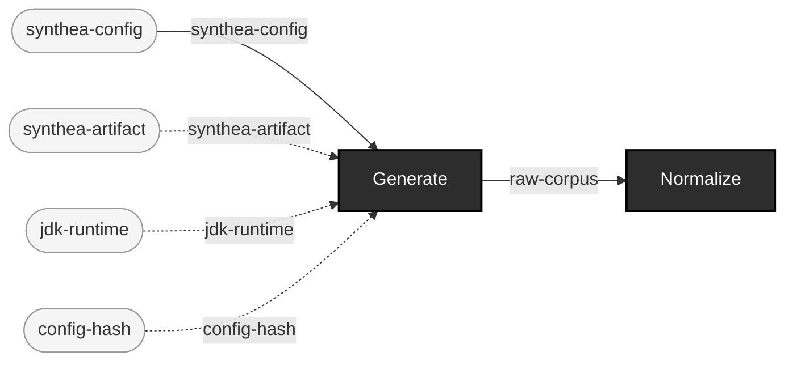

## Generate controlled-fault data

**Audience:** Teams needing deliberately broken data for any downstream use, with full traceability back to what was broken and why.

**You bring:** A base corpus (generated or intaken) plus a chosen defect operator and locator.

**You get:** A mutant with a lineage record naming the exact base-spec constraint it violates -- never produced without one.

**Maturity:** experimental

**You type:**

```sh
# The catalog you are choosing from: every operator, and the
# constraint its output violates.
make ehr ARGS="corpus operators --format fhir"

# A base corpus to break, if you don't already have one.
make ehr ARGS="corpus generate --config-path config/synthea/synthea.properties \
  --seed 100 --clinician-seed 555 --population 10 \
  --reference-date 20260101 --output-dir out/demo-corpus"

# Pick one patient bundle. --input takes a file, or a directory of
# files sharing one locator's shape; a generated corpus also holds two
# non-patient bundles, so this picks a patient file specifically.
PATIENT_FILE=$(ls out/demo-corpus/fhir/*.json | grep -v -e hospitalInformation -e practitionerInformation | head -1)

# Break exactly one element, at exactly one locator.
make ehr ARGS="corpus mutate --input $PATIENT_FILE \
  --operator-id remove-required-element --locator-path entry[0].resource.gender \
  --output-dir out/demo-mutants"

# The mutant is never written without this: the lineage record naming
# the operator, the locator, and the constraint the result violates.
cat out/demo-mutants/lineage/*.lineage.edn
```

Operator ids and what each one edits: [operators.md](operators.md). Locator syntax for both formats: [locators.md](locators.md). The lineage record's own fields: [formats.md](formats.md#the-lineage-record). Whether a given gate actually *convicts* a given mutant is a measured property rather than a promise -- [judge-calibration.md](judge-calibration.md) is where a surprising gate result gets explained.

```
canonical-fhir-datum × operator-catalog → mutant-fhir-datum + lineage-record  [Mutate]  {catalytic: operator-catalog}
```

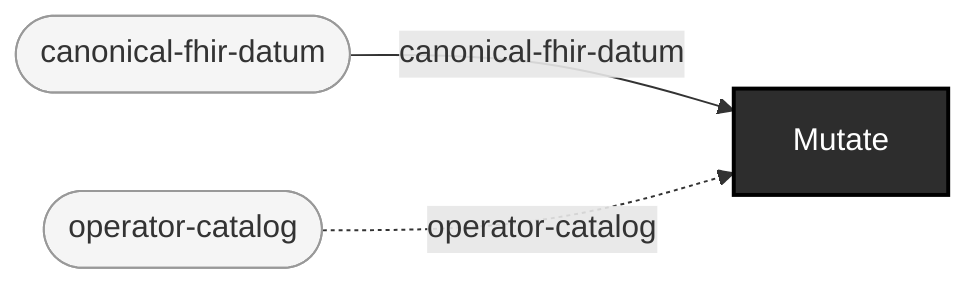

## Test a validator/gate with generated + mutated data

**Audience:** Anyone standing up a new gate/validator who needs to prove it actually detects what it claims to check for, not just trust the vendor's claim.

**You bring:** Nothing beyond the pinned artifacts -- this repo generates and mutates its own test data.

**You get:** Contract pairing: for each defect operator, proof that the gate produces a new, locator-matching finding -- the exemplar is P5's own contract-pairing suite (test-integration/ehr_testing_tools/contract_pairing_test.clj) against the real official FHIR validator.

**Maturity:** usable

**You type:** no strip -- this repo doesn't drive this use case end to end, so there is no command sequence to copy. You bring: Nothing beyond the pinned artifacts -- this repo generates and mutates its own test data.

```
synthea-config × synthea-artifact × jdk-runtime × config-hash → raw-corpus  [Generate]  {catalytic: synthea-artifact, jdk-runtime, config-hash}
raw-corpus → canonical-fhir-datum  [Normalize]
canonical-fhir-datum × operator-catalog → mutant-fhir-datum + lineage-record  [Mutate]  {catalytic: operator-catalog}
canonical-fhir-datum × mutant-fhir-datum × foreign-file → datum  [UnionDatum]  {spider: funnel}
datum × validator-artifact × runtime × hapi-hl7v2-dep × profile-artifact → pass + rejected + indeterminate  [Gate]  {catalytic: validator-artifact, runtime, hapi-hl7v2-dep, profile-artifact}
```

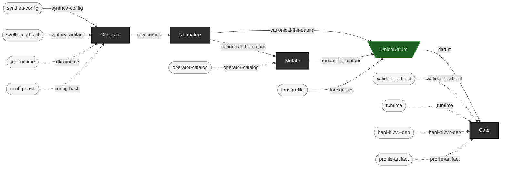

## Judge user-supplied data: intake -> gate -> report

**Audience:** Anyone gating a corpus they didn't generate themselves -- an ingestion pipeline's own output, a partner's export, anything foreign.

**You bring:** Your own corpus (foreign files, any origin).

**You get:** A conformance report: verdicts plus findings, normalized to the shared finding envelope. Real-world, profile-stamped corpora carry pre-existing findings (EXP-C5) -- reach for --baseline mode (docs/judge-calibration.md) when file-level verdict alone can't discriminate old noise from a new problem.

**Maturity:** usable

**You type:** no strip -- this repo doesn't drive this use case end to end, so there is no command sequence to copy. You bring: Your own corpus (foreign files, any origin).

```
foreign-file → catalog-entry + intake-record  [Intake]
canonical-fhir-datum × mutant-fhir-datum × foreign-file → datum  [UnionDatum]  {spider: funnel}
datum × validator-artifact × runtime × hapi-hl7v2-dep × profile-artifact → pass + rejected + indeterminate  [Gate]  {catalytic: validator-artifact, runtime, hapi-hl7v2-dep, profile-artifact}
pass × rejected × indeterminate → report  [Report]
```

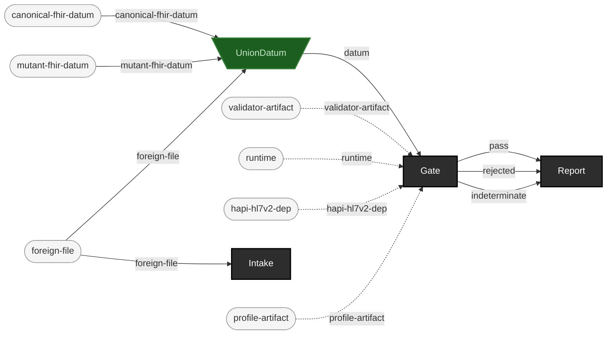

## Black-box transform surround

**Audience:** Teams whose actual system under test is a transform (an ingestion/mapping/ETL step) this repo doesn't implement and shouldn't have to.

**You bring:** Your own transform, run outside this repo's own pipeline.

**You get:** Conformance evidence (Gate) and equivalence evidence (Check, against an expected corpus) surrounding a black box you never have to instrument -- only its declared inputs/outputs.

**Maturity:** illustrative

**You type:** no strip -- this repo doesn't drive this use case end to end, so there is no command sequence to copy. You bring: Your own transform, run outside this repo's own pipeline.

```
synthea-config × synthea-artifact × jdk-runtime × config-hash → raw-corpus  [Generate]  {catalytic: synthea-artifact, jdk-runtime, config-hash}
raw-corpus → canonical-fhir-datum  [Normalize]
canonical-fhir-datum → transform-output  [Transform]  {external: true}
transform-output × validator-artifact × runtime × hapi-hl7v2-dep × profile-artifact → pass + rejected + indeterminate  [Gate]  {catalytic: validator-artifact, runtime, hapi-hl7v2-dep, profile-artifact}
transform-output × expected-corpus × assertion-set × canonicalizer-set → pass + rejected  [Check]  {catalytic: expected-corpus, assertion-set, canonicalizer-set}
```

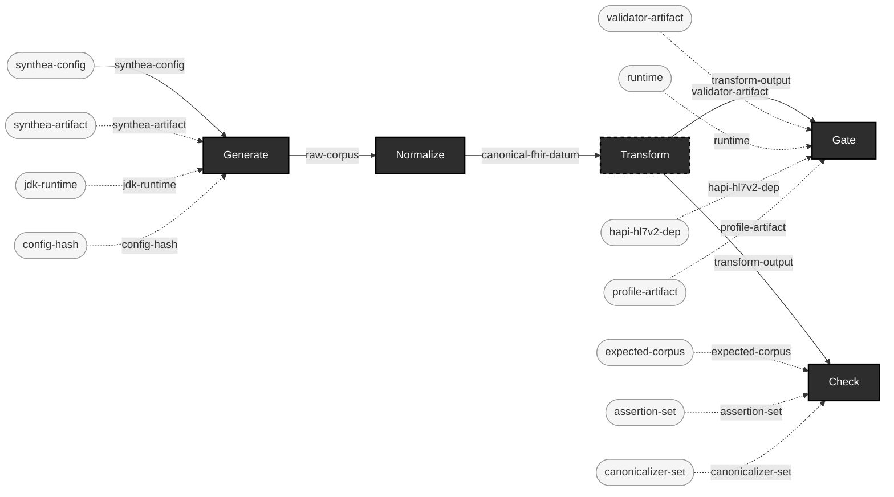

## Mutation-adequacy of the user's own checks

**Audience:** Teams who already have their own validation logic and want to know how good it actually is, not just that it exists.

**You bring:** Your own validation logic (external to this repo) plus a corpus.

**You get:** An adequacy score: of the defects this repo's operators inject, how many does your own validation actually catch? A validation suite that never rejects a mutant is exactly as informative as one that always does.

**Maturity:** illustrative

**You type:** no strip -- this repo doesn't drive this use case end to end, so there is no command sequence to copy. You bring: Your own validation logic (external to this repo) plus a corpus.

```
canonical-fhir-datum × operator-catalog → mutant-fhir-datum + lineage-record  [Mutate]  {catalytic: operator-catalog}
mutant-fhir-datum → your-validation-verdict  [YourValidation]  {external: true}
```

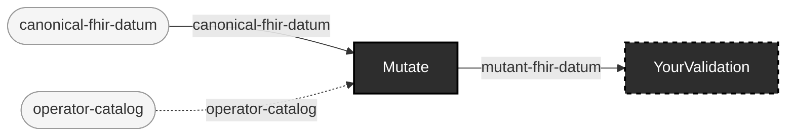

## Regression baselining / drift detection

**Audience:** Teams gating the same corpus (or corpus shape) repeatedly over time -- CI runs, periodic re-validation of a stable pipeline.

**You bring:** A corpus you gate repeatedly, and the report from the last run you trusted.

**You get:** What changed: judge.report/diff-reports compares two full reports (every changed verdict, added/removed file, appeared/disappeared code); --baseline mode (docs/judge-calibration.md) answers the narrower did-anything-NEW-appear question for a single run against a captured baseline.

**Maturity:** usable

**You type:** no strip -- this repo doesn't drive this use case end to end, so there is no command sequence to copy. You bring: A corpus you gate repeatedly, and the report from the last run you trusted.

```
datum × validator-artifact × runtime × hapi-hl7v2-dep × profile-artifact → pass + rejected + indeterminate  [Gate]  {catalytic: validator-artifact, runtime, hapi-hl7v2-dep, profile-artifact}
pass × rejected × indeterminate → report  [Report]
```

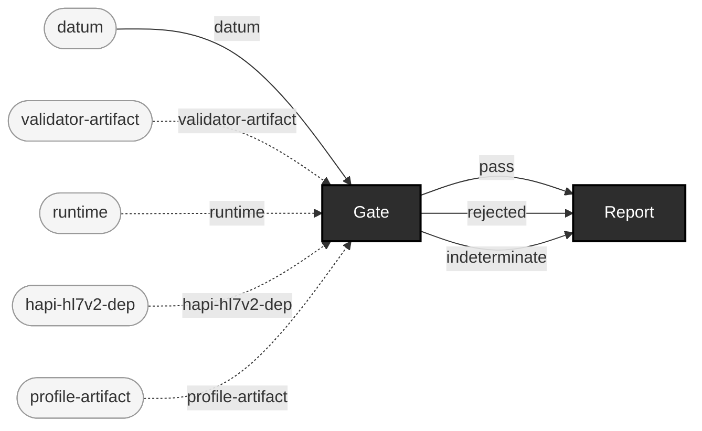

## Differential A/B of two transform versions

**Audience:** Teams upgrading their own transform/mapping step who need to know exactly where the new version's output diverges from the old.

**You bring:** The same input corpus, run through two versions of your own transform.

**You get:** An equivalence report from Check: the old version's output as the expected corpus, the new version's output as the candidate -- every divergence reported with a locator path.

**Maturity:** illustrative

**You type:** no strip -- this repo doesn't drive this use case end to end, so there is no command sequence to copy. You bring: The same input corpus, run through two versions of your own transform.

```
canonical-fhir-datum → expected-corpus  [OldTransform]  {external: true}
canonical-fhir-datum → new-transform-output  [NewTransform]  {external: true}
new-transform-output × expected-corpus × assertion-set × canonicalizer-set → pass + rejected  [Check]  {catalytic: expected-corpus, assertion-set, canonicalizer-set}
```

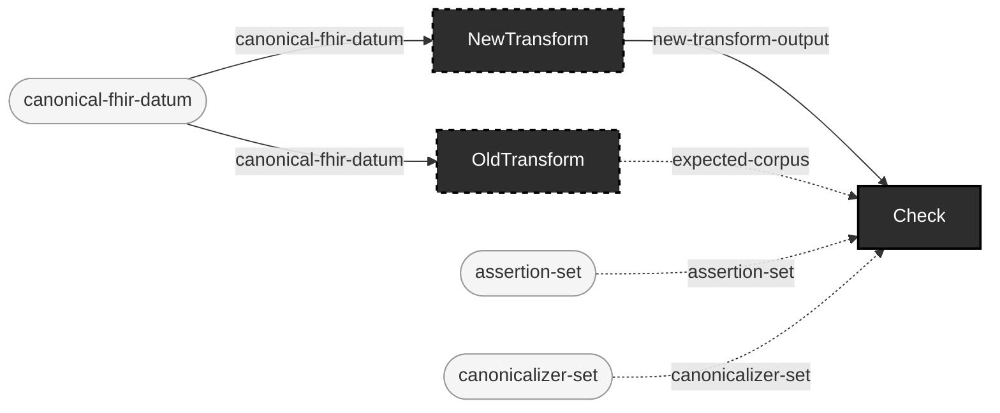

## Acceptance QA of delivered/vendor corpora

**Audience:** Teams accepting a delivered corpus from a vendor or partner before it enters their own pipeline.

**You bring:** A vendor-delivered corpus.

**You get:** Cataloging (Intake, with content-hash provenance) plus a gate verdict, before you accept delivery -- an acceptance decision backed by evidence, not a spot check.

**Maturity:** usable

**You type:** no strip -- this repo doesn't drive this use case end to end, so there is no command sequence to copy. You bring: A vendor-delivered corpus.

```
foreign-file → catalog-entry + intake-record  [Intake]
canonical-fhir-datum × mutant-fhir-datum × foreign-file → datum  [UnionDatum]  {spider: funnel}
datum × validator-artifact × runtime × hapi-hl7v2-dep × profile-artifact → pass + rejected + indeterminate  [Gate]  {catalytic: validator-artifact, runtime, hapi-hl7v2-dep, profile-artifact}
```

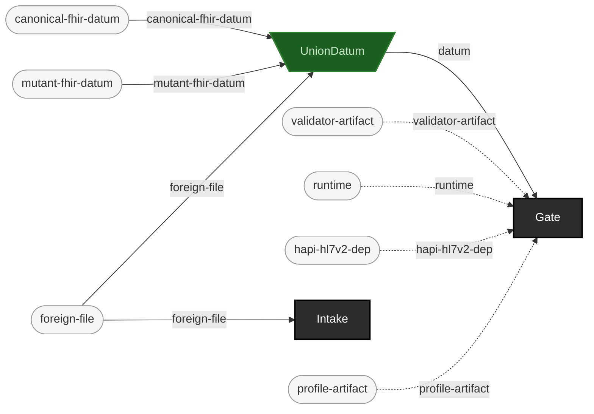

## Reproduction packages

**Audience:** Anyone who needs to hand someone else (a teammate, a reviewer, a future self) something that regenerates an exact corpus, not just the corpus itself.

**You bring:** Nothing beyond the pinned artifacts -- the manifest already names everything else.

**You get:** A manifest (config hash, seeds, artifact hashes, forced environment) that reproduces the exact corpus byte-for-byte, proven in EXP-A4 from a freshly emptied artifact cache.

**Maturity:** usable

**You type:**

```sh
# Generate once.
make ehr ARGS="corpus generate --config-path config/synthea/synthea.properties \
  --seed 100 --clinician-seed 555 --population 10 \
  --reference-date 20260101 --output-dir out/repro-a"

# The manifest IS the reproduction package: config hash, both seeds,
# the sha256 of the Synthea jar and of the JDK, the forced locale and
# timezone. Hand someone this file rather than the corpus.
cat out/repro-a/manifest.edn

# There is no regenerate-from-manifest verb: you read the settings
# back out of the manifest and pass them in again -- later, elsewhere,
# from an empty artifact cache.
make ehr ARGS="corpus generate --config-path config/synthea/synthea.properties \
  --seed 100 --clinician-seed 555 --population 10 \
  --reference-date 20260101 --output-dir out/repro-b"

# Same corpus? Ask this repo's own equivalence judge, pairing files
# by content hash.
make ehr ARGS="check out/repro-b/fhir --expected out/repro-a/fhir --pair-by hash"
```

Why `--pair-by hash` rather than `diff -r`: two of Synthea's own output filenames (`hospitalInformation<timestamp>.json`, `practitionerInformation<timestamp>.json`) embed a wall-clock export timestamp no seed can pin, while their *contents* are identical run over run. [EXP-A4](experiments/EXP-A4-results.md) found exactly this and registered `:strip-run-timestamp-suffix` as a canonicalizer for it -- so the byte-identity claim is byte-identity *modulo* recorded canonicalizations, and pairing by content hash is the shell-level way to ask the same question. `check`'s flags: [cli.md](cli.md#ehr-check).

```
synthea-config × synthea-artifact × jdk-runtime × config-hash → raw-corpus  [Generate]  {catalytic: synthea-artifact, jdk-runtime, config-hash}
```

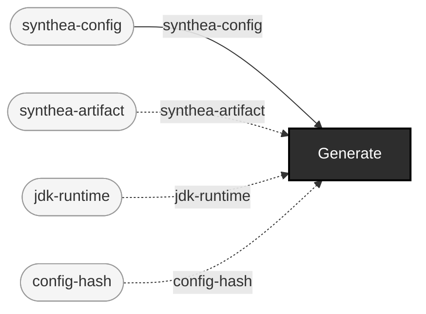

## Audit/regulatory evidence trail

**Audience:** Teams needing to show, after the fact, exactly what test data was used, what was deliberately broken, and what a gate found -- an audit or regulatory review, not just an internal sanity check.

**You bring:** A corpus that's been through generation, mutation, and gating.

**You get:** A hash-linked, self-verifying provenance chain: lineage records (Merkle-style, correction-only-by-new-record), manifests, and reports, each independently checkable -- assembling these into one shareable evidence package is future work, not yet a single command.

**Maturity:** experimental

**You type:** no strip -- this repo doesn't drive this use case end to end, so there is no command sequence to copy. You bring: A corpus that's been through generation, mutation, and gating.

```
canonical-fhir-datum × operator-catalog → mutant-fhir-datum + lineage-record  [Mutate]  {catalytic: operator-catalog}
pass × rejected × indeterminate → report  [Report]
```

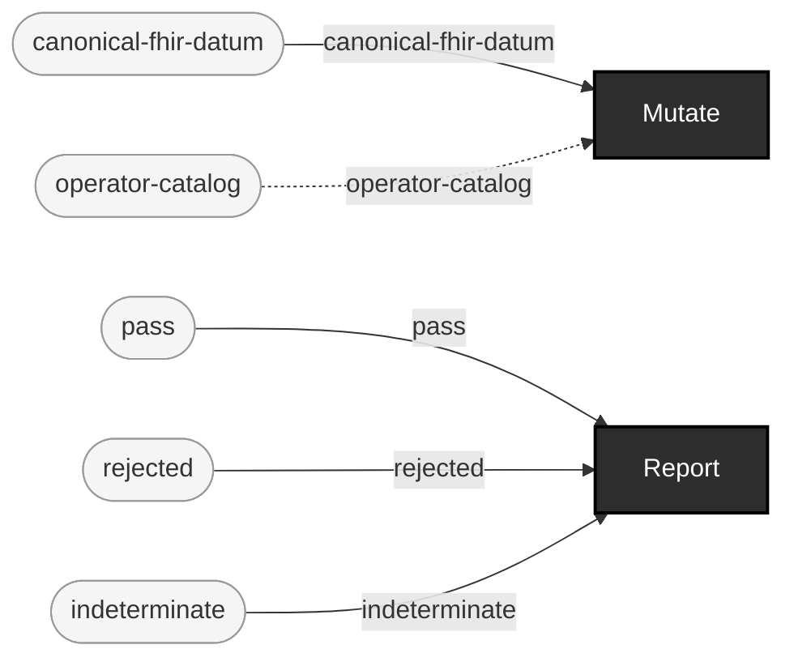

## Judge-tier calibration studies

**Audience:** Anyone who needs to know, precisely and with evidence, what a given judge tier actually catches before they trust a green run against it.

**You bring:** A set of defect operators and a judge tier you want characterized.

**You get:** A per-{operator, locator} classification of what that tier detects, misses, or can only partially resolve -- docs/judge-calibration.md is exactly this, the first instance, derived from EXP-C5's own method.

**Maturity:** usable

**You type:** no strip -- this repo doesn't drive this use case end to end, so there is no command sequence to copy. You bring: A set of defect operators and a judge tier you want characterized.

```
canonical-fhir-datum × operator-catalog → mutant-fhir-datum + lineage-record  [Mutate]  {catalytic: operator-catalog}
datum × validator-artifact × runtime × hapi-hl7v2-dep × profile-artifact → pass + rejected + indeterminate  [Gate]  {catalytic: validator-artifact, runtime, hapi-hl7v2-dep, profile-artifact}
```

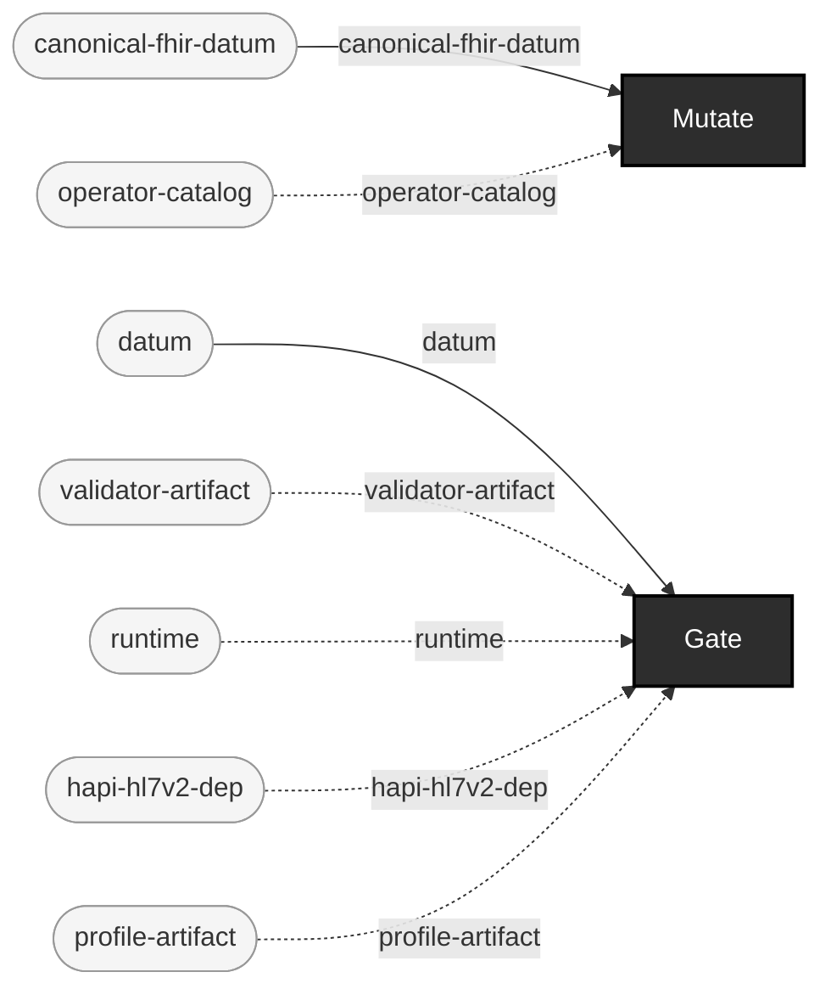

## Training material

**Audience:** Anyone teaching what a given defect class looks like -- onboarding, a workshop, a documentation example.

**You bring:** Nothing -- generate a small corpus and mutate it with known operators.

**You get:** Labeled before/after pairs: each lineage record names the exact base-spec constraint its mutant violates, ready to use as a worked example.

**Maturity:** illustrative

**You type:**

```sh
# A small corpus to teach from.
make ehr ARGS="corpus generate --config-path config/synthea/synthea.properties \
  --seed 100 --clinician-seed 555 --population 5 \
  --reference-date 20260101 --output-dir out/teaching-corpus"
PATIENT_FILE=$(ls out/teaching-corpus/fhir/*.json | grep -v -e hospitalInformation -e practitionerInformation | head -1)

# One run per defect class you want to show. Each writes a mutant
# plus a lineage record; that pair is the worked example.
make ehr ARGS="corpus mutate --input $PATIENT_FILE \
  --operator-id malformed-date --locator-path entry[0].resource.birthDate \
  --output-dir out/teaching/malformed-date"
make ehr ARGS="corpus mutate --input $PATIENT_FILE \
  --operator-id invalid-code-value --locator-path entry[0].resource.gender \
  --output-dir out/teaching/invalid-code-value"

# The label: what was broken, where, and which constraint that violates.
cat out/teaching/malformed-date/lineage/*.lineage.edn

# The value itself, before and after.
grep -o '"birthDate"[^,]*' "$PATIENT_FILE" | head -1
grep -o '"birthDate"[^,]*' out/teaching/malformed-date/*.json | head -1
```

A mutant is written as canonical JSON (one line); Synthea's own output is pretty-printed. A raw `diff` between the two is therefore ~60,000 lines of reformatting and not the teaching artifact -- the lineage record and the one changed value are. Operator ids: [operators.md](operators.md); locator syntax: [locators.md](locators.md); the lineage record's fields: [formats.md](formats.md#the-lineage-record). This case is `illustrative` because no shipped example pipeline runs it end to end, not because the commands don't run: these were run, 2026-07-26.

```
canonical-fhir-datum × operator-catalog → mutant-fhir-datum + lineage-record  [Mutate]  {catalytic: operator-catalog}
```


## Bring-your-own-generator augmentation

**Audience:** Teams with their own generator (or none at all, just a foreign corpus) who want this repo's mutation, lineage, and gating on top, without reimplementing generation.

**You bring:** A corpus from a generator this repo doesn't implement.

**You get:** This repo's own mutation/lineage/gate machinery applied to a foreign corpus -- today this requires the foreign corpus to already be canonical-fhir-datum-shaped (FHIR JSON matching corpus.mutate's own substrate); a general foreign-format adapter into Mutate is future work, stated honestly rather than implied.

**Maturity:** planned

**You type:** no strip -- this repo doesn't drive this use case end to end, so there is no command sequence to copy. You bring: A corpus from a generator this repo doesn't implement.

```
foreign-file → catalog-entry + intake-record  [Intake]
foreign-file × operator-catalog → mutant-fhir-datum + lineage-record  [Mutate]  {catalytic: operator-catalog}
```

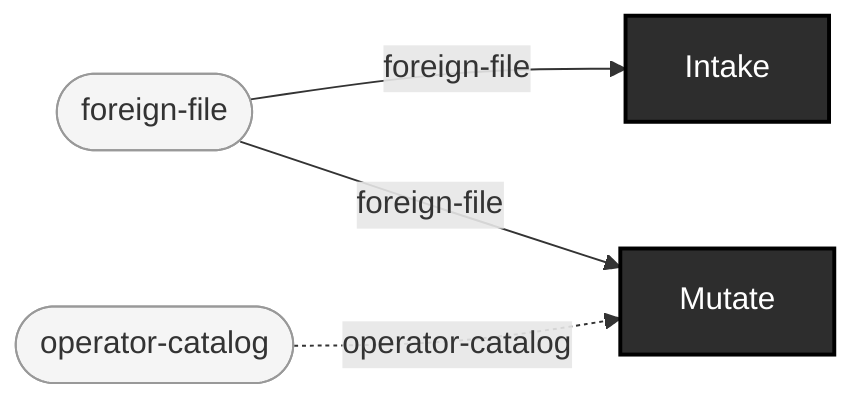
