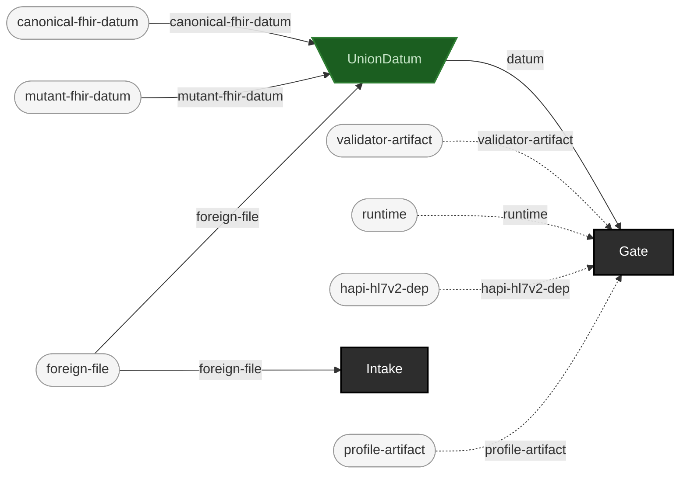

<!-- GENERATED by `make use-cases` from components/corpus/docs/use-cases.edn (case acceptance-qa-of-vendor-corpora) -- do not hand-edit.
     Edit components/corpus/docs/use-cases.edn and regenerate instead. -->

# Acceptance QA of delivered/vendor corpora

**Audience:** Teams accepting a delivered corpus from a vendor or partner before it enters their own pipeline.

**You bring:** A vendor-delivered corpus.

**You get:** Cataloging (Intake, with content-hash provenance) plus a gate verdict, before you accept delivery -- an acceptance decision backed by evidence, not a spot check.

**Maturity:** usable

**You type:**

```sh
# The delivered corpus, as received.
VENDOR_CORPUS=components/corpus/test-fixtures/v2

# 1. Catalog before you accept: a content hash per file, and one
#    batch record naming the source and the date you received it.
bin/ehrt corpus intake --path $VENDOR_CORPUS \
  --label acme-delivery --received 2026-07-26 \
  --out out/acceptance/intake
cat out/acceptance/intake/intake-record.edn

# 2. Gate it, and keep the report: that is the evidence behind the
#    acceptance decision, rather than a spot check.
bin/ehrt gate v2 $VENDOR_CORPUS --report out/acceptance/gate-report.edn
```

The intake record's `:catalog-hash` is the sha256 of the catalog file's own bytes, so "this is the delivery I accepted" is later checkable against the record rather than against memory ([formats.md](../formats.md)). The gate's exit code is the acceptance decision in machine-readable form -- 0 accept, 1 rejected, 3 the aggregate contains `:no-verdict` and you have not said how to treat it ([cli.md](../cli.md#exit-codes)).

```
foreign-file → catalog-entry + intake-record  [Intake]
canonical-fhir-datum × mutant-fhir-datum × foreign-file → datum  [UnionDatum]  {spider: funnel}
datum × validator-artifact × runtime × hapi-hl7v2-dep × profile-artifact → pass + rejected + indeterminate  [Gate]  {catalytic: validator-artifact, runtime, hapi-hl7v2-dep, profile-artifact}
```


