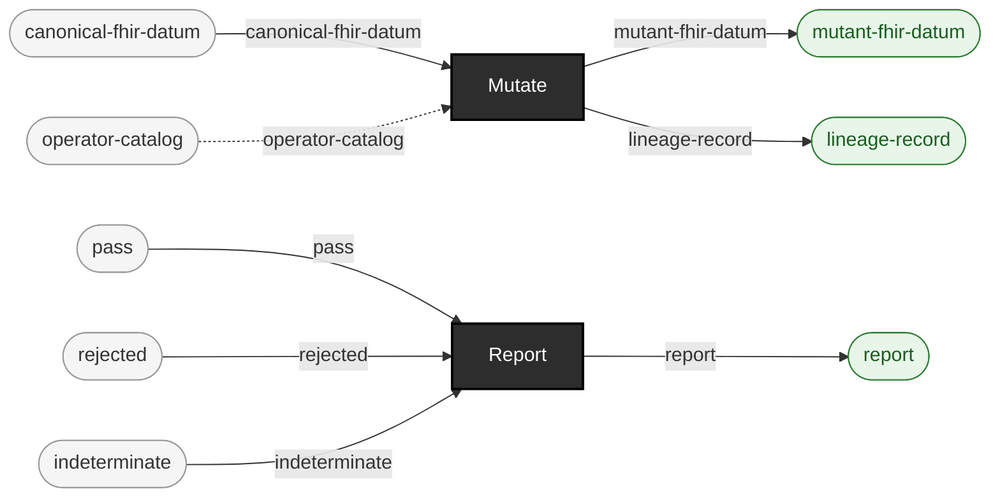

<!-- GENERATED by `make use-cases` from components/corpus/docs/use-cases.edn (case audit-regulatory-evidence-trail) -- do not hand-edit.
     Edit components/corpus/docs/use-cases.edn and regenerate instead. -->

# Audit/regulatory evidence trail

**Audience:** Teams needing to show, after the fact, exactly what test data was used, what was deliberately broken, and what a gate found -- an audit or regulatory review, not just an internal sanity check.

**You bring:** A corpus that's been through generation, mutation, and gating.

**You get:** A hash-linked, self-verifying provenance chain: lineage records (Merkle-style, correction-only-by-new-record), manifests, and reports, each independently checkable -- assembling these into one shareable evidence package is future work, not yet a single command.

**Maturity:** experimental

**You type:**

```sh
# The trail is not one command: it is what the ordinary commands
# leave behind, each artifact independently checkable.

# Generate -- the manifest is the first link.
bin/ehrt corpus generate synthea --config-path config/synthea/synthea.properties \
  --seed 100 --clinician-seed 555 --population 10 \
  --reference-date 20260101 --out-dir out/audit/corpus
PATIENT_FILE=$(ls out/audit/corpus/fhir/*.json | grep -v -e hospitalInformation -e practitionerInformation | head -1)

# Mutate -- the lineage record is the second: hash-linked to the
# file it came from, corrected only by a new record, never by
# editing this one.
bin/ehrt corpus mutate --path $PATIENT_FILE \
  --operator-id remove-required-element --locator-path entry[0].resource.resourceType \
  --out-dir out/audit/mutants

# Gate -- the report is the third, and it is finding-level, not
# just a verdict. The gate legitimately rejects here: that is the
# evidence, not a failure of the run.
bin/ehrt artifact fetch --name fhir-validator-cli --version 6.9.12
bin/ehrt gate fhir out/audit/mutants --report out/audit/gate-report.edn

# The three links, side by side.
ls out/audit/corpus/manifest.edn \
   out/audit/mutants/lineage/*.lineage.edn \
   out/audit/gate-report.edn
```

There is no `ehrt audit package` verb: assembling these three into one shareable evidence bundle is future work, as *You get* above already says. What ships is that each artifact is independently checkable -- a lineage record's `:id` is the hash of its own remaining fields, a manifest names the sha256 of every artifact that produced the corpus, and the report carries findings rather than verdicts alone ([formats.md](../formats.md)). Expect the gate to reject and therefore expect a non-zero exit -- 1, the rejection code ([cli.md](../cli.md#exit-codes)). `gate fhir` runs the real validator as a subprocess and takes minutes, not seconds.

```
canonical-fhir-datum × operator-catalog → mutant-fhir-datum + lineage-record  [Mutate]  {catalytic: operator-catalog}
pass × rejected × indeterminate → report  [Report]
```


