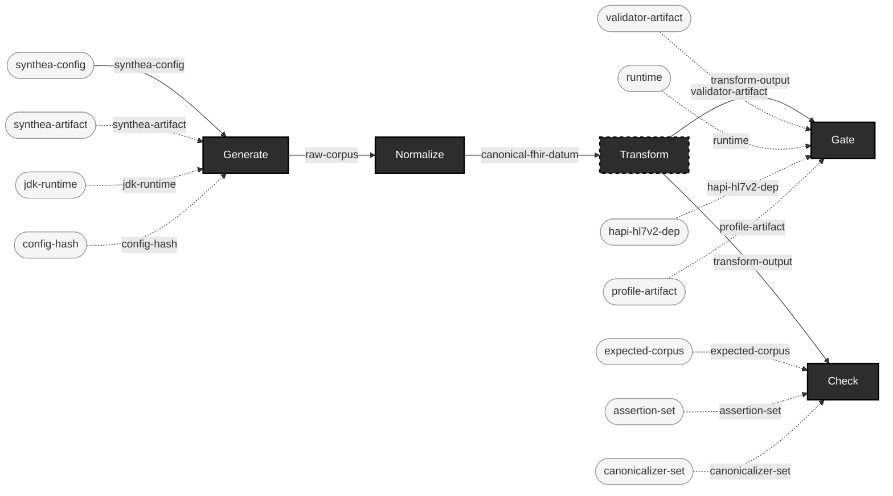

<!-- GENERATED by `make use-cases` from components/corpus/docs/use-cases.edn (case black-box-transform-surround) -- do not hand-edit.
     Edit components/corpus/docs/use-cases.edn and regenerate instead. -->

# Black-box transform surround

**Audience:** Teams whose actual system under test is a transform (an ingestion/mapping/ETL step) this repo doesn't implement and shouldn't have to.

**You bring:** Your own transform, run outside this repo's own pipeline.

**You get:** Conformance evidence (Gate) and equivalence evidence (Check, against an expected corpus) surrounding a black box you never have to instrument -- only its declared inputs/outputs.

**Maturity:** illustrative

**You type:** no strip -- this repo doesn't drive this use case end to end, so there is no command sequence to copy. You bring: Your own transform, run outside this repo's own pipeline. Its `Transform` stage is `{external: true}`: the system under test is your own transform, which this repo neither runs nor instruments. The shipped halves it surrounds do have strips -- producing the input corpus is [Generate conforming synthetic data](generate-conforming-data.md), gating the output is [Judge user-supplied data: intake -> gate -> report](judge-user-supplied-data.md), and `ehrt check` compares that output against an expected corpus ([cli.md](../cli.md#ehrt-check)). What no strip can write for you is the line in the middle that runs your transform.

```
synthea-config × synthea-artifact × jdk-runtime × config-hash → raw-corpus  [Generate]  {catalytic: synthea-artifact, jdk-runtime, config-hash}
raw-corpus → canonical-fhir-datum  [Normalize]
canonical-fhir-datum → transform-output  [Transform]  {external: true}
transform-output × validator-artifact × runtime × hapi-hl7v2-dep × profile-artifact → pass + rejected + indeterminate  [Gate]  {catalytic: validator-artifact, runtime, hapi-hl7v2-dep, profile-artifact}
transform-output × expected-corpus × assertion-set × canonicalizer-set → pass + rejected  [Check]  {catalytic: expected-corpus, assertion-set, canonicalizer-set}
```


