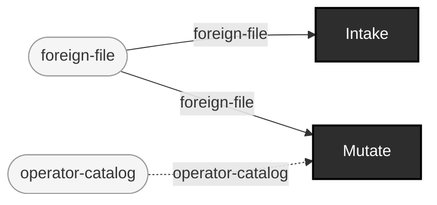

<!-- GENERATED by `make use-cases` from components/corpus/docs/use-cases.edn (case bring-your-own-generator-augmentation) -- do not hand-edit.
     Edit components/corpus/docs/use-cases.edn and regenerate instead. -->

# Bring-your-own-generator augmentation

**Audience:** Teams with their own generator (or none at all, just a foreign corpus) who want this repo's mutation, lineage, and gating on top, without reimplementing generation.

**You bring:** A corpus from a generator this repo doesn't implement.

**You get:** This repo's own mutation/lineage/gate machinery applied to a foreign corpus -- today this requires the foreign corpus to already be canonical-fhir-datum-shaped (FHIR JSON matching corpus.mutate's own substrate); a general foreign-format adapter into Mutate is future work, stated honestly rather than implied.

**Maturity:** planned

**You type:** no strip -- this repo doesn't drive this use case end to end, so there is no command sequence to copy. You bring: A corpus from a generator this repo doesn't implement. `Intake` ships, and has a strip at [Acceptance QA of delivered/vendor corpora](acceptance-qa-of-vendor-corpora.md). But the `Mutate` stage in this case's equations consumes `foreign-file` directly, and that works today only if your corpus is already `canonical-fhir-datum`-shaped (FHIR JSON matching `corpus.mutate`'s own substrate); the general foreign-format adapter into Mutate is future work, and no plan wave schedules it yet. Inventing an invocation for it here is exactly the dishonesty this page avoids. If your corpus is already FHIR JSON, [Judge user-supplied data: intake -> gate -> report](judge-user-supplied-data.md) is the case that runs today.

```
foreign-file → catalog-entry + intake-record  [Intake]
foreign-file × operator-catalog → mutant-fhir-datum + lineage-record  [Mutate]  {catalytic: operator-catalog}
```


