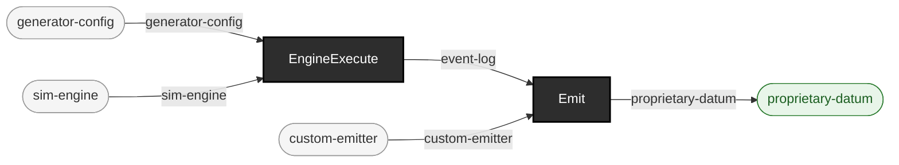

<!-- GENERATED by `make use-cases` from components/corpus/docs/use-cases.edn (case custom-emitter-from-the-event-log) -- do not hand-edit.
     Edit components/corpus/docs/use-cases.edn and regenerate instead. -->

# Write your own emitter from the event log

**Audience:** Teams who need simulated hospital traffic in a format this project does not ship -- a proprietary interface, an internal schema, a vendor's flat file.

**You bring:** Your own emitter, in any language that can read EDN or JSON, plus a seed.

**You get:** Your format, rendered from the same ground-truth event log this repo's own HL7v2 and FHIR emitters read -- against a published, versioned contract instead of a reverse-engineered one.

**Maturity:** usable

**You type:**

```sh
mkdir -p out/custom-emitter

# The ground-truth event log: the richest semantic form this project
# produces. Every shipped emitter is a projection of it.
bin/ehrt sim run --seed 42 --patients 5 --format ground-truth > out/custom-emitter/events.edn

# A worked example emitter, ~40 lines, depending on nothing in this
# repo -- which is the point: if it needed our code, the log would not
# really be a consumable contract.
bin/example-custom-emitter out/custom-emitter/events.edn
```

The contract is [formats.md, "The event log"](../formats.md#the-event-log) -- 21 event kinds, per-kind keys, and one real example each, all generated from the committed schema at [`event-schema.edn`](../../components/sim-engine/resources/sim-engine/event-schema.edn). Read that page's first subsection before writing anything: the log's sharpest edge is that `:registered` events carry nested `:pre-horizon-facts` whose entries have an `:event` key of their own, four of whose values collide with real log kinds. Iterate the top-level vector; do not walk the tree. The example emitter at [`bin/example-custom-emitter`](../../bin/example-custom-emitter) is a teaching artefact, not a feature -- its pipe-delimited format is deliberately useless, so the only interesting thing about it is the seam. It also does the thing a real custom emitter most needs to do: it reports how many events it did *not* translate, rather than dropping them silently.

The contract is versioned. Every run's `manifest.edn` records `:event-schema-version`, so a log always carries the version of the contract that produced it; additive change does not bump it, anything else does.

```
generator-config × sim-engine → event-log  [EngineExecute]
event-log × custom-emitter → proprietary-datum  [Emit]
```


