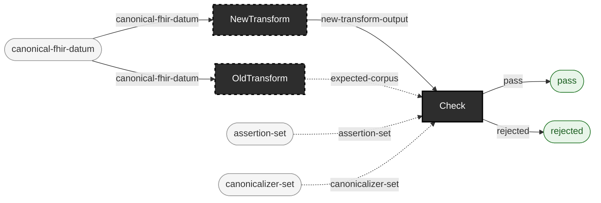

<!-- GENERATED by `make use-cases` from components/corpus/docs/use-cases.edn (case differential-ab-of-two-transform-versions) -- do not hand-edit.
     Edit components/corpus/docs/use-cases.edn and regenerate instead. -->

# Differential A/B of two transform versions

**Audience:** Teams upgrading their own transform/mapping step who need to know exactly where the new version's output diverges from the old.

**You bring:** The same input corpus, run through two versions of your own transform.

**You get:** An equivalence report from Check: the old version's output as the expected corpus, the new version's output as the candidate -- every divergence reported with a locator path.

**Maturity:** illustrative

**You type:** no strip -- this repo doesn't drive this use case end to end, so there is no command sequence to copy. You bring: The same input corpus, run through two versions of your own transform. Both `OldTransform` and `NewTransform` are `{external: true}` -- this repo never runs either version of your transform, so there is no invocation to show for the part that matters. Once their two output corpora exist, `ehrt check --expected` compares them ([cli.md](../cli.md#ehrt-check)) and reports each divergence with a locator path.

```
canonical-fhir-datum → expected-corpus  [OldTransform]  {external: true}
canonical-fhir-datum → new-transform-output  [NewTransform]  {external: true}
new-transform-output × expected-corpus × assertion-set × canonicalizer-set → pass + rejected  [Check]  {catalytic: expected-corpus, assertion-set, canonicalizer-set}
```


