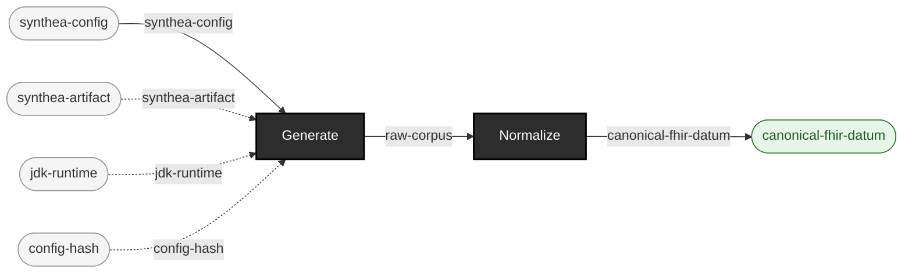

<!-- GENERATED by `make use-cases` from components/corpus/docs/use-cases.edn (case generate-conforming-data) -- do not hand-edit.
     Edit components/corpus/docs/use-cases.edn and regenerate instead. -->

# Generate conforming synthetic data

**Audience:** Teams needing realistic FHIR test data without hand-authoring it, for any downstream use they choose.

**You bring:** A Synthea configuration (population size, seed, clinician seed, reference date).

**You get:** A byte-reproducible synthetic corpus, from a manifest that regenerates it byte-for-byte (EXP-A4).

**Maturity:** usable

**You type:**

```sh
# One-time: the pinned Synthea distribution and the JDK it runs on,
# into the local artifact cache (~/.cache/ehr-testing-tools/artifacts).
bin/ehrt artifact fetch --name synthea --version 4.0.0
bin/ehrt artifact fetch --name temurin-jdk --version 21.0.12+8

# Generate. Every value here is pinned on purpose: --seed and
# --clinician-seed fix Synthea's two RNGs, --reference-date fixes what
# "now" means. Leave any of them out and the corpus stops being
# reproducible.
bin/ehrt corpus generate synthea --config-path config/synthea/synthea.properties \
  --seed 100 --clinician-seed 555 --population 10 \
  --reference-date 20260101 --out-dir out/demo-corpus

# What you got: FHIR R4 bundles, and the manifest that regenerates them.
ls out/demo-corpus/fhir
cat out/demo-corpus/manifest.edn
```

Flags and their defaults: [cli.md](../cli.md#ehrt-corpus-generate), or `ehrt help corpus` at the shell. What each manifest field means: [formats.md](../formats.md#the-corpus-manifest). Regenerating this corpus later *from* that manifest is its own case -- [Reproduction packages](reproduction-packages.md).

```
synthea-config × synthea-artifact × jdk-runtime × config-hash → raw-corpus  [Generate]  {catalytic: synthea-artifact, jdk-runtime, config-hash}
raw-corpus → canonical-fhir-datum  [Normalize]
```


