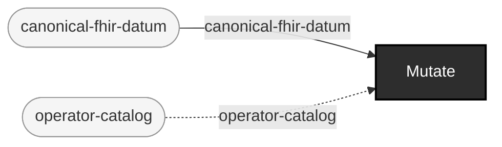

<!-- GENERATED by `make use-cases` from components/corpus/docs/use-cases.edn (case generate-controlled-fault-data) -- do not hand-edit.
     Edit components/corpus/docs/use-cases.edn and regenerate instead. -->

# Generate controlled-fault data

**Audience:** Teams needing deliberately broken data for any downstream use, with full traceability back to what was broken and why.

**You bring:** A base corpus (generated or intaken) plus a chosen defect operator and locator.

**You get:** A mutant with a lineage record naming the exact base-spec constraint it violates -- never produced without one -- plus an operation-manifest.edn naming the whole batch's own producer and per-item lineage (SS-4b).

**Maturity:** experimental

**You type:**

```sh
# The catalog you are choosing from: every operator, and the
# constraint its output violates.
bin/ehrt corpus operators --format fhir

# A base corpus to break, if you don't already have one.
bin/ehrt corpus generate synthea --config-path config/synthea/synthea.properties \
  --seed 100 --clinician-seed 555 --population 10 \
  --reference-date 20260101 --out-dir out/demo-corpus

# Pick one patient bundle. --path takes a file, or a directory of
# files sharing one locator's shape; a generated corpus also holds two
# non-patient bundles, so this picks a patient file specifically.
PATIENT_FILE=$(ls out/demo-corpus/fhir/*.json | grep -v -e hospitalInformation -e practitionerInformation | head -1)

# Break exactly one element, at exactly one locator.
bin/ehrt corpus mutate --path $PATIENT_FILE \
  --operator-id remove-required-element --locator-path entry[0].resource.gender \
  --out-dir out/demo-mutants

# The mutant is never written without this: the lineage record naming
# the operator, the locator, and the constraint the result violates.
cat out/demo-mutants/lineage/*.lineage.edn

# The batch's own self-description, written last, after every mutant
# and lineage sidecar above -- the same producer/per-item-lineage shape
# `ehrt corpus intake` recognizes automatically (SS-4b, formats.md).
cat out/demo-mutants/operation-manifest.edn
```

Operator ids and what each one edits: [operators.md](../operators.md). Locator syntax for both formats: [locators.md](../locators.md). The lineage record's own fields: [formats.md](../formats.md#the-lineage-record). Whether a given gate actually *convicts* a given mutant is a measured property rather than a promise -- [judge-calibration.md](../judge-calibration.md) is where a surprising gate result gets explained.

```
canonical-fhir-datum × operator-catalog → mutant-fhir-datum + lineage-record  [Mutate]  {catalytic: operator-catalog}
```


