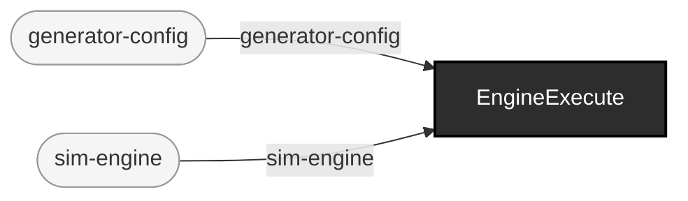

<!-- GENERATED by `make use-cases` from components/corpus/docs/use-cases.edn (case generate-sim-traffic) -- do not hand-edit.
     Edit components/corpus/docs/use-cases.edn and regenerate instead. -->

# Generate deterministic sim (HL7v2) traffic

**Audience:** Teams wanting deterministic, seeded HL7v2 hospital traffic (boarding, churn, cancellations, merges) as a corpus, with no cataloging step required first.

**You bring:** A seed (optional -- the zero-flag default is deterministic on its own, D9/ADR-0015[^adr-0015]).

**You get:** A v2 (ER7) corpus: one .hl7 file per message plus sim's own manifest.edn, at a derived, byte-reproducible out-dir.

**Maturity:** usable

**You type:**

```sh
# Zero-flag: one patient, HL7v2 messages, sim's own pinned seed.
bin/ehrt corpus generate sim

# Seeded, multi-patient.
bin/ehrt corpus generate sim --seed 42 --patients 5

# What you got.
ls out/corpus/sim-s42-p5
cat out/corpus/sim-s42-p5/manifest.edn

# Look at it.
bin/ehrt show out/corpus/sim-s42-p5
```

Flags and their defaults: [cli.md](../cli.md#ehrt-corpus-generate), or `ehrt help corpus` at the shell -- `generate sim`'s own flags (--patients/--churn/--emit/--config) sit alongside `generate synthea`'s in the same verb entry. This is the front door for sim traffic (ADR-0015[^adr-0015]); `corpus intake 'sim:...'` remains the one-command generate-and-catalog compose form for when you want a cataloged batch, not a bare corpus -- see [Simulator (sim) traffic as an intake source, in one command](simulator-traffic-as-intake-source.md). Play it back paced against its own MSH-7 timestamps -- `bin/ehrt play out/corpus/sim-s42-p5` (ADR-0015[^adr-0015]: `play` accepts a directory of .hl7 files directly, no manual `cat` step, in lexical filename order -- exactly the `msg-%03d` order this generator emits) -- see [Play a generated corpus back over time](play-a-generated-corpus-back-over-time.md). Small, fully worked examples of this traffic, generate command and rendered output side by side, live in [`demos/`](../../demos/) at the repo root.

[^adr-0015]: Design record [ADR-0015](../../notes/ADRs.md).

```
generator-config × sim-engine → generated-corpus  [EngineExecute]
```


