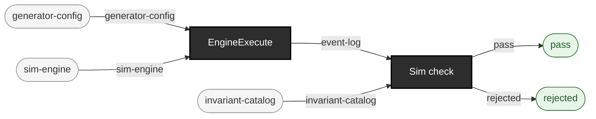

<!-- GENERATED by `make use-cases` from components/corpus/docs/use-cases.edn (case ground-truth-as-a-test-oracle) -- do not hand-edit.
     Edit components/corpus/docs/use-cases.edn and regenerate instead. -->

# Ground truth as a test oracle for your own system

**Audience:** Teams doing QA on a downstream system of their own -- an interface engine, an EHR inbound path, a patient index, a scheduling or bed-management module -- who need a semantic answer key to assert that system's behaviour against, rather than a pile of sample messages. This workspace's prime audience (docs/dev/AUDIENCES.md, segment 7).

**You bring:** A system whose behaviour is defined over patients, encounters, appointments and beds, plus a seed -- and, where your facility is not the shipped default, the --config file that describes it.

**You get:** The run's whole world model as a bare EDN vector: the versioned ground-truth event log every shipped emitter is a projection of, with a stated set of guarantees and an equally explicit set of exclusions. `ehrt sim check` is the reference judge over that log -- 46 invariants, every one reported by name -- and `ehrt sim mutate` injects one named defect class into it, so you can prove your own checks report that class and nothing else.

**Maturity:** usable

**You type:**

```sh
mkdir -p out/ground-truth-oracle

# The whole loop, in one line and nothing on disk: generate a world
# and hand it straight to the reference judge. Pass `sim check` the
# SAME --config the run used -- four of the 46 invariants need config
# the log itself does not carry, and without the flag they are checked
# against the shipped defaults instead of against your facility.
bin/ehrt sim run --seed 42 --patients 8 --churn --config demos/scenarios/ed-tuesday/config.edn --format ground-truth | bin/ehrt sim check --config demos/scenarios/ed-tuesday/config.edn

# The same run, retained. `--format ground-truth` writes the bare EDN
# vector and nothing around it, so this file IS the QA asset: pin it by
# its manifest's :seeds, :generator, :stream-scheme and
# :event-schema-version plus the --config file's hash, and it still
# means the same thing next quarter.
bin/ehrt sim run --seed 42 --patients 8 --churn --config demos/scenarios/ed-tuesday/config.edn --format ground-truth > out/ground-truth-oracle/events.edn

# The judge again, over the retained asset rather than over a pipe --
# this is the shape your CI re-runs. It reports the identical verdict.
bin/ehrt sim check --config demos/scenarios/ed-tuesday/config.edn < out/ground-truth-oracle/events.edn
```

**What the log is, and what it is not.** It is the semantic layer *underneath* every message this workspace emits -- one flat, timestamped vector of event maps describing what happened in the simulated hospital, with no message format anywhere in it. Derive your own invariants over the patients, encounters, appointments and beds it describes, then assert your system agrees. The full run contract -- the invocation, which configuration keys make which event kinds appear at all (a bare `ehrt sim run` produces the thinnest stream this simulator has), the determinism and identity models, and how far it scales -- is [consuming-ground-truth.md](../consuming-ground-truth.md). Read [formats.md's "Read the top-level vector only"](../formats.md#read-the-top-level-vector-only) before you write a line of consuming code: it is the log's sharpest edge and this page does not repeat it.

**`ehrt sim check` is the sim-side judge, not `ehrt corpus check`.** It reads a ground-truth EDN vector on stdin and runs an invariant catalog over it -- occupancy against the facility's capacity, timestamps monotone per patient, a discharge closing an encounter an admission opened, an appointment reaching at most one terminal, a bed never double-occupied. Exit 0 with `:status :ok` means every invariant held; exit 1 with `:status :rejected` carries a `:violations` vector naming the invariant, the patient and the instant.

**A green check is a statement about that catalog and nothing else.** [consuming-ground-truth.md's "What is not warranted"](../consuming-ground-truth.md#what-is-not-warranted) is the other half of the contract and is meant to be read with the same weight -- including that several invariants are vacuous on a log that never opted into the kinds they police, while all 45 are still listed as checked. Count the kinds in your own log.

**Controlled negatives.** `ehrt sim mutate --operator-id ID --seed N` is a filter over the same vector: it injects one named defect class and declares up front which findings the checker must then report -- exactly that set, in either direction. Put it between the run and the check and you have a negative test for your own pipeline that fails loudly if your checks have gone blind. See [consuming-ground-truth.md's fault-injection section](../consuming-ground-truth.md#fault-injection-as-it-stands-today) for the catalog and the taxonomy, and [operators.md](../operators.md) for the operator ids.

**This actor is witnessed in-tree, not inferred.** [`test-fixtures/downstream-calibration/PROVENANCE.md`](../../test-fixtures/downstream-calibration/PROVENANCE.md) is a downstream QA team's own controlled calibration of `ehrt sim run` -- their config vendored byte-for-byte, with the seed, reference date, flags and event-schema version it was measured at, their result table carried across verbatim, and their own qualification of it carried across too. That file is what this page cites, and it is the whole of what it cites.

```
generator-config × sim-engine → event-log  [EngineExecute]
event-log × invariant-catalog → pass + rejected  [Sim check]
```


