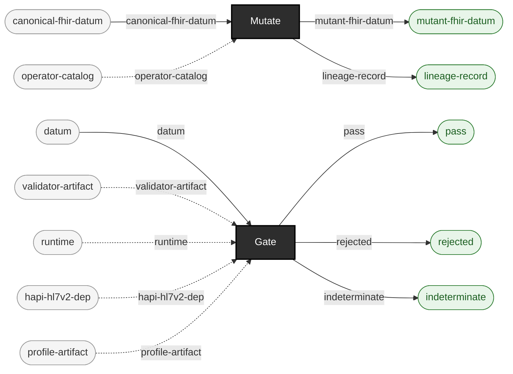

<!-- GENERATED by `make use-cases` from components/corpus/docs/use-cases.edn (case judge-tier-calibration-studies) -- do not hand-edit.
     Edit components/corpus/docs/use-cases.edn and regenerate instead. -->

# Judge-tier calibration studies

**Audience:** Anyone who needs to know, precisely and with evidence, what a given judge tier actually catches before they trust a green run against it.

**You bring:** A set of defect operators and a judge tier you want characterized.

**You get:** A per-{operator, locator} classification of what that tier detects, misses, or can only partially resolve -- docs/judge-calibration.md is exactly this, the first instance, derived from EXP-C5's own method.

**Maturity:** usable

**You type:**

```sh
# The tier you are characterizing (v2 here; `gate fhir` is the
# other), and the operators you are characterizing it against.
bin/ehrt corpus operators --format v2

# Baseline: what does this tier say about the file BEFORE you
# break it? On a real-world corpus this is not a formality.
bin/ehrt gate v2 test-fixtures/v2/adt-a01-admit.hl7 \
  --report out/calibration/before.edn

# One mutant per {operator, locator} cell you want filled in.
bin/ehrt corpus mutate --path test-fixtures/v2/adt-a01-admit.hl7 \
  --operator-id blank-required-field --locator-path MSH-9 \
  --out-dir out/calibration/blank-required-field

# Gate the mutant at the same tier. The verdict, and the finding
# code it carries, are that cell of the table.
bin/ehrt gate v2 out/calibration/blank-required-field \
  --report out/calibration/after.edn

# before: {:pass 1 ...} / after: {:rejected 1 ...} with
# :by-code {"hl7-exception" 1} -- that difference is the result.
cat out/calibration/before.edn out/calibration/after.edn
```

Three cells are worth knowing before you start: a `:rejected` verdict is trustworthy, a `:pass` is a claim about what was checked rather than about correctness, and `:no-verdict` means the judge couldn't fully apply its criterion at all -- [judge-calibration.md](../judge-calibration.md#reading-this-table) is the first instance of exactly this study, run over both tiers, and [operators.md](../operators.md#what-this-catalog-does-not-tell-you) explains why conviction is measured rather than declared. Locator syntax, including the MSH conventions this example depends on: [locators.md](../locators.md#hl7-v2-locators).

```
canonical-fhir-datum × operator-catalog → mutant-fhir-datum + lineage-record  [Mutate]  {catalytic: operator-catalog}
datum × validator-artifact × runtime × hapi-hl7v2-dep × profile-artifact → pass + rejected + indeterminate  [Gate]  {catalytic: validator-artifact, runtime, hapi-hl7v2-dep, profile-artifact}
```


