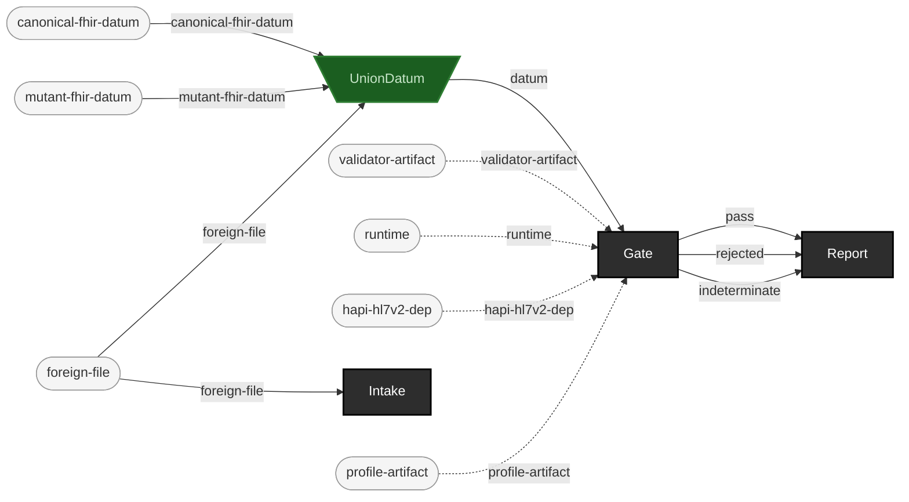

<!-- GENERATED by `make use-cases` from components/corpus/docs/use-cases.edn (case judge-user-supplied-data) -- do not hand-edit.
     Edit components/corpus/docs/use-cases.edn and regenerate instead. -->

# Judge user-supplied data: intake -> gate -> report

**Audience:** Anyone gating a corpus they didn't generate themselves -- an ingestion pipeline's own output, a partner's export, anything foreign.

**You bring:** Your own corpus (foreign files, any origin).

**You get:** A conformance report: verdicts plus findings, normalized to the shared finding envelope. Real-world, profile-stamped corpora carry pre-existing findings (EXP-C5) -- reach for --baseline mode (docs/judge-calibration.md) when file-level verdict alone can't discriminate old noise from a new problem.

**Maturity:** usable

**You type:**

```sh
# Point this at your own corpus. This repo vendors one you can try
# it on: five HL7 v2 messages, plus a synthetic 1,013-message corpus
# under simhospital/ (ADR-0011).
YOUR_CORPUS=test-fixtures/v2

# Catalog it first. Intake recurses and records EVERY file it finds
# -- content hash, sniffed format, source label, received date -- so
# a file it can't sniff is recorded as :unknown, never skipped.
bin/ehrt corpus intake --path $YOUR_CORPUS \
  --label partner-export --out out/partner/intake
cat out/partner/intake/intake-record.edn

# Gate it. `gate v2` reads *.hl7 in the directory you name (not
# recursively); `gate fhir` is the same shape for FHIR JSON.
bin/ehrt gate v2 $YOUR_CORPUS --report out/partner/gate-report.edn

# Look at what you just gated -- ER7's own segment separator is a
# bare CR, unreadable in a terminal; `show` renders it for a human
# (never wire format -- don't pipe this anywhere a real v2 consumer
# sits).
bin/ehrt show $YOUR_CORPUS/adt-a01-admit.hl7

# Play it back, paced against each message's own MSH-7 timestamp --
# ehrt show plus time (ADR-0014). A tight --idle-cap keeps this demo
# fast even though the two real messages are over an hour apart.
cat $YOUR_CORPUS/adt-a01-admit.hl7 <(printf '\n\n') $YOUR_CORPUS/adt-a02-transfer.hl7 \
  > out/partner/playback.hl7
bin/ehrt play out/partner/playback.hl7 --rate 3600 --idle-cap 1

# Don't recognize EDN? --json has been on every command all along --
# pipe straight into jq, no report file needed.
bin/ehrt gate v2 $YOUR_CORPUS --json | jq '.payload.totals'
```

What the report contains, field by field: [formats.md](../formats.md#the-report); the stdout envelope and the `--report` file are deliberately different shapes. If your corpus is real-world and profile-stamped, read [judge-calibration.md](../judge-calibration.md#baseline-relative-gating-2026-07-25-p6) before you trust a red verdict, and reach for `--baseline` ([Regression baselining / drift detection](regression-baselining.md)). A workflow can branch on the gate's exit code directly: `bin/ehrt` carries the 0/1/2/3 contract ([cli.md](../cli.md#exit-codes)). `ehrt show` ([formats.md](../formats.md#display-is-not-wire-format)) is the pretty-always display verb for a quick look at what you just gated; `ehrt play` ([formats.md](../formats.md#display-is-not-wire-format)) is the same rendering, paced against real timestamps (ADR-0014[^adr-0014]). For querying EDN directly (or a `--report` file after the fact) see [formats.md](../formats.md#reading-these-from-a-shell)'s jet mention.

[^adr-0014]: Design record [ADR-0014](../../notes/ADRs.md).

```
foreign-file → catalog-entry + intake-record  [Intake]
canonical-fhir-datum × mutant-fhir-datum × foreign-file → datum  [UnionDatum]  {spider: funnel}
datum × validator-artifact × runtime × hapi-hl7v2-dep × profile-artifact → pass + rejected + indeterminate  [Gate]  {catalytic: validator-artifact, runtime, hapi-hl7v2-dep, profile-artifact}
pass × rejected × indeterminate → report  [Report]
```


