```mermaid
flowchart LR

    %% --- Source types (raw inputs, not produced by any operation) ---
    mutant_v2_datum(["mutant-v2-datum"])
    size_cap(["size-cap"])
    stdout_sink_map(["stdout-sink-map"])

    %% --- Operations (boxes; spiders use distinct shapes) ---
    Write["Write"]
    EncodeFraming["EncodeFraming"]
    Spool["Spool"]
    Intake["Intake"]

    %% --- Result types (terminal outputs) ---
    catalog_entry_out(["catalog-entry"])
    intake_record_out(["intake-record"])

    %% --- Wires (typed connections) ---
    %% Arrow 1: Write
    mutant_v2_datum -- mutant-v2-datum --> Write
    stdout_sink_map -- stdout-sink-map --> Write

    %% Arrow 2: EncodeFraming
    Write -- sink-bytes --> EncodeFraming

    %% Arrow 3: Spool
    EncodeFraming -- framed-stream --> Spool
    size_cap -- size-cap --> Spool

    %% Arrow 4: Intake
    Spool -- spooled-corpus --> Intake
    Intake -- "catalog-entry" --> catalog_entry_out
    Intake -- "intake-record" --> intake_record_out

    %% --- Styling ---

    %% Operations: dark boxes (fan=blue, funnel=green, enrichment=outlined, gate=purple, external=dashed)
    style Write fill:#2d2d2d,stroke:#000,color:#fff,stroke-width:2px
    style EncodeFraming fill:#2d2d2d,stroke:#000,color:#fff,stroke-width:2px
    style Spool fill:#2d2d2d,stroke:#000,color:#fff,stroke-width:2px
    style Intake fill:#2d2d2d,stroke:#000,color:#fff,stroke-width:2px

    %% Source types: light rounded
    style mutant_v2_datum fill:#f5f5f5,stroke:#999,color:#333
    style size_cap fill:#f5f5f5,stroke:#999,color:#333
    style stdout_sink_map fill:#f5f5f5,stroke:#999,color:#333

    %% Result types (terminal outputs): green rounded
    style catalog_entry_out fill:#e8f5e9,stroke:#2e7d32,color:#1b5e20
    style intake_record_out fill:#e8f5e9,stroke:#2e7d32,color:#1b5e20
```

<!-- GENERATED by `make use-cases` from components/corpus/docs/use-cases.edn (case mutate-output-piped-straight-into-intake) -- do not hand-edit.
     Edit components/corpus/docs/use-cases.edn and regenerate instead. -->

# Mutate's own output, piped straight into intake -- no intermediate directory

**Audience:** Teams generating mutant corpora as part of a larger pipeline who don't want a scratch directory in between two of this repo's own commands, and anyone wanting to see the composability law (every sink's output is a valid source, docs/source-sink-design.md Part III) exercised end to end rather than merely asserted.

**You bring:** A base v2 corpus (a directory of .hl7 files) and a chosen defect operator/locator -- exactly what [Generate controlled-fault data](generate-controlled-fault-data.md) already brings; the difference is only where the mutants go.

**You get:** A cataloged mutant corpus, produced by chaining two `ehrt` invocations through a real OS pipe: `corpus mutate` batches every mutant, frames them (MLLP here; er7-multi/ndjson work the same way), and writes the framed bytes to its own stdout instead of a directory; `corpus intake` reads them from its own stdin, spools one file per mutant, and catalogs the result -- no scratch files land on disk in between (SS-4).

**Maturity:** usable

**You type:**

```sh
# Same operator/locator as the plain directory-output case; only
# --out-dir changes, to a stdout: designator instead of a path.
bin/ehrt corpus mutate in/v2-corpus \
  --operator-id blank-required-field --locator-path MSH-9 \
  --out-dir 'stdout:?format=v2-er7&framing=mllp' \
  | bin/ehrt corpus intake 'stdin:?format=v2-er7&framing=mllp' \
    --label mutate-loopback --out out/mutate-loopback-intake

# What you got: one file per mutant, cataloged -- no directory of
# mutant files or lineage sidecars ever touched disk on the way.
cat out/mutate-loopback-intake/intake-record.edn
```

Named scope decision, not an oversight: a stdout destination writes no lineage sidecar (`--out-dir/lineage/*.lineage.edn`, [Generate controlled-fault data](generate-controlled-fault-data.md)'s own directory case) -- there is no directory to drop one into. A run that needs lineage writes to a directory, exactly as before; this pipe is for batching mutants straight into another consumer, not for the lineage-preserving path. Any of the framing kinds that concatenate soundly work here (`mllp`/`er7-multi`/`ndjson`) -- see [source-sink-design.md](../dev/source-sink-design.md) Part III for the sink side and Part II for what each framing assumes about its bytes.

```
mutant-v2-datum × stdout-sink-map → sink-bytes  [Write]
sink-bytes → framed-stream  [EncodeFraming]  {catalytic: framing-codec}
framed-stream × size-cap → spooled-corpus  [Spool]  {catalytic: framing-codec}
spooled-corpus → catalog-entry + intake-record  [Intake]
```


