```mermaid
%% GENERATED by components/palgebra/tools/resource_equations_to_mermaid.py
%% from target/use-cases/mutation-adequacy-of-your-own-checks.txt -- do not hand-edit this block.
%% Regenerate with `make docsgen`; a change to the converter moves
%% every diagram it renders, which is why it is named here.
flowchart LR

    %% --- Source types (raw inputs, not produced by any operation) ---
    canonical_fhir_datum(["canonical-fhir-datum"])
    operator_catalog(["operator-catalog"])

    %% --- Operations (boxes; spiders use distinct shapes) ---
    Mutate["Mutate"]
    YourValidation["YourValidation"]

    %% --- Result types (terminal outputs) ---
    lineage_record_out(["lineage-record"])
    your_validation_verdict_out(["your-validation-verdict"])

    %% --- Wires (typed connections) ---
    %% Arrow 1: Mutate
    canonical_fhir_datum -- canonical-fhir-datum --> Mutate
    operator_catalog -. operator-catalog .-> Mutate
    Mutate -- "lineage-record" --> lineage_record_out

    %% Arrow 2: YourValidation
    Mutate -- mutant-fhir-datum --> YourValidation
    YourValidation -- "your-validation-verdict" --> your_validation_verdict_out

    %% --- Styling ---

    %% Operations: dark boxes (fan=blue, funnel=green, enrichment=outlined, gate=purple, external=dashed)
    style Mutate fill:#2d2d2d,stroke:#000,color:#fff,stroke-width:2px
    style YourValidation fill:#2d2d2d,stroke:#000,color:#fff,stroke-width:2px,stroke-dasharray: 5 5

    %% Source types: light rounded
    style canonical_fhir_datum fill:#f5f5f5,stroke:#999,color:#333
    style operator_catalog fill:#f5f5f5,stroke:#999,color:#333

    %% Result types (terminal outputs): green rounded
    style lineage_record_out fill:#e8f5e9,stroke:#2e7d32,color:#1b5e20
    style your_validation_verdict_out fill:#e8f5e9,stroke:#2e7d32,color:#1b5e20
```

<!-- GENERATED by `make use-cases` from components/corpus/docs/use-cases.edn (case mutation-adequacy-of-your-own-checks) -- do not hand-edit.
     Edit components/corpus/docs/use-cases.edn and regenerate instead. -->

# Mutation-adequacy of the user's own checks

**Audience:** Teams who already have their own validation logic and want to know how good it actually is, not just that it exists.

**You bring:** Your own validation logic (external to this repo) plus a corpus.

**You get:** An adequacy score: of the defects this repo's operators inject, how many does your own validation actually catch? A validation suite that never rejects a mutant is exactly as informative as one that always does.

**Maturity:** illustrative

**You type:** no strip -- this repo doesn't drive this use case end to end, so there is no command sequence to copy. You bring: Your own validation logic (external to this repo) plus a corpus. Its `YourValidation` stage is `{external: true}`: the adequacy score is a property of validation logic this repo doesn't have and makes no claim about. The half this repo does drive -- producing the labeled mutants you score against -- has a strip at [Generate controlled-fault data](generate-controlled-fault-data.md); the scoring loop around your own validator is yours to write.

```
canonical-fhir-datum × operator-catalog → mutant-fhir-datum + lineage-record  [Mutate]  {catalytic: operator-catalog}
mutant-fhir-datum → your-validation-verdict  [YourValidation]  {external: true}
```


