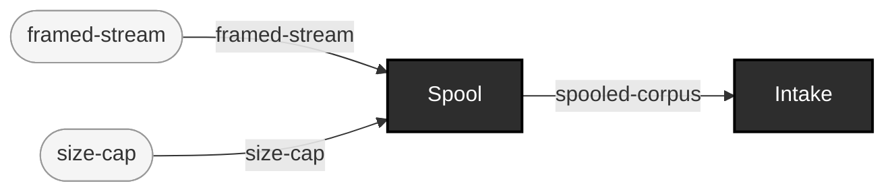

<!-- GENERATED by `make use-cases` from components/corpus/docs/use-cases.edn (case piped-hl7-traffic-as-intake-source) -- do not hand-edit.
     Edit components/corpus/docs/use-cases.edn and regenerate instead. -->

# Piped multi-message HL7v2 traffic as an intake source (stdin)

**Audience:** Teams with an existing HL7v2 feed (a file of many MSH-delimited messages, or anything nc/a real interface engine can pipe as bytes) who want it cataloged as a corpus without a separate file-splitting step.

**You bring:** A byte stream framed as one of the SS-3 framing kinds (er7-multi here; ndjson/mllp/bundle-entries work the same way) -- this example pipes an excerpt of the vendored SimHospital corpus (test-fixtures/v2/simhospital/messages.out, ADR-0011), but any MSH-multi-message file or a real nc pipe works identically.

**You get:** A cataloged v2 corpus: one file per message (the spool, docs/source-sink-design.md Part I.2/D2), plus capture-manifest.edn recording when it was captured, its declared origin, framing, format, item count, and per-item sha256s -- generated in one command, no manual message-splitting step (SS-3).

**Maturity:** usable

**You type:**

```sh
# A 3-message excerpt of the vendored SimHospital fixture, piped
# straight into intake -- the framing (er7-multi: MSH-led messages
# separated by a blank line) is decoded and spooled, one file per
# message, before anything is cataloged.
head -c 2464 test-fixtures/v2/simhospital/messages.out | \
  bin/ehrt corpus intake 'stdin:?format=v2-er7&framing=er7-multi' \
  --label simhospital-excerpt --out out/demo-stdin-intake

# What you got: one file per message, plus the spool's own capture
# manifest -- every catalog entry below carries the label as :origin.
ls out/demo-stdin-intake
cat out/demo-stdin-intake/intake-record.edn
```

Any of the four multi-item framing kinds work the same way: `?framing=ndjson`, `?framing=mllp`, or `?framing=bundle-entries` (for a piped FHIR Bundle) instead of `er7-multi` -- see [source-sink-design.md](../dev/source-sink-design.md) Part II for what each one assumes about its bytes. A real interface engine's own feed pipes in exactly the same way this excerpt does (`nc ... | bin/ehrt corpus intake 'stdin:?framing=mllp&format=v2-er7' ...`) -- `nc` (or any transport) is the one piece outside this repo's scope (D2); everything on this repo's side of the pipe is real. The spool's own capture-manifest.edn is a distinct schema from ADR-0014's manifest.edn (captured-at/origin/framing/format/item-count/per-item sha256s, not a generator's provenance record), so it is not treated as a provenance sidecar -- it gets cataloged like any other foreign file, which is why the catalog above has one more entry than there are messages. Gate the result the same way any intaken corpus gates -- [Judge user-supplied data: intake -> gate -> report](judge-user-supplied-data.md).

```
framed-stream × size-cap → spooled-corpus  [Spool]  {catalytic: framing-codec}
spooled-corpus → catalog-entry + intake-record  [Intake]
```


