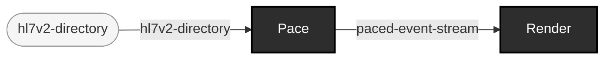

<!-- GENERATED by `make use-cases` from components/corpus/docs/use-cases.edn (case play-a-generated-corpus-back-over-time) -- do not hand-edit.
     Edit components/corpus/docs/use-cases.edn and regenerate instead. -->

# Play a generated corpus back over time

**Audience:** Teams wanting to watch, demo, or load-test against hospital traffic paced the way it actually happened, not delivered all at once.

**You bring:** A directory of HL7 v2 (ER7) messages sharing one sniffed format -- a `corpus generate sim` out-dir is the natural source, its own `msg-%03d.hl7` filenames already in the intended play order (ADR-0015[^adr-0015]).

**You get:** The same messages, rendered (or, with --sink, written byte-identically to an unpaced batch write) at a chosen wallclock rate against their own MSH-7 timestamps -- `ehrt play PATH` at an arbitrarily large --rate is exactly `ehrt show PATH` (ADR-0013[^adr-0013]/ADR-0014[^adr-0014]'s own identity).

**Maturity:** usable

**You type:**

```sh
bin/ehrt corpus generate sim --seed 42 --patients 5

# Real time is --rate 1; the default (--rate 60) plays a stream-hour
# per wallclock-minute. No manual `cat` step -- play reads the
# directory directly, in lexical filename order (ADR-0015).
bin/ehrt play out/corpus/sim-s42-p5 --rate 3600

# Write it out paced, byte-identical to an unpaced batch write,
# instead of rendering it to the terminal.
bin/ehrt play out/corpus/sim-s42-p5 --rate 3600 --sink file:out/paced-tail.hl7
```

The directory-listing order is the play order -- name files so their sort order is their intended order (D9's own emitted `msg-%03d` naming already satisfies this; see [Generate deterministic sim (HL7v2) traffic](generate-sim-traffic.md)). A directory mixing HL7 v2 and FHIR JSON, or containing an unclassifiable file, is `:play-input-unsupported` -- the same shape a mixed `gate PATH` directory already uses (D11), never a silent per-file split. Flags and their defaults: [cli.md](../cli.md#ehrt-play), or `ehrt help play` at the shell. [`demos/scenarios/busy-tuesday/`](../../demos/scenarios/busy-tuesday/) is a ready-made population-scale example, generate command and playback command both in its own README.

[^adr-0013]: Design record [ADR-0013](../../notes/ADRs.md).
[^adr-0014]: Design record [ADR-0014](../../notes/ADRs.md).
[^adr-0015]: Design record [ADR-0015](../../notes/ADRs.md).

```
hl7v2-directory → paced-event-stream  [Pace]
paced-event-stream → rendered-ticker-output  [Render]
```


