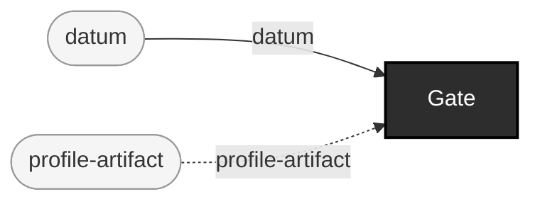

<!-- GENERATED by `make use-cases` from components/corpus/docs/use-cases.edn (case profile-tier-hl7v2-conformance-gating) -- do not hand-edit.
     Edit components/corpus/docs/use-cases.edn and regenerate instead. -->

# Profile-tier HL7v2 conformance gating (NIST)

**Audience:** Teams who need to check usage/cardinality/length, conformance statements, co-constraints, slicing, or value-set bindings against a specific implementation guide -- what `gate v2`'s base-structural (HAPI) tier structurally cannot check.

**You bring:** A HL7 v2 (ER7) file or directory, and a conformance-profile bundle (Π): PROFILE.xml required, CONSTRAINTS.xml/VALUESETS.xml/VALUESETBINDINGS.xml/COCONSTRAINTS.xml/SLICINGS.xml optional.

**You get:** A verdict per file (:pass/:rejected/:no-verdict, with :cause when the profile itself is defective or a value set is unavailable) -- the same Report shape and pretty summary every other gate produces (ADR-0004/ADR-0013).

**Maturity:** usable

**You type:**

```sh
# No project-owned profile exists yet (ADR-0012) -- the committed
# CDC COVID19_ELR-v2.3.1 bundle is this repo's own try-it Π,
# vendored under test-fixtures/ with its own NOTICE.md provenance.
bin/ehrt gate v2-nist \
  test-fixtures/v2-nist/covidELR/231HL7TestFilewithHHSData.txt \
  --profile test-fixtures/v2-nist/COVID19_ELR-v2.3.1 --pretty
```

This fixture message is a real, deliberately imperfect example: it comes back `:no-verdict`/`:profile-spec-error` (the bundle's own PROFILE.xml references value sets NIST's engine can't resolve -- a defect in the Π, not in the message), which is exactly the honest three-way verdict vocabulary D10/ADR-0010 exists for -- a `:pass` from `gate v2` doesn't mean `gate v2-nist` will agree, and vice versa; they check different things. Building the validator is the expensive part (context construction, not per-message checking) -- it happens once per invocation and is reused across every file in a directory, never rebuilt per file. `--profile` is required; there is no default bundle to fall back to silently. Flags: [cli.md](../cli.md#ehrt-gate-v2-nist), or `ehrt help gate` at the shell.

```
datum × profile-artifact → pass + rejected + no-verdict  [Gate]  {catalytic: profile-artifact}
```


