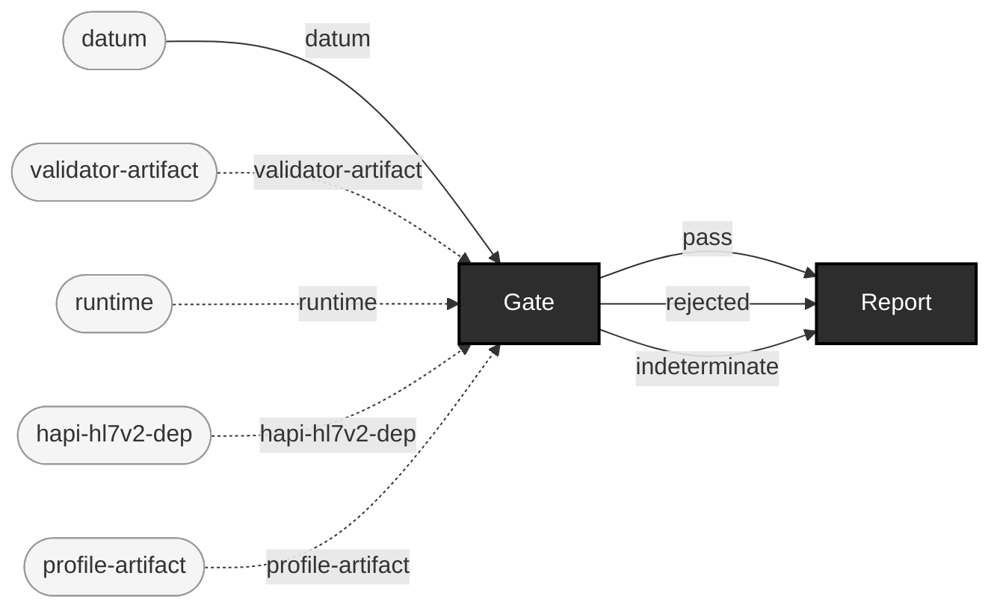

<!-- GENERATED by `make use-cases` from components/corpus/docs/use-cases.edn (case regression-baselining) -- do not hand-edit.
     Edit components/corpus/docs/use-cases.edn and regenerate instead. -->

# Regression baselining / drift detection

**Audience:** Teams gating the same corpus (or corpus shape) repeatedly over time -- CI runs, periodic re-validation of a stable pipeline.

**You bring:** A corpus you gate repeatedly, and the report from the last run you trusted.

**You get:** What changed: judge.report/diff-reports compares two full reports (every changed verdict, added/removed file, appeared/disappeared code); --baseline mode (docs/judge-calibration.md) answers the narrower did-anything-NEW-appear question for a single run against a captured baseline.

**Maturity:** usable

**You type:**

```sh
# The run you trust becomes the baseline. Keep this file.
bin/ehrt gate v2 test-fixtures/v2 --report out/regression/baseline.edn

# ...later, the same corpus again -- but judged relative to that
# baseline: a finding counts toward rejection only if its
# {severity, code, locator-path} isn't already in the baseline for
# that same file. The exit code follows the relative view, so a
# corpus that is identically noisy to its baseline still exits 0.
bin/ehrt gate v2 test-fixtures/v2 \
  --report out/regression/today.edn \
  --baseline out/regression/baseline.edn
```

In `--baseline` mode the payload becomes `{:absolute :relative}` rather than a bare report -- `:absolute` still carries every finding, `:relative` is the filtered view the exit code follows ([formats.md](../formats.md#baseline-mode-changes-the-payloads-shape), [judge-calibration.md](../judge-calibration.md#baseline-relative-gating-2026-07-25-p6)). Baseline matching is by file path, so this answers *did anything new appear in this corpus*. The wider question -- every changed verdict, added/removed file, appeared/disappeared code between two arbitrary reports -- is `ehrt.judge.report/diff-reports`, a library function today, not a CLI verb.

```
datum × validator-artifact × runtime × hapi-hl7v2-dep × profile-artifact → pass + rejected + indeterminate  [Gate]  {catalytic: validator-artifact, runtime, hapi-hl7v2-dep, profile-artifact}
pass × rejected × indeterminate → report  [Report]
```


