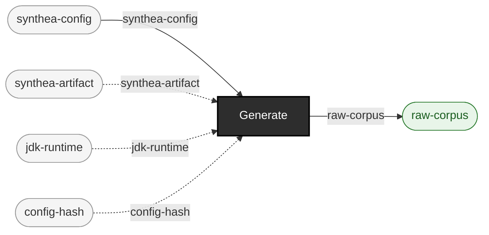

<!-- GENERATED by `make use-cases` from components/corpus/docs/use-cases.edn (case reproduction-packages) -- do not hand-edit.
     Edit components/corpus/docs/use-cases.edn and regenerate instead. -->

# Reproduction packages

**Audience:** Anyone who needs to hand someone else (a teammate, a reviewer, a future self) something that regenerates an exact corpus, not just the corpus itself.

**You bring:** Nothing beyond the pinned artifacts -- the manifest already names everything else.

**You get:** A manifest (config hash, seeds, artifact hashes, forced environment) that reproduces the exact corpus byte-for-byte, proven in EXP-A4 from a freshly emptied artifact cache.

**Maturity:** usable

**You type:**

```sh
# Generate once.
bin/ehrt corpus generate synthea --config-path config/synthea/synthea.properties \
  --seed 100 --clinician-seed 555 --population 10 \
  --reference-date 20260101 --out-dir out/repro-a

# The manifest IS the reproduction package: config hash, both seeds,
# the sha256 of the Synthea jar and of the JDK, the forced locale and
# timezone. Hand someone this file rather than the corpus.
cat out/repro-a/manifest.edn

# There is no regenerate-from-manifest verb: you read the settings
# back out of the manifest and pass them in again -- later, elsewhere,
# from an empty artifact cache.
bin/ehrt corpus generate synthea --config-path config/synthea/synthea.properties \
  --seed 100 --clinician-seed 555 --population 10 \
  --reference-date 20260101 --out-dir out/repro-b

# Same corpus? Ask this repo's own equivalence judge, pairing files
# by content hash.
bin/ehrt check out/repro-b/fhir --expected out/repro-a/fhir --pair-by hash
```

Why `--pair-by hash` rather than `diff -r`: two of Synthea's own output filenames (`hospitalInformation<timestamp>.json`, `practitionerInformation<timestamp>.json`) embed a wall-clock export timestamp no seed can pin, while their *contents* are identical run over run. [EXP-A4](../../components/corpus/docs/experiments/EXP-A4-results.md) found exactly this and registered `:strip-run-timestamp-suffix` as a canonicalizer for it -- so the byte-identity claim is byte-identity *modulo* recorded canonicalizations, and pairing by content hash is the shell-level way to ask the same question. `check`'s flags: [cli.md](../cli.md#ehrt-check).

```
synthea-config × synthea-artifact × jdk-runtime × config-hash → raw-corpus  [Generate]  {catalytic: synthea-artifact, jdk-runtime, config-hash}
```


