```mermaid
flowchart LR

    %% --- Source types (raw inputs, not produced by any operation) ---
    generator_config(["generator-config"])
    sim_engine(["sim-engine"])

    %% --- Operations (boxes; spiders use distinct shapes) ---
    EngineExecute["EngineExecute"]
    Intake["Intake"]

    %% --- Result types (terminal outputs) ---
    catalog_entry_out(["catalog-entry"])
    intake_record_out(["intake-record"])

    %% --- Wires (typed connections) ---
    %% Arrow 1: EngineExecute
    generator_config -- generator-config --> EngineExecute
    sim_engine -- sim-engine --> EngineExecute

    %% Arrow 2: Intake
    EngineExecute -- generated-corpus --> Intake
    Intake -- "catalog-entry" --> catalog_entry_out
    Intake -- "intake-record" --> intake_record_out

    %% --- Styling ---

    %% Operations: dark boxes (fan=blue, funnel=green, enrichment=outlined, gate=purple, external=dashed)
    style EngineExecute fill:#2d2d2d,stroke:#000,color:#fff,stroke-width:2px
    style Intake fill:#2d2d2d,stroke:#000,color:#fff,stroke-width:2px

    %% Source types: light rounded
    style generator_config fill:#f5f5f5,stroke:#999,color:#333
    style sim_engine fill:#f5f5f5,stroke:#999,color:#333

    %% Result types (terminal outputs): green rounded
    style catalog_entry_out fill:#e8f5e9,stroke:#2e7d32,color:#1b5e20
    style intake_record_out fill:#e8f5e9,stroke:#2e7d32,color:#1b5e20
```

<!-- GENERATED by `make use-cases` from components/corpus/docs/use-cases.edn (case simulator-traffic-as-intake-source) -- do not hand-edit.
     Edit components/corpus/docs/use-cases.edn and regenerate instead. -->

# Simulator (sim) traffic as an intake source, in one command

**Audience:** Teams wanting deterministic, seeded HL7v2 hospital traffic (boarding, churn, cancellations, merges) as a corpus, without a separate generate-then-catalog step.

**You bring:** A seed.

**You get:** A cataloged v2 corpus: HL7v2 messages plus sim's own manifest.edn sidecar, its provenance (generator name/version/sha256, seeds) attached to every catalog entry[^adr-0014] -- generated fresh at your own seed, in one command (SS-2, the generator registry).

**Maturity:** usable

**You type:**

```sh
bin/ehrt corpus intake 'sim:?seed=42&patients=5&emit=hl7' \
  --label sim-traffic --out out/sim-intake
cat out/sim-intake/intake-record.edn

# Every catalog entry carries sim's own real provenance (ADR-0014).
cat out/sim-intake/catalog.edn
```

This is the compose form -- generate, then catalog, in one command -- for when you want a cataloged batch, not a bare corpus; `bin/ehrt corpus generate sim` ([^adr-0015], [Generate deterministic sim (HL7v2) traffic](generate-sim-traffic.md)) is the front door when you just want the corpus. Generator-URL params (seed, patients, churn, emit, reference-date, config) are sim's own `run` verb's flags, the same names `generate sim`'s own flags use; a bare `sim:` with no query string still works, at sim's own pinned one-patient/hl7 default (the determinism law of defaults, D8). Gate the result the same way any intaken corpus gates -- [Judge user-supplied data: intake -> gate -> report](judge-user-supplied-data.md). Synthea's own equivalent one-command compose path is `bin/ehrt corpus intake 'synthea:?seed=1&population=5'`, over the SAME generator registry (docs/source-sink-design.md), fronted the same way by `bin/ehrt corpus generate synthea` ([^adr-0015] amendment, 2026-07-30: bare `corpus generate`, with no subcommand, means `generate sim` now, not synthea).

[^adr-0014]: Design record [ADR-0014](../../notes/ADRs.md).
[^adr-0015]: Design record [ADR-0015](../../notes/ADRs.md).

```
generator-config × sim-engine → generated-corpus  [EngineExecute]
generated-corpus → catalog-entry + intake-record  [Intake]
```


