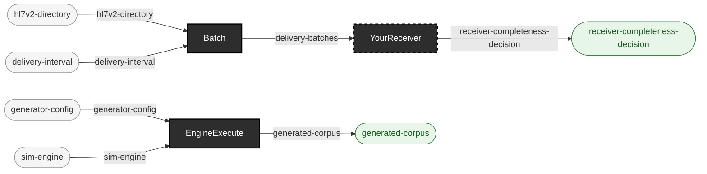

<!-- GENERATED by `make use-cases` from components/corpus/docs/use-cases.edn (case supply-batch-straddling-traffic) -- do not hand-edit.
     Edit components/corpus/docs/use-cases.edn and regenerate instead. -->

# Supply batch-straddling encounter traffic to a downstream

**Audience:** Teams testing whether a downstream receiver's encounter-completeness logic survives scheduled batch delivery -- where a clinically open encounter's messages arrive split across adjacent, individually transport-clean batches.

**You bring:** A downstream receiver (yours, external to this repo) that consumes HL7 v2 batch files and decides, per encounter, whether it holds the full record set. The commands below generate the input corpus; any existing directory of valid v2 message files -- including a corpus this repo never generated -- batches identically.

**You get:** Deterministic BHS/BTS batch files, epoch-aligned to the delivery schedule, every written file's BTS-1 message count decoded back and verified before success -- containing at least one encounter whose admission and discharge land in different batches. Transport-level completeness with clinical-level incompleteness: the exact case a receiver's "do I have all of this encounter?" decision needs, and one that trips up the unaware in real feeds.

**Maturity:** usable

**You type:**

```sh
# Generate the ed-tuesday scenario's latency wire (1,554 messages,
# seed-pinned, byte-reproducible).
bin/ehrt corpus generate sim --seed 20260811 --patients 100 \
  --reference-date 2026-08-11 --churn \
  --config demos/scenarios/ed-tuesday/config-latency.edn \
  --out-dir out/scenarios/ed-tuesday-latency

# Batch it hourly: buckets align to the clock hour against the Unix
# epoch, BHS/BTS wrappers, BTS-1 self-verified on every write.
bin/ehrt corpus batch out/scenarios/ed-tuesday-latency --interval 60 \
  --out-dir out/scenarios/ed-tuesday-latency-batches

# What you got: one file per occupied hour; interior empty hours are
# simply absent (a named v1 deferral).
ls out/scenarios/ed-tuesday-latency-batches
```

The witnessed straddling encounter -- Hernandez, Sandra (MRN000002): admitted in `batch-000.hl7`, discharged in `batch-002.hl7`, with `batch-001.hl7` between them holding no message for her at all and all three files individually BTS-verified clean -- is worked end to end, wrapper bytes and all, in [the ed-tuesday scenario's Batched delivery section](../../demos/scenarios/ed-tuesday/README.md#batched-delivery)[^adr-0111]. Flags and their defaults: [cli.md](../cli.md#ehrt-corpus-batch), or `ehrt help corpus` at the shell. The batcher is corpus-level and sim-separate by ruling: it reads any directory of valid `.hl7` files, so a foreign corpus is exactly as batchable as this scenario's own out-dir.

[^adr-0111]: Design record [ADR-0111](../../notes/ADRs.md).

```
generator-config × sim-engine → generated-corpus  [EngineExecute]
hl7v2-directory × delivery-interval → delivery-batches  [Batch]
delivery-batches → receiver-completeness-decision  [YourReceiver]  {external: true}
```


