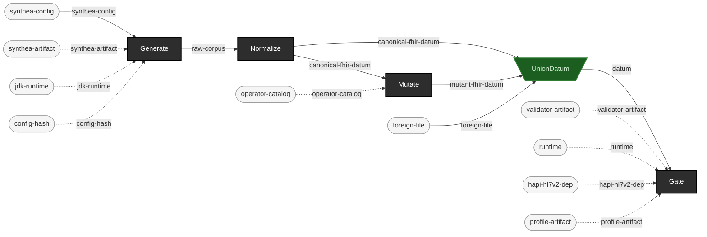

<!-- GENERATED by `make use-cases` from components/corpus/docs/use-cases.edn (case test-a-validator-with-contract-pairing) -- do not hand-edit.
     Edit components/corpus/docs/use-cases.edn and regenerate instead. -->

# Test a validator/gate with generated + mutated data

**Audience:** Anyone standing up a new gate/validator who needs to prove it actually detects what it claims to check for, not just trust the vendor's claim.

**You bring:** Nothing beyond the pinned artifacts -- this repo generates and mutates its own test data.

**You get:** Contract pairing: for each defect operator, proof that the gate produces a new, locator-matching finding -- the exemplar is P5's own contract-pairing suite (projects/integration/test/ehrt/integration/contract_pairing_test.clj) against the real official FHIR validator.

**Maturity:** usable

**You type:**

```sh
# The exemplar, run for real: five FHIR defect operators, each
# mutated into a real Synthea bundle, each gated through the real
# official validator as a subprocess. Needs the three pinned
# artifacts first; takes minutes, not seconds.
bin/ehrt artifact fetch --name synthea --version 4.0.0
bin/ehrt artifact fetch --name temurin-jdk --version 21.0.12+8
bin/ehrt artifact fetch --name fhir-validator-cli --version 6.9.12
make integration

# The same shape by hand, for a gate of your own: take the mutant
# you made in "Generate controlled-fault data" above and gate it.
bin/ehrt gate fhir out/demo-mutants --report out/demo-mutants-report.edn
```

What makes this *contract pairing* rather than "the gate went red": the assertion is on a specific **new** finding whose locator matches the mutation, never on the file's aggregate verdict. [EXP-C5](../../components/corpus/docs/experiments/EXP-C5-results.md) found every baseline file in this corpus already carries hundreds of profile-driven errors (the validator auto-loads US Core from Synthea's own declared `meta.profile`), so an aggregate verdict cannot discriminate a mutant from its own base file. The exemplar is [`projects/integration/test/ehrt/integration/contract_pairing_test.clj`](../../projects/integration/test/ehrt/integration/contract_pairing_test.clj) -- read it rather than reimplementing it. Note which locator it uses and why: the by-hand mutant above breaks `entry[0].resource.gender`, which EXP-C5 found the validator does **not** convict (`gender` is min-cardinality 0 in base FHIR, so removing it violates nothing), which is exactly why the suite itself uses `resourceType`. That asymmetry is the point of calibrating a gate instead of trusting it -- [judge-calibration.md](../judge-calibration.md). `make integration` is the nightly tier and never a per-push gate; it lives on the `projects/integration/test/` path, which is a path split rather than a tag filter (see `AGENTS.md`).

```
synthea-config × synthea-artifact × jdk-runtime × config-hash → raw-corpus  [Generate]  {catalytic: synthea-artifact, jdk-runtime, config-hash}
raw-corpus → canonical-fhir-datum  [Normalize]
canonical-fhir-datum × operator-catalog → mutant-fhir-datum + lineage-record  [Mutate]  {catalytic: operator-catalog}
canonical-fhir-datum × mutant-fhir-datum × foreign-file → datum  [UnionDatum]  {spider: funnel}
datum × validator-artifact × runtime × hapi-hl7v2-dep × profile-artifact → pass + rejected + indeterminate  [Gate]  {catalytic: validator-artifact, runtime, hapi-hl7v2-dep, profile-artifact}
```


