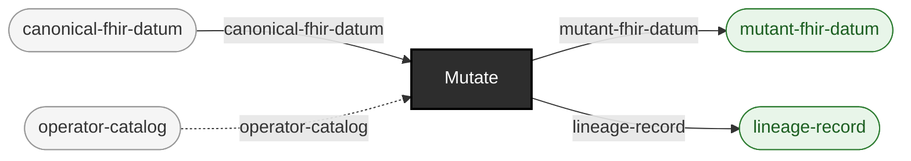

<!-- GENERATED by `make use-cases` from components/corpus/docs/use-cases.edn (case training-material) -- do not hand-edit.
     Edit components/corpus/docs/use-cases.edn and regenerate instead. -->

# Training material

**Audience:** Anyone teaching what a given defect class looks like -- onboarding, a workshop, a documentation example.

**You bring:** Nothing -- generate a small corpus and mutate it with known operators.

**You get:** Labeled before/after pairs: each lineage record names the exact base-spec constraint its mutant violates, ready to use as a worked example.

**Maturity:** illustrative

**You type:**

```sh
# A small corpus to teach from.
bin/ehrt corpus generate synthea --config-path config/synthea/synthea.properties \
  --seed 100 --clinician-seed 555 --population 5 \
  --reference-date 20260101 --out-dir out/teaching-corpus
PATIENT_FILE=$(ls out/teaching-corpus/fhir/*.json | grep -v -e hospitalInformation -e practitionerInformation | head -1)

# One run per defect class you want to show. Each writes a mutant
# plus a lineage record; that pair is the worked example.
bin/ehrt corpus mutate --path $PATIENT_FILE \
  --operator-id malformed-date --locator-path entry[0].resource.birthDate \
  --out-dir out/teaching/malformed-date
bin/ehrt corpus mutate --path $PATIENT_FILE \
  --operator-id invalid-code-value --locator-path entry[0].resource.gender \
  --out-dir out/teaching/invalid-code-value

# The label: what was broken, where, and which constraint that violates.
cat out/teaching/malformed-date/lineage/*.lineage.edn

# The value itself, before and after.
grep -o '"birthDate"[^,]*' "$PATIENT_FILE" | head -1
grep -o '"birthDate"[^,]*' out/teaching/malformed-date/*.json | head -1
```

A mutant is written as canonical JSON (one line); Synthea's own output is pretty-printed. A raw `diff` between the two is therefore ~60,000 lines of reformatting and not the teaching artifact -- the lineage record and the one changed value are. Operator ids: [operators.md](../operators.md); locator syntax: [locators.md](../locators.md); the lineage record's fields: [formats.md](../formats.md#the-lineage-record). This case is `illustrative` because no shipped example pipeline runs it end to end, not because the commands don't run: these were run, 2026-07-26.

```
canonical-fhir-datum × operator-catalog → mutant-fhir-datum + lineage-record  [Mutate]  {catalytic: operator-catalog}
```


